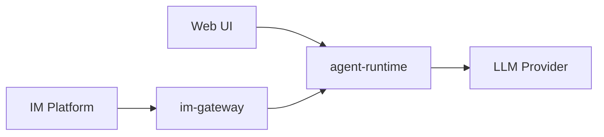

# Netherbrain

## Overview

Netherbrain is a general agent service for homelab use, with IM integration. The project consists of two main components:

- **agent-runtime**: A FastAPI-based service that hosts the agent logic, with a built-in web UI for configuration (admin) and chat.
- **im-gateway**: A gateway that connects IM bots (e.g. Telegram, Discord) to the agent-runtime.

## Architecture



## Project Structure

```
netherbrain/
  __init__.py
  cli.py               # Unified click CLI (netherbrain agent / netherbrain gateway / netherbrain db)
  agent_runtime/       # FastAPI service
    app.py             # FastAPI application (serves API + static UI)
    settings.py        # pydantic-settings configuration (NETHER_* env vars)
    deps.py            # FastAPI dependency injection (DbSession, RedisClient, SessionMgr)
    registry.py        # In-memory session registry (interrupt, steering, drain)
    context.py         # RuntimeSession dataclass (in-flight execution state)
    alembic.ini        # Alembic configuration (packaged)
    alembic/           # Database migrations
      env.py           # Migration environment
      versions/        # Migration scripts
    db/                # Database layer
      tables.py        # SQLAlchemy ORM models (schema source of truth)
      engine.py        # Async engine factory
    models/            # Pydantic domain models and API schemas
      enums.py         # Shared enumerations (SessionStatus, Transport, etc.)
      api.py           # Request/response schemas (Create/Update/Response)
      session.py       # Session/conversation domain models
      preset.py        # Preset domain models
      workspace.py     # Workspace domain models
      events.py        # Protocol event models
    managers/          # Business logic (data access, CRUD, orchestration)
      presets.py       # Preset CRUD functions
      workspaces.py    # Workspace CRUD functions
      conversations.py # Conversation CRUD functions
      sessions.py      # SessionManager class (create/commit/get/list, state store)
    routers/           # Thin HTTP adapters (parse params, call managers, translate errors)
      presets.py       # /api/presets/* endpoints
      workspaces.py    # /api/workspaces/* endpoints
      conversations.py # /api/conversations/* endpoints
      sessions.py      # /api/sessions/* endpoints
    store/             # State store for session persistence (large blobs)
      base.py          # StateStore async Protocol
      local.py         # Local filesystem implementation (atomic writes)
  im_gateway/          # IM bot gateway
    gateway.py         # Gateway logic
ui/                    # Frontend (Vite + React + TypeScript)
  spec/                # UI design specification
    00-overview.md     # Product model, workspace-centric design, tech stack
    01-layout.md       # Page structure, navigation, responsive behavior
    02-chat.md         # Message rendering, streaming, controls
    03-settings.md     # Preset and workspace management
  src/
    pages/
      Chat.tsx         # Conversation interface
      Config.tsx       # Agent preset management
    App.tsx            # Root component with routing
    main.tsx           # Entry point
dev/
  docker-compose.dev.yml  # Dev PostgreSQL + Redis
  dev-setup.sh            # Infrastructure management script (up/down/status/reset)
  dev.env                 # Dev environment variables
tests/
  conftest.py           # Shared fixtures (testcontainers, db_session, redis_client)
  test_agent_runtime.py
  test_db_integration.py
  test_im_gateway.py
```

## Layered Architecture

The agent-runtime follows a strict three-layer separation:

- **Routers** (`routers/`): Thin HTTP adapters. Parse request parameters, call managers, translate domain exceptions (`LookupError`, `ValueError`) to HTTP responses (`404`, `409`, `422`). No SQLAlchemy queries or business logic here.
- **Managers** (`managers/`): Business logic and data access. Accept `db: AsyncSession` as parameter. Raise domain exceptions, never HTTP exceptions. Stateless CRUD managers use module-level async functions; stateful managers (e.g. `SessionManager`) use classes.
- **Store** (`store/`): State persistence for large blobs (session state, display messages). Async Protocol interface with pluggable backends (local FS, S3).

Key rules:

- Managers do NOT depend on FastAPI.
- Routers do NOT contain SQLAlchemy queries.
- Singletons (SessionManager, StateStore) are initialised in `app.py` lifespan, accessed via FastAPI dependency injection (`deps.py`).
- DB sessions are per-request (from DI), passed to manager methods as parameters.
- No backward-compatibility shims; update all imports directly when moving code.

## Tech Stack

- Python 3.13+
- Package manager: uv
- CLI framework: click
- Web framework: FastAPI + uvicorn
- HTTP client: httpx
- Linting: ruff, pyright
- Testing: pytest
- Frontend: Vite + React + TypeScript
- Frontend linting: eslint, prettier

## CLI Commands

- `netherbrain agent` - Start the agent runtime server (default: 0.0.0.0:8000)
- `netherbrain gateway` - Start the IM gateway (connects to agent-runtime)
- `netherbrain db upgrade` - Run database migrations to latest
- `netherbrain db downgrade` - Roll back database by one migration
- `netherbrain db migrate <message>` - Autogenerate a migration from model changes
- `netherbrain db current` - Show current database revision
- `netherbrain db history` - Show migration history

## Dev Commands (Makefile)

- `make install` - Install all dependencies (server + UI)
- `make install-server` - Install Python venv and pre-commit hooks only
- `make install-ui` - Install UI dependencies only
- `make check` - Run all quality checks (server + UI)
- `make check-server` - Run server-side quality checks only
- `make check-ui` - Run UI linting and formatting checks only
- `make test` - Run all tests (requires Docker for integration tests)
- `make test-unit` - Run unit tests only (no Docker required)
- `make build` - Build wheel (includes UI)
- `make dev` - Run agent-runtime and UI dev server concurrently
- `make run-agent` - Run agent-runtime with auto-reload
- `make run-gateway` - Run im-gateway
- `make db-upgrade` - Run database migrations to latest
- `make db-downgrade` - Roll back database by one migration
- `make db-current` - Show current database revision
- `make db-history` - Show migration history
- `make infra-up` - Start dev PostgreSQL and Redis
- `make infra-down` - Stop dev infrastructure (data preserved)
- `make infra-status` - Show dev infrastructure status
- `make infra-reset` - Stop and wipe dev infrastructure data

## Settings

- All settings read from `NETHER_*` env vars via `pydantic-settings`, with `.env` fallback.
- Use `get_settings()` (cached via `lru_cache`) instead of instantiating `NetherSettings()` directly.
- Do NOT create `NetherSettings()` at module level in app code -- it prevents test env var overrides.
- CLI commands (`cli.py`) and Alembic `env.py` may create `NetherSettings()` directly since they run in isolated contexts.

## Database

- Driver: `psycopg[binary,pool]` (psycopg3) -- single driver for both sync (Alembic) and async (FastAPI).
- Dialect: `postgresql+psycopg://` for sync, `postgresql+asyncpg://` is NOT used.
- Alembic config (`alembic.ini`) and migrations (`alembic/`) are packaged inside `netherbrain/agent_runtime/`.
- `tables.py` (SQLAlchemy ORM) is the single source of truth for schema. Alembic reads `Base.metadata`.
- `env.py` uses `include_object` filter to protect foreign tables, `compare_type=True`, `compare_server_default=True`.
- Dev infrastructure: PostgreSQL on port **15432**, Redis on port **16379** (non-default to avoid conflicts).

## Testing

- Function-style tests only (no test classes).
- Use `@pytest.mark.integration` for tests that need PostgreSQL / Redis containers.
- Containers are managed by `testcontainers-python` (session-scoped: started once per run).
- `PostgresContainer(driver="psycopg")` -- use the driver param, not string replacement.
- DB test isolation via savepoint rollback (`join_transaction_mode="create_savepoint"`).
- Redis test isolation via `flushdb` after each test.
- Schema setup uses Alembic `upgrade head` with the packaged `alembic.ini` (tests the real migration path).
- After setting test env vars, call `_get_settings_cached.cache_clear()` so `get_settings()` picks them up.
- Fixtures: `db_session` (async SQLAlchemy session), `redis_client` (async Redis client), `async_engine` (session-scoped).
- CRUD API tests use `httpx.AsyncClient` + `ASGITransport` with `get_db` dependency override.
- Test directory: `tests/agent_runtime/` for agent-runtime integration tests, with its own `conftest.py` providing the `client` fixture.

## Documentation Conventions

### docs/

Usage documentation: how-to guides, API usage examples, integration instructions.

### spec/

Design specification for this project: architecture diagrams, flowcharts, swimlane diagrams, pseudocode flows.

- Use mermaid for all diagrams.
- Keep documents concise and elegant; focus on high-level design only.
- Create UML diagrams only when necessary.
- Do not include code implementation details or code examples.

### API Style

- **RPC-style** (not RESTful): actions are expressed in URL paths, not HTTP methods.
- Use **GET** for reads (queries, get-by-id) and **POST** for all writes (create, update, delete, actions).
- Example: `POST /sessions/{id}/cancel`, not `DELETE /sessions/{id}`.
- Branch: `main`
- Commit messages: imperative English, prefixed (`feat:`, `fix:`, `refactor:`, `docs:`)
- Do not auto-commit.

## Docker

Single image: `ghcr.io/wh1isper/netherbrain`

Uses ENTRYPOINT + CMD pattern, default runs `agent`:

- `docker run ghcr.io/wh1isper/netherbrain` (runs agent)
- `docker run ghcr.io/wh1isper/netherbrain gateway` (runs gateway)

Tags:

- `dev` - Built on every push to main
- `latest` + version tag - Built on release

## Web UI

Chat-app style web interface served by the agent-runtime at root path (`/`).

- **Design language**: Modern chat app (ChatGPT/Claude), not admin dashboard.
- **Workspace-centric**: Workspaces organize conversations by project context.
- **Default workspace**: Auto-created on first launch (`webui-default`, project: `webui`, metadata: `{"source": "webui", "default": true}`).
- **Responsive**: Desktop and mobile are both first-class.
- **Tech stack**: Tailwind CSS + shadcn/ui + Zustand + react-markdown + Shiki.
- **Two pages**: Chat (`/`, `/c/:id`) and Settings (`/settings`).

UI design spec lives in `ui/spec/`. When modifying agent-runtime APIs, always consider corresponding UI changes.

## CI/CD

- Push to main: quality checks, tests, then build and push `dev` image
- Release: publish to PyPI, build and push tagged + `latest` image
