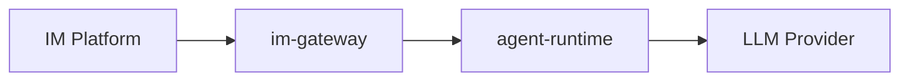

# Netherbrain

## Overview

Netherbrain is a general agent service for homelab use, with IM integration. The project consists of two main components:

- **agent-runtime**: A FastAPI-based service that hosts the agent logic.
- **im-gateway**: A gateway that connects IM bots (e.g. Telegram, Discord) to the agent-runtime.

## Architecture



## Project Structure

```
netherbrain/
  __init__.py
  cli.py               # Unified click CLI (netherbrain agent / netherbrain gateway)
  agent_runtime/       # FastAPI service
    app.py             # FastAPI application
  im_gateway/          # IM bot gateway
    gateway.py         # Gateway logic
tests/
  test_agent_runtime.py
  test_im_gateway.py
```

## Tech Stack

- Python 3.13+
- Package manager: uv
- CLI framework: click
- Web framework: FastAPI + uvicorn
- HTTP client: httpx
- Linting: ruff, pyright
- Testing: pytest

## CLI Commands

- `netherbrain agent` - Start the agent runtime server (default: 0.0.0.0:8000)
- `netherbrain gateway` - Start the IM gateway (connects to agent-runtime)

## Dev Commands (Makefile)

- `make install` - Set up virtual environment and pre-commit hooks
- `make check` - Run linting, type checking, and dependency checks
- `make test` - Run tests with pytest
- `make build` - Build wheel
- `make run-agent` - Run agent-runtime with auto-reload
- `make run-gateway` - Run im-gateway

## Docker

Single image: `ghcr.io/wh1isper/netherbrain`

Uses ENTRYPOINT + CMD pattern, default runs `agent`:

- `docker run ghcr.io/wh1isper/netherbrain` (runs agent)
- `docker run ghcr.io/wh1isper/netherbrain gateway` (runs gateway)

Tags:

- `dev` - Built on every push to main
- `latest` + version tag - Built on release

## CI/CD

- Push to main: quality checks, tests, then build and push `dev` image
- Release: publish to PyPI, build and push tagged + `latest` image
