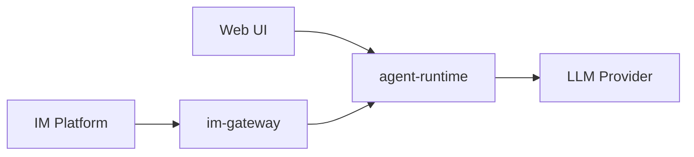

# Netherbrain

## Overview

Netherbrain is a general agent service for homelab use, with IM integration. The project consists of two main components:

- **agent-runtime**: A FastAPI-based service that hosts the agent logic, with a built-in web UI for configuration (admin) and chat.
- **im-gateway**: A gateway that connects IM bots (e.g. Telegram, Discord) to the agent-runtime.

## Architecture



## Project Structure

```
netherbrain/
  __init__.py
  cli.py               # Unified click CLI (netherbrain agent / netherbrain gateway)
  agent_runtime/       # FastAPI service
    app.py             # FastAPI application (serves API + static UI)
  im_gateway/          # IM bot gateway
    gateway.py         # Gateway logic
ui/                    # Frontend (Vite + React + TypeScript)
  src/
    pages/
      Chat.tsx         # Conversation interface
      Config.tsx       # Agent preset management
    App.tsx            # Root component with routing
    main.tsx           # Entry point
dev/
  docker-compose.dev.yml  # Dev PostgreSQL + Redis
  dev-setup.sh            # Infrastructure management script (up/down/status/reset)
  dev.env                 # Dev environment variables
tests/
  test_agent_runtime.py
  test_im_gateway.py
```

## Tech Stack

- Python 3.13+
- Package manager: uv
- CLI framework: click
- Web framework: FastAPI + uvicorn
- HTTP client: httpx
- Linting: ruff, pyright
- Testing: pytest
- Frontend: Vite + React + TypeScript
- Frontend linting: eslint, prettier

## CLI Commands

- `netherbrain agent` - Start the agent runtime server (default: 0.0.0.0:8000)
- `netherbrain gateway` - Start the IM gateway (connects to agent-runtime)

## Dev Commands (Makefile)

- `make install` - Install all dependencies (server + UI)
- `make install-server` - Install Python venv and pre-commit hooks only
- `make install-ui` - Install UI dependencies only
- `make check` - Run all quality checks (server + UI)
- `make check-server` - Run server-side quality checks only
- `make check-ui` - Run UI linting and formatting checks only
- `make test` - Run tests with pytest
- `make build` - Build wheel (includes UI)
- `make dev` - Run agent-runtime and UI dev server concurrently
- `make run-agent` - Run agent-runtime with auto-reload
- `make run-gateway` - Run im-gateway
- `make infra-up` - Start dev PostgreSQL and Redis
- `make infra-down` - Stop dev infrastructure (data preserved)
- `make infra-status` - Show dev infrastructure status
- `make infra-reset` - Stop and wipe dev infrastructure data

## Documentation Conventions

### docs/

Usage documentation: how-to guides, API usage examples, integration instructions.

### spec/

Design specification for this project: architecture diagrams, flowcharts, swimlane diagrams, pseudocode flows.

- Use mermaid for all diagrams.
- Keep documents concise and elegant; focus on high-level design only.
- Create UML diagrams only when necessary.
- Do not include code implementation details or code examples.

### API Style

- **RPC-style** (not RESTful): actions are expressed in URL paths, not HTTP methods.
- Use **GET** for reads (queries, get-by-id) and **POST** for all writes (create, update, delete, actions).
- Example: `POST /sessions/{id}/cancel`, not `DELETE /sessions/{id}`.
- Branch: `main`
- Commit messages: imperative English, prefixed (`feat:`, `fix:`, `refactor:`, `docs:`)
- Do not auto-commit.

## Docker

Single image: `ghcr.io/wh1isper/netherbrain`

Uses ENTRYPOINT + CMD pattern, default runs `agent`:

- `docker run ghcr.io/wh1isper/netherbrain` (runs agent)
- `docker run ghcr.io/wh1isper/netherbrain gateway` (runs gateway)

Tags:

- `dev` - Built on every push to main
- `latest` + version tag - Built on release

## Web UI

The agent-runtime serves a built-in web UI with two sections:

- **Admin**: Agent preset management (create, edit, delete presets)
- **Chat**: Conversation interface (create conversations, send messages, view streaming responses)

The UI is part of the agent-runtime package and served by FastAPI at the root path. When modifying agent-runtime APIs, always consider corresponding UI changes.

## CI/CD

- Push to main: quality checks, tests, then build and push `dev` image
- Release: publish to PyPI, build and push tagged + `latest` image
  nt-runtime package and served by FastAPI at the root path. When modifying agent-runtime APIs, always consider corresponding UI changes.

## CI/CD

- Push to main: quality checks, tests, then build and push `dev` image
- Release: publish to PyPI, build and push tagged + `latest` image
