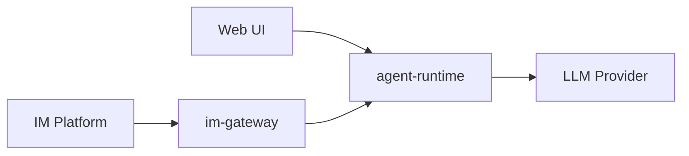

# Netherbrain

## Overview

Netherbrain is a general agent service for homelab use, with IM integration. The project consists of two main components:

- **agent-runtime**: A FastAPI-based service that hosts the agent logic, with a built-in web UI for configuration (admin) and chat.
- **im-gateway**: A gateway that connects IM bots (e.g. Telegram, Discord) to the agent-runtime.

## Architecture


```mermaid
graph LR
    UI[Web UI] --> RT[agent-runtime]
    IM[IM Platform] --> GW[im-gateway]
    GW --> RT
    RT --> LLM[LLM Provider]
```

## Project Structure

```
netherbrain/
  __init__.py
  cli.py               # Unified click CLI (netherbrain agent / netherbrain gateway / netherbrain db)
  agent_runtime/       # FastAPI service
    app.py             # FastAPI application (serves API + static UI)
    settings.py        # pydantic-settings configuration (NETHER_* env vars)
    deps.py            # FastAPI dependency injection (DbSession, RedisClient, SessionMgr)
    registry.py        # In-memory session registry (interrupt, steering, drain)
    context.py         # RuntimeSession dataclass (in-flight execution state)
    alembic.ini        # Alembic configuration (packaged)
    alembic/           # Database migrations
      env.py           # Migration environment
      versions/        # Migration scripts
    db/                # Database layer
      tables.py        # SQLAlchemy ORM models (schema source of truth)
      engine.py        # Async engine factory
    models/            # Pydantic domain models and API schemas
      enums.py         # Shared enumerations (SessionStatus, Transport, etc.)
      api.py           # Request/response schemas (Create/Update/Response)
      session.py       # Session/conversation domain models
      preset.py        # Preset domain models
      workspace.py     # Workspace domain models
      events.py        # Protocol event models
    managers/          # Business logic (data access, CRUD, orchestration)
      presets.py       # Preset CRUD functions
      workspaces.py    # Workspace CRUD functions
      conversations.py # Conversation CRUD functions
      sessions.py      # SessionManager class (create/commit/get/list, state store)
      mailbox.py       # Mailbox CRUD (post, drain, query, count)
      importer.py      # Config importer (TOML -> upsert presets/workspaces)
      files.py         # File operations (path resolver, list, read, write, archive)
      shell.py         # PTY lifecycle, Docker exec bridge
    routers/           # Thin HTTP adapters (parse params, call managers, translate errors)
      presets.py       # /api/presets/* endpoints
      workspaces.py    # /api/workspaces/* endpoints
      conversations.py # /api/conversations/* endpoints
      sessions.py      # /api/sessions/* endpoints
      toolsets.py      # GET /api/toolsets (capability discovery, no DB)
      files.py         # /api/files/* endpoints (file browsing, read, write, upload, download)
      shell.py         # /api/shell/* WebSocket endpoint (interactive terminal)
    store/             # State store for session persistence (large blobs)
      base.py          # StateStore async Protocol
      local.py         # Local filesystem implementation (atomic writes)
    execution/         # Execution pipeline
      resolver.py      # Config resolver (preset + override + workspace -> ResolvedConfig)
      environment.py   # Environment setup (project paths, virtual workspace, SDK Environment factory)
      runtime.py       # SDK adapter (ResolvedConfig -> create_agent -> AgentRuntime)
      input.py         # Input mapping (InputPart list -> SDK UserPrompt)
      prompt.py        # System prompt rendering (Jinja2 templates)
      events.py        # Internal pipeline events (PipelineStarted, etc.)
      hooks.py         # Stream hooks (UsageSnapshotEmitter for real-time usage tracking)
      coordinator.py   # Execution orchestration (setup -> run -> finalize pipeline)
      delegate.py      # Async delegate tool (DelegateContext + tool factory)
      mailbox_prompt.py # Mailbox message rendering for fire-continuation prompts
    streaming/         # Protocol adapters (internal -> external events)
      protocols/
        base.py        # ProtocolAdapter abstract interface
        agui.py        # AGUIProtocol (ag_ui.core types)
    transport/         # Event delivery backends
      base.py          # EventTransport protocol
      sse.py           # SSE transport (queue-backed)
      redis_stream.py  # Redis Stream transport (XADD)
      bridge.py        # Stream-to-SSE bridge (XREAD + resume)
  im_gateway/          # IM bot gateway
    gateway.py         # Gateway logic
ui/                    # Frontend (Vite + React + TypeScript)
  design-system.md     # Visual design language (colors, typography, spacing, components)
  spec/                # UI design specification
    00-overview.md     # Product model, workspace-centric design, tech stack
    01-layout.md       # Page structure, navigation, responsive behavior
    02-chat.md         # Message rendering, streaming, controls
    03-settings.md     # Preset and workspace management
  src/
    pages/
      Chat.tsx         # Conversation interface
      Files.tsx        # File browser, editor, and terminal
      Settings.tsx     # Preset and workspace management
    App.tsx            # Root component with routing
    main.tsx           # Entry point
dev/
  docker-compose.dev.yml  # Dev PostgreSQL + Redis
  dev-setup.sh            # Infrastructure management script (up/down/status/reset)
  dev.env                 # Dev environment variables
tests/
  conftest.py           # Shared fixtures (testcontainers, db_session, redis_client)
  test_agent_runtime.py
  test_db_integration.py
  test_im_gateway.py
```

## Layered Architecture

The agent-runtime follows a strict three-layer separation:

- **Routers** (`routers/`): Thin HTTP adapters. Parse request parameters, call managers, translate domain exceptions (`LookupError`, `ValueError`) to HTTP responses (`404`, `409`, `422`). No SQLAlchemy queries or business logic here.
- **Managers** (`managers/`): Business logic and data access. Accept `db: AsyncSession` as parameter. Raise domain exceptions, never HTTP exceptions. Stateless CRUD managers use module-level async functions; stateful managers (e.g. `SessionManager`) use classes.
- **Store** (`store/`): State persistence for large SDK blobs (context_state, message_history, environment_state). Async Protocol interface with pluggable backends (local FS, S3). Display data (input, final_message) lives in PG on the session row.

Key rules:

- Managers do NOT depend on FastAPI.
- Routers do NOT contain SQLAlchemy queries.
- Singletons (SessionManager, StateStore) are initialised in `app.py` lifespan, accessed via FastAPI dependency injection (`deps.py`).
- DB sessions are per-request (from DI), passed to manager methods as parameters.
- No backward-compatibility shims; update all imports directly when moving code.

## Tech Stack

- Python 3.13+
- Package manager: uv
- CLI framework: click
- Web framework: FastAPI + uvicorn
- HTTP client: httpx
- Linting: ruff, pyright
- Testing: pytest
- Frontend: Vite + React + TypeScript
- Frontend package manager: pnpm
- Frontend linting: eslint, prettier

## CLI Commands

- `netherbrain agent` - Start the agent runtime server (default: 0.0.0.0:9001)
- `netherbrain gateway` - Start the IM gateway (connects to agent-runtime)
- `netherbrain db upgrade` - Run database migrations to latest
- `netherbrain db downgrade` - Roll back database by one migration
- `netherbrain db migrate <message>` - Autogenerate a migration from model changes
- `netherbrain db current` - Show current database revision
- `netherbrain db history` - Show migration history
- `netherbrain db import` - Import presets and workspaces from a TOML file
- `netherbrain db create-admin` - Manually create an admin user (rarely needed; auto-bootstrap handles this)

## Dev Commands (Makefile)

- `make install` - Install all dependencies (server + UI)
- `make install-server` - Install Python venv and pre-commit hooks only
- `make install-ui` - Install UI dependencies only
- `make check` - Run all quality checks (server + UI)
- `make check-server` - Run server-side quality checks only
- `make check-ui` - Run UI linting and formatting checks only
- `make test` - Run all tests (requires Docker for integration tests)
- `make test-unit` - Run unit tests only (no Docker required)
- `make build` - Build wheel (includes UI)
- `make dev` - Run agent-runtime and UI dev server concurrently
- `make run-agent` - Run agent-runtime with auto-reload
- `make run-gateway` - Run im-gateway
- `make db-upgrade` - Run database migrations to latest
- `make db-downgrade` - Roll back database by one migration
- `make db-current` - Show current database revision
- `make db-history` - Show migration history
- `make infra-up` - Start dev PostgreSQL and Redis
- `make infra-down` - Stop dev infrastructure (data preserved)
- `make infra-status` - Show dev infrastructure status
- `make infra-reset` - Reset dev infrastructure (wipe data, recreate schema, import presets)

## Settings

- All settings read from `NETHER_*` env vars via `pydantic-settings`, with `.env` fallback.
- Use `get_settings()` (cached via `lru_cache`) instead of instantiating `NetherSettings()` directly.
- Do NOT create `NetherSettings()` at module level in app code -- it prevents test env var overrides.
- CLI commands (`cli.py`) and Alembic `env.py` may create `NetherSettings()` directly since they run in isolated contexts.
- `extra="ignore"` is set on `NetherSettings` so non-`NETHER_*` env vars (e.g. `HOMELAB_*`, `ANTHROPIC_API_KEY`) in `.env` are silently ignored.

## Authentication

- **`NETHER_AUTH_TOKEN`** is required. The agent-runtime refuses to start without it.
- Three auth methods (tried in order by middleware): root token -> JWT -> API key.
- **Root token**: constant-time comparison against `NETHER_AUTH_TOKEN`. No DB access. Always maps to admin role.
- **JWT**: signed tokens issued by `POST /api/auth/login`. Derived from `NETHER_AUTH_TOKEN` via HMAC-SHA256 (no separate secret). Each request checks `user.is_active` in DB.
- **API keys**: `nb_` prefixed, SHA-256 hashed in DB. Read-only DB lookup per request.
- **Bootstrap**: On first startup (no users in DB), an `admin` user is auto-created with password = `NETHER_AUTH_TOKEN`. Users must change password on first login (`must_change_password` flag).
- **Password management**: Passwords are server-generated for new users and admin-initiated resets. `change_password` clears the `must_change_password` flag.
- CLI commands (`db upgrade`, `db import`, etc.) do NOT require `NETHER_AUTH_TOKEN`.

## Database

- Driver: `psycopg[binary,pool]` (psycopg3) -- single driver for both sync (Alembic) and async (FastAPI).
- Dialect: `postgresql+psycopg://` for sync, `postgresql+asyncpg://` is NOT used.
- Alembic config (`alembic.ini`) and migrations (`alembic/`) are packaged inside `netherbrain/agent_runtime/`.
- `tables.py` (SQLAlchemy ORM) is the single source of truth for schema. Alembic reads `Base.metadata`.
- `env.py` uses `include_object` filter to protect foreign tables, `compare_type=True`, `compare_server_default=True`.
- Dev infrastructure: PostgreSQL on port **15432**, Redis on port **16379** (non-default to avoid conflicts).

## Testing

- Function-style tests only (no test classes).
- Use `@pytest.mark.integration` for tests that need PostgreSQL / Redis containers.
- Containers are managed by `testcontainers-python` (session-scoped: started once per run).
- `PostgresContainer(driver="psycopg")` -- use the driver param, not string replacement.
- DB test isolation via savepoint rollback (`join_transaction_mode="create_savepoint"`).
- Redis test isolation via `flushdb` after each test.
- Schema setup uses Alembic `upgrade head` with the packaged `alembic.ini` (tests the real migration path).
- After setting test env vars, call `_get_settings_cached.cache_clear()` so `get_settings()` picks them up.
- Fixtures: `db_session` (async SQLAlchemy session), `redis_client` (async Redis client), `async_engine` (session-scoped).
- CRUD API tests use `httpx.AsyncClient` + `ASGITransport` with `get_db` dependency override.
- Test directory: `tests/agent_runtime/` for agent-runtime integration tests, with its own `conftest.py` providing the `client` fixture.

## Documentation Conventions

### docs/

Usage documentation: how-to guides, API usage examples, integration instructions.

### spec/

Design specification for the agent-runtime and im-gateway: architecture diagrams, flowcharts, swimlane diagrams, pseudocode flows.

### ui/spec/

Design specification for the Web UI: product model, layout, page behavior, interaction flows. Follows the same conventions as `spec/` (mermaid diagrams, concise, high-level). When modifying agent-runtime APIs, always review `ui/spec/` for corresponding impact.

- Use mermaid for all diagrams.
- Keep documents concise and elegant; focus on high-level design only.
- Create UML diagrams only when necessary.
- Do not include code implementation details or code examples.

### API Style

- **RPC-style** (not RESTful): actions are expressed in URL paths, not HTTP methods.
- Use **GET** for reads (queries, get-by-id) and **POST** for all writes (create, update, delete, actions).
- Example: `POST /sessions/{id}/cancel`, not `DELETE /sessions/{id}`.
- Branch: `main`
- Commit messages: imperative English, prefixed (`feat:`, `fix:`, `refactor:`, `docs:`)
- Do not auto-commit.

## Docker

Single image: `ghcr.io/wh1isper/netherbrain`

Uses ENTRYPOINT + CMD pattern, default runs `agent`:

- `docker run ghcr.io/wh1isper/netherbrain` (runs agent)
- `docker run ghcr.io/wh1isper/netherbrain gateway` (runs gateway)

Tags:

- `dev` - Built on every push to main
- `latest` + version tag - Built on release

## Web UI

Chat-app style web interface served by the agent-runtime at root path (`/`).

- **Design language**: Warm, earthy aesthetic. See `ui/design-system.md` for the full design system (color tokens, typography, spacing, component patterns). All UI changes must follow this spec.
- **Workspace-centric**: Workspaces organize conversations by project context.
- **Default workspace**: Auto-created on first launch (`webui-default`, no projects, metadata: `{"source": "webui", "default": true}`).
- **Responsive**: Desktop and mobile are both first-class.
- **Tech stack**: Tailwind CSS v4 + shadcn/ui + Zustand + react-markdown + Shiki (vitesse themes).
- **Three pages**: Chat (`/`, `/c/:id`), Files (`/files/:projectId`), and Settings (`/settings`).
- **Theme**: Light (warm beige) and dark (warm charcoal) modes. Brand color is earthy green (`~#55644a`). CSS tokens defined in `src/index.css` using oklch color space.

## CI/CD

- Push to main: quality checks, tests, then build and push `dev` image
- Release: publish to PyPI, build and push tagged + `latest` image

## Data Import

Presets and workspaces can be imported from a TOML file (`presets.toml`).

- **CLI only**: `netherbrain db import <file>`. Upsert semantics: creates if missing, updates if existing.
- Removing entries from the file does NOT delete them from the database.
- **`preset_id` and `workspace_id` are required** in entries (no auto-generation).
- The file format mirrors the `PresetCreate` / `WorkspaceCreate` API schemas in TOML.
