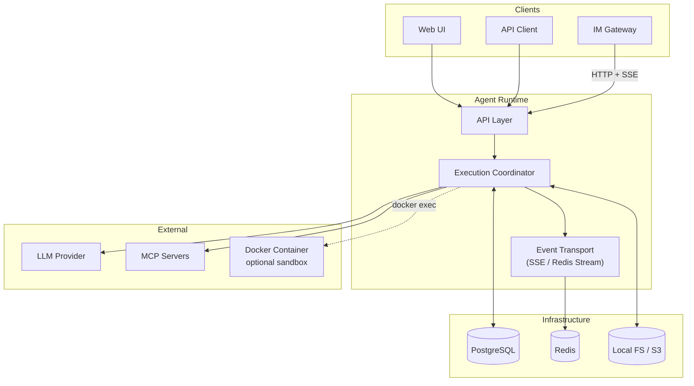
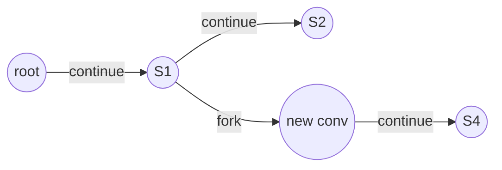
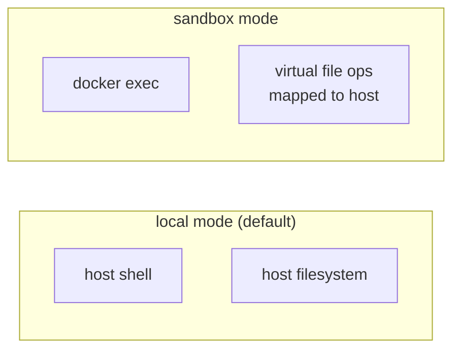
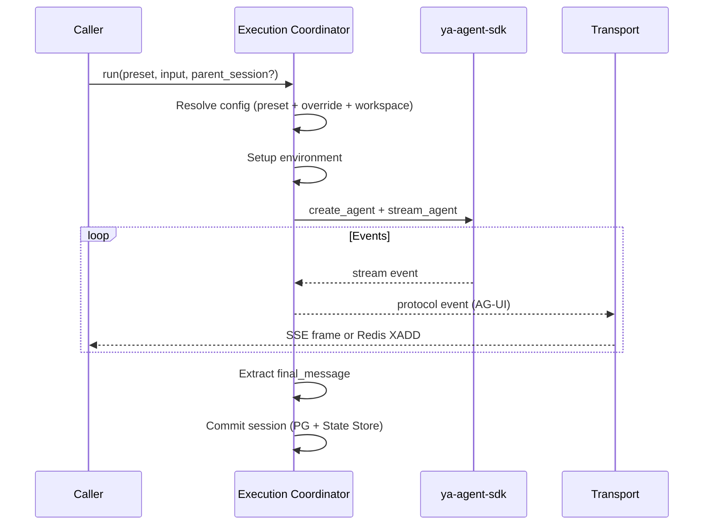
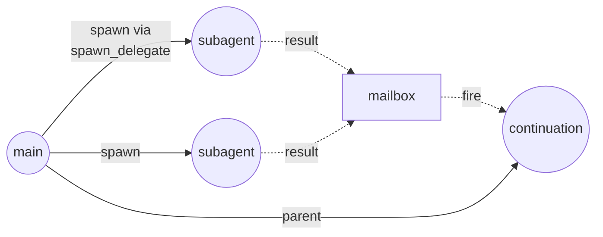
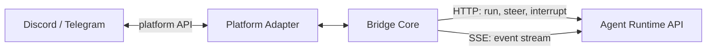
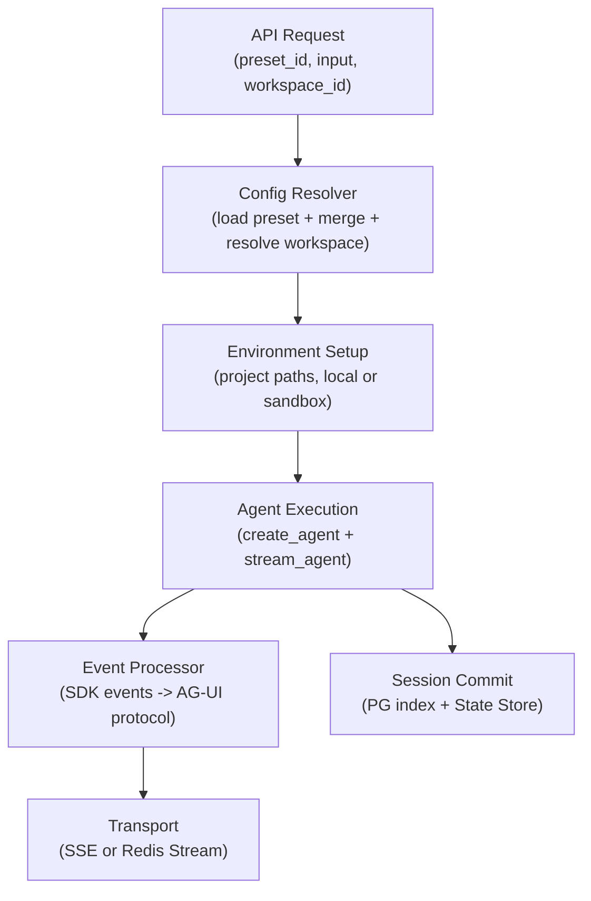

# Architecture Overview

Netherbrain consists of two independent services: **agent-runtime** and **im-gateway**. The runtime is the core -- it manages agents, sessions, and state. The gateway is a thin bridge that connects IM platforms to the runtime.

______________________________________________________________________

## System Diagram

**PostgreSQL** is the single source of truth for all durable data: presets, workspaces, conversation index, session index, mailbox.

**Redis** is an ephemeral event buffer used only for the stream transport (short TTL). If Redis is unavailable, SSE transport still works.

**Local FS / S3** stores session state blobs: `context_state`, `message_history`, `environment_state`.

______________________________________________________________________

## Key Concepts

### Conversations and Sessions

A **conversation** is a persistent thread. A **session** is one immutable execution snapshot within that thread, forming a git-like DAG.

- Each session has a `parent_session_id` pointing to its predecessor.
- Sessions are never mutated after commit. Continuing a conversation creates a new session.
- Forking creates an entirely new conversation from any historical session.

### Presets and Workspaces

A **preset** is a saved agent configuration (model, system prompt, toolsets, environment). Presets are stored in PostgreSQL and referenced by ID when starting a conversation.

A **workspace** is a named list of project directories. It is a reusable shortcut -- like a `.code-workspace` file. Workspaces are optional; project directories can always be passed inline per request.

A **project** is a directory on the host filesystem identified by a slug. Any slug used as a `project_id` maps to `{NETHER_DATA_ROOT}/projects/{project_id}/`, auto-created on first access.

### Environment Modes

**local**: Agent runs shell commands directly on the host and reads/writes files at real host paths.

**sandbox**: Agent runs shell commands via `docker exec` inside a container you provide. File I/O uses a virtual path space (e.g., `/workspace/`) that maps back to the host. The runtime never manages container lifecycle.

______________________________________________________________________

## Execution Pipeline

Each agent run follows a fixed pipeline.

The pipeline is decoupled from transport delivery: the agent runs to completion regardless of whether the caller is connected.

______________________________________________________________________

## Event Transport

Two transport modes control how events reach callers.

| Transport | Mechanism    | Use Case                                          |
| --------- | ------------ | ------------------------------------------------- |
| `sse`     | HTTP SSE     | Synchronous: caller blocks on the response stream |
| `stream`  | Redis Stream | Async: caller can detach and reattach via bridge  |

With `transport=stream`, the runtime returns `202 Accepted` immediately with a `stream_key`. The caller connects to `GET /api/conversations/{id}/events` (the SSE bridge) at any time to consume events, resuming from where it left off via `Last-Event-ID`.

______________________________________________________________________

## Async Subagents

The runtime supports parallel agent execution within a conversation.

1. The main agent calls the `spawn_delegate` tool to spawn subagents in parallel.
2. Each subagent runs independently with its own session.
3. When subagents complete, their results are posted to the conversation mailbox.
4. The caller fires `POST /api/conversations/{id}/fire` to drain the mailbox and create a continuation session, delivering all results back to the main agent.

______________________________________________________________________

## IM Gateway

The gateway is a stateless HTTP client. It translates IM platform events into runtime API calls and renders agent responses back as platform messages.

- The gateway stores no durable state. All state lives in the runtime.
- Each IM thread or channel maps to one runtime conversation, identified by metadata stored on the conversation (`platform`, `thread_id`, etc.).
- On restart, the gateway recovers its in-memory mapping by querying the runtime for conversations with matching metadata.

______________________________________________________________________

## Data Flow Summary

______________________________________________________________________

## Layers

The agent-runtime code follows a strict three-layer separation:

| Layer    | Location    | Responsibility                                                         |
| -------- | ----------- | ---------------------------------------------------------------------- |
| Routers  | `routers/`  | Parse HTTP requests, call managers, translate exceptions to HTTP codes |
| Managers | `managers/` | Business logic and data access. No FastAPI dependency.                 |
| Store    | `store/`    | State persistence for large SDK blobs. Pluggable backend.              |

Singletons (SessionManager, StateStore) are initialized in app lifespan and injected via FastAPI dependencies. DB sessions are per-request.
