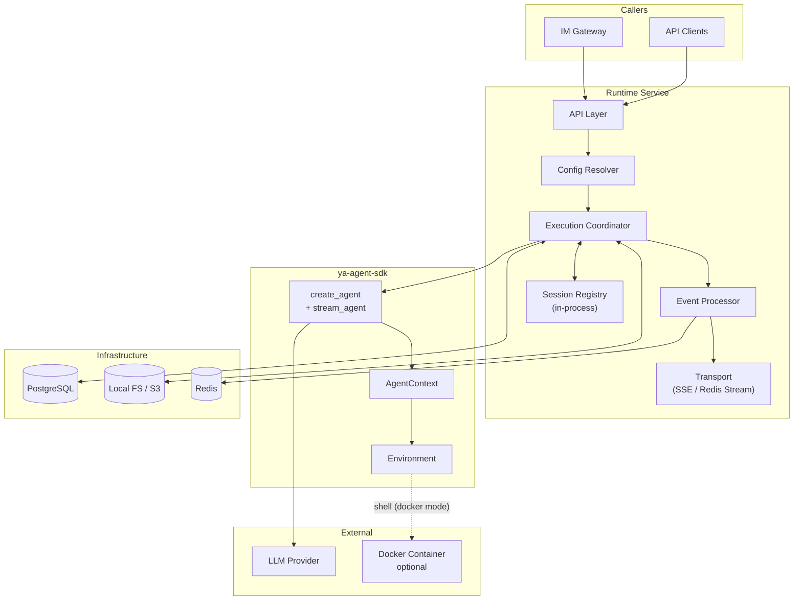

# Runtime Service Overview

## Definition

Agent Runtime is a single-instance agent service for homelab deployment. It manages agent lifecycle, execution context, and session persistence on a single PC, exposing agentic capabilities through API for IM gateways and other local clients.

Built on `ya-agent-sdk` (which wraps `pydantic-ai`), the runtime exposes `create_agent` + `stream_agent` as a managed service with session persistence, event streaming, and async subagent orchestration.

## Design Principles

- **Single-instance**: One service process on one machine; no horizontal scaling concerns
- **Local-first**: File operations are always local; state storage defaults to local filesystem
- **Immutable sessions**: Git-like snapshot model; no in-place mutation
- **Protocol-driven events**: Unified event protocol across all layers
- **PG as single source of truth**: All durable data in PostgreSQL; Redis is only an ephemeral event buffer

## Infrastructure

| Component  | Role                                                      |
| ---------- | --------------------------------------------------------- |
| PostgreSQL | Agent presets, conversation index, session index, mailbox |
| Redis      | Event stream buffer (short TTL, ephemeral)                |
| Local FS   | Default session state storage (context, history, display) |
| S3         | Optional alternative session state storage                |

## Architecture

## Environment Model

The agent operates on the local machine. File operations are always local. Shell execution has two modes:

| Mode   | Shell Target                 | Configured By            |
| ------ | ---------------------------- | ------------------------ |
| local  | Host machine directly        | Default                  |
| docker | `docker exec` in a container | User sets `container_id` |

In docker mode, the user is responsible for running the container and ensuring a shared volume mount between the host working directory and the container. The runtime does not manage container lifecycle.

## Boundary

| Concern              | Owner        | Not Runtime's Job                      |
| -------------------- | ------------ | -------------------------------------- |
| Agent execution      | Runtime      | -                                      |
| Session persistence  | Runtime      | -                                      |
| Event streaming      | Runtime      | -                                      |
| Interrupt / Steering | Runtime      | -                                      |
| Preset management    | Runtime      | -                                      |
| Authentication       | Runtime      | Simple token auth; no user system      |
| Container lifecycle  | User         | Runtime only executes commands         |
| LLM provider routing | LLM Provider | Runtime sends native pydantic-ai calls |

## Section Index

| Section | Document                                           | Topic                                               |
| ------- | -------------------------------------------------- | --------------------------------------------------- |
| 01      | [Session](01-session.md)                           | Conversation, session DAG, persistence, lifecycle   |
| 02      | [Configuration](02-configuration.md)               | Agent presets (DB), model config, toolsets, auth    |
| 03      | [Execution](03-execution.md)                       | Execution coordinator, environment, SDK integration |
| 04      | [Events and Streaming](04-events-and-streaming.md) | Event protocol, SSE, Redis Stream                   |
| 05      | [Control](05-control.md)                           | Interrupt and steering                              |
| 06      | [Async Agents](06-async-agents.md)                 | Agent taxonomy, mailbox, fire logic                 |
| 07      | [API](07-api.md)                                   | Full API surface                                    |
