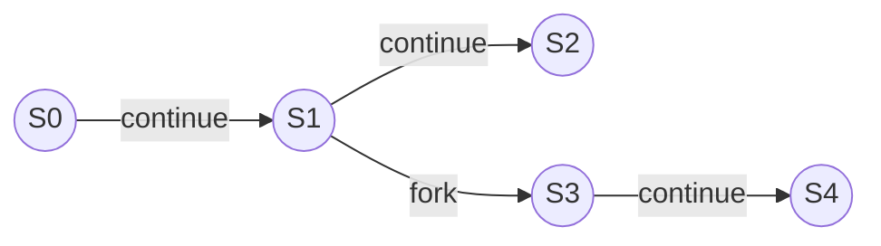
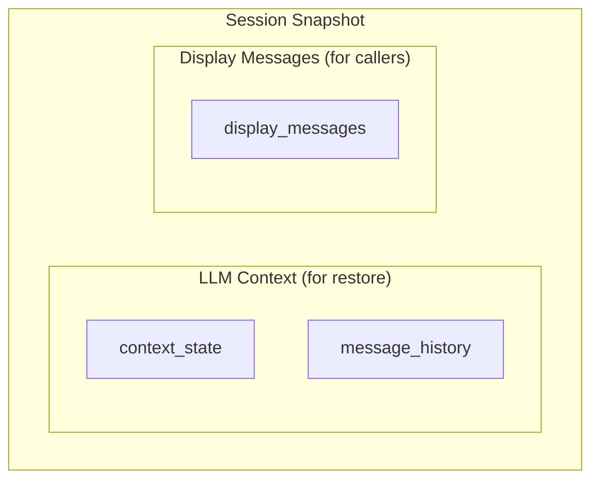
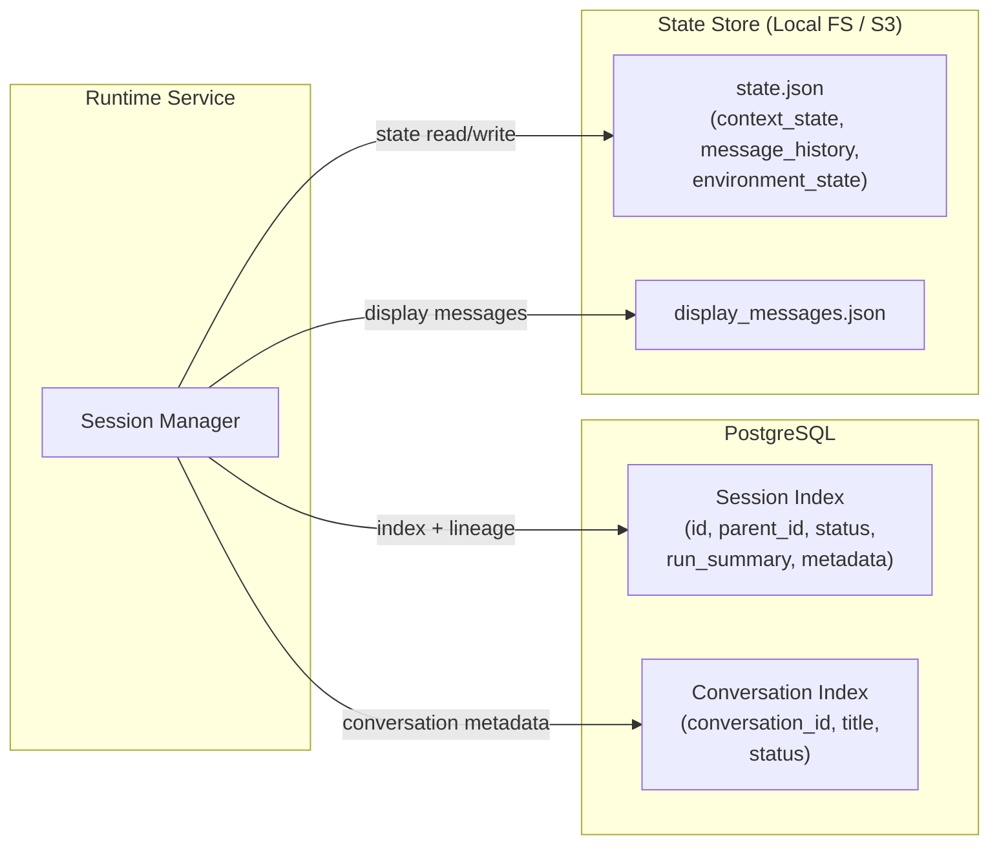
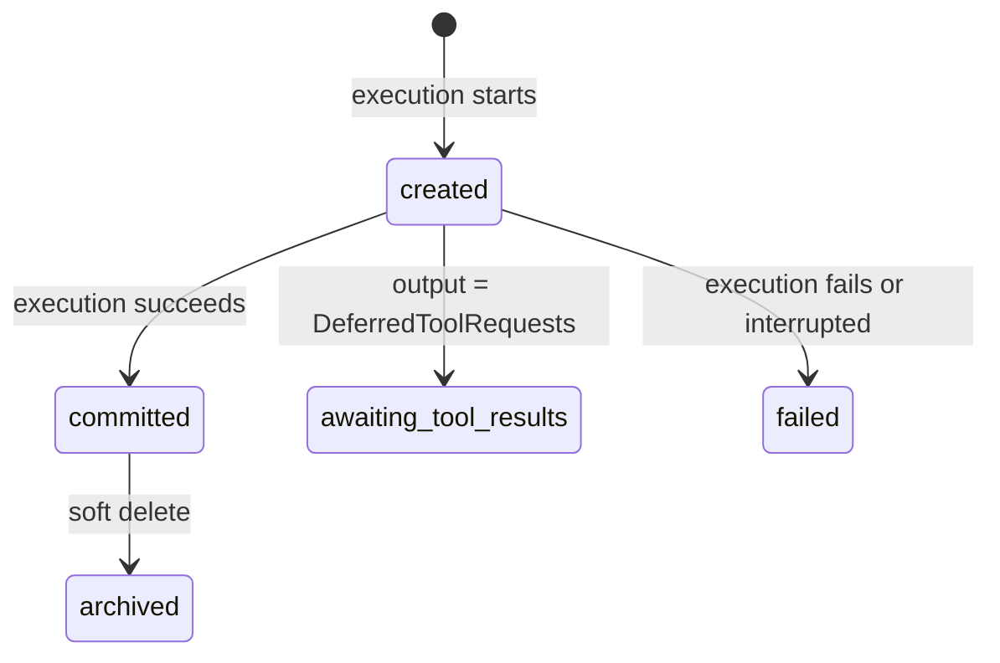

# 01 - Conversation and Session

Two core data models. **Conversations** group related agent interactions. **Sessions** are immutable snapshots linked in a git-like DAG within a conversation.

## Git-like DAG

Each session is a commit. `parent_session_id` forms the history chain.



- **Continue**: New session with parent pointing to previous session
- **Fork**: New session with parent pointing to any historical session (starts new conversation)
- **Root**: Session with no parent (new conversation)

Sessions are never mutated after commit. A new execution always produces a new session_id.

## Session Structure

| Field             | Type               | Description                                                     |
| ----------------- | ------------------ | --------------------------------------------------------------- |
| session_id        | string (immutable) | Unique snapshot identity                                        |
| parent_session_id | string?            | Previous snapshot (null for root)                               |
| status            | enum               | created / committed / awaiting_tool_results / failed / archived |
| run_summary       | RunSummary         | Run metadata captured at commit time                            |
| context_state     | JSON               | SDK ResumableState (subagent history, handoff, usages)          |
| message_history   | JSON               | LLM message history (pydantic-ai ModelMessage sequence)         |
| environment_state | JSON               | Environment resource state for restore                          |
| display_messages  | JSON               | Compressed protocol events for external consumption             |
| metadata          | SessionMetadata    | Indexed fields for query and attribution                        |
| created_at        | timestamp          | Snapshot creation time                                          |

## Run Summary

Captured at commit time. Persisted in PG index for queryability.

| Field       | Type         | Description                  |
| ----------- | ------------ | ---------------------------- |
| duration_ms | int          | Run duration in milliseconds |
| usage       | UsageSummary | Aggregated token usage       |

### UsageSummary

| Field             | Type | Description               |
| ----------------- | ---- | ------------------------- |
| total_tokens      | int  | Total tokens consumed     |
| prompt_tokens     | int  | Input tokens              |
| completion_tokens | int  | Output tokens             |
| model_requests    | int  | Number of model API calls |

## Session Metadata

Indexed fields stored in PG for query.

| Field           | Type    | Mutable | Description                                     |
| --------------- | ------- | ------- | ----------------------------------------------- |
| session_type    | enum    | No      | `agent` / `async_subagent`                      |
| transport       | enum    | No      | `sse` / `stream`                                |
| conversation_id | string  | No      | Conversation identifier (= session_id for root) |
| spawned_by      | string? | No      | Session that dispatched this async subagent     |
| preset_id       | string? | No      | Agent preset used                               |

`conversation_id` is always set at creation time:

| Scenario       | conversation_id           |
| -------------- | ------------------------- |
| Root           | = session_id              |
| Continuation   | = parent.conversation_id  |
| Fork           | = session_id (new)        |
| Async subagent | = spawner.conversation_id |

## Conversation

A conversation is a logical collection of sessions sharing a `conversation_id`. Backed by a lightweight index table in PostgreSQL.

### Conversation Index

| Field             | Type      | Mutable | Description                                 |
| ----------------- | --------- | ------- | ------------------------------------------- |
| conversation_id   | string    | No      | Primary key                                 |
| title             | string?   | Yes     | Conversation title                          |
| default_preset_id | string?   | Yes     | Default agent preset                        |
| metadata          | JSONB     | Yes     | Client-defined metadata (opaque to runtime) |
| status            | enum      | Yes     | active / archived                           |
| created_at        | timestamp | No      | Creation time                               |
| updated_at        | timestamp | Yes     | Last activity time                          |

| Aspect      | Scope                                                             |
| ----------- | ----------------------------------------------------------------- |
| Concurrency | At most one running `session_type=agent` session per conversation |
| Environment | All sessions in a conversation share the same environment context |

## Dual Message Model

LLM context and external display messages are distinct concerns.



- **LLM Context** (`context_state` + `message_history`): Used to restore agent state for the next turn. Not for caller consumption.
- **Display Messages** (`display_messages`): Compressed protocol events for UI rendering and IM message formatting.

## Persistence Topology



| Store       | What                        | Why                         |
| ----------- | --------------------------- | --------------------------- |
| PG          | Session index, conversation | Queryable lineage, metadata |
| State Store | Session state + display     | Large blob, immutable       |

### Storage Layout

Local filesystem (default):

```
{data_dir}/sessions/{session_id}/state.json
{data_dir}/sessions/{session_id}/display_messages.json
```

S3 (optional):

```
{bucket}/sessions/{session_id}/state.json
{bucket}/sessions/{session_id}/display_messages.json
```

## Session Lifecycle

### Session Status (PG)



| Status                | Meaning                                        |
| --------------------- | ---------------------------------------------- |
| created               | Execution started, PG index exists             |
| committed             | State written, session is complete             |
| awaiting_tool_results | Committed with deferred tools pending feedback |
| failed                | Execution failed, no state written             |
| archived              | Soft deleted                                   |

### Session Registry (In-Process)

An in-memory registry tracks active sessions. It holds live object references for direct control (interrupt, steering) and serves as the authoritative "is this session running?" index.

| Field      | Type          | Description                            |
| ---------- | ------------- | -------------------------------------- |
| session_id | string        | Registry key                           |
| streamer   | AgentStreamer | Live reference for interrupt           |
| context    | AgentContext  | Live reference for steering (bus.send) |
| stream_key | string?       | Redis stream key (if transport=stream) |

The registry is ephemeral. On process restart, it is empty. All durable metadata lives in PG.

### Startup Recovery

On startup, the runtime scans PG for sessions with `status = created` (orphaned by a previous crash) and marks them as `failed`. This ensures PG and the empty registry are consistent.
