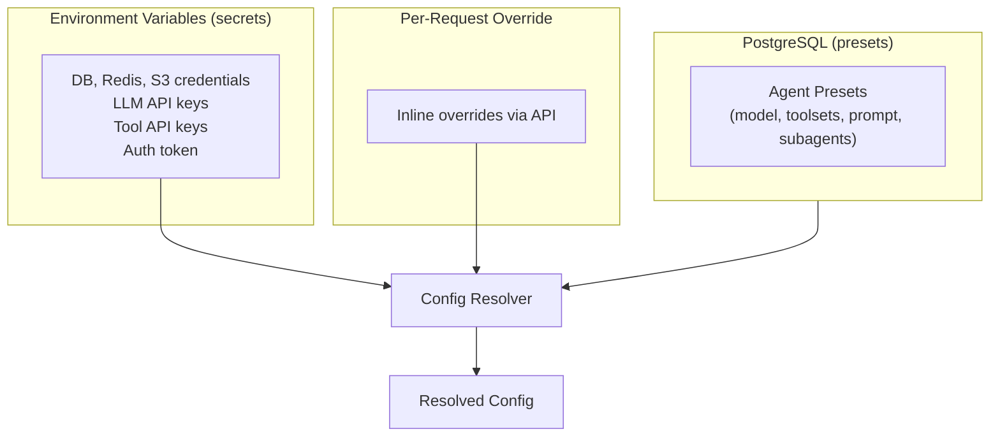
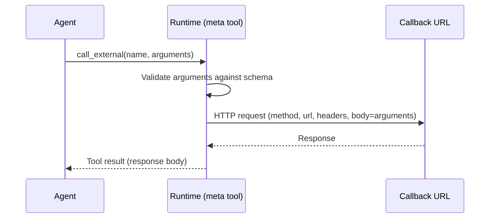
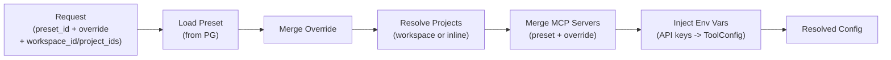
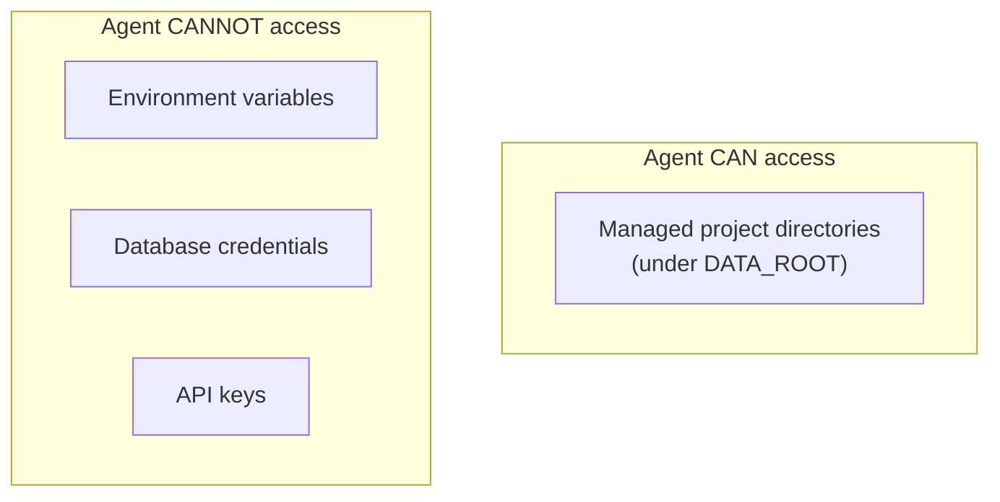

# 02 - Configuration

Agent preset management and service configuration. Service secrets come from environment variables. Agent presets are stored in PostgreSQL with JSON fields, manageable via API and admin UI.

## Configuration Layers


```mermaid
flowchart TB
    subgraph Secure["Environment Variables (secrets)"]
        ENV["DB, Redis, S3 credentials<br/>LLM API keys<br/>Tool API keys<br/>Auth token"]
    end

    subgraph DB["PostgreSQL (presets)"]
        AP["Agent Presets<br/>(model, toolsets, prompt, subagents)"]
    end

    subgraph Request["Per-Request Override"]
        OVR["Inline overrides via API"]
    end

    ENV --> RES[Config Resolver]
    DB --> RES
    OVR --> RES
    RES --> RC[Resolved Config]
```

**Principle**: Agent presets contain no secrets. All credentials come from environment variables, never exposed to agent tools.

## Authentication

Simple token-based authentication for all API endpoints.

| Variable     | Description                                                                  |
| ------------ | ---------------------------------------------------------------------------- |
| `AUTH_TOKEN` | Bearer token for API access. If empty, auto-generated and logged at startup. |

All requests must include `Authorization: Bearer {token}` header. The runtime validates the token against `AUTH_TOKEN`. No user system -- a single shared token protects the service.

Auto-generation behavior: if `AUTH_TOKEN` is not set or empty, the runtime generates a random token at startup and logs it at `WARNING` level so the operator can retrieve it from the console output.

## Service Configuration (Environment Variables)

### Infrastructure

| Variable        | Required | Description                                  |
| --------------- | -------- | -------------------------------------------- |
| `DATABASE_URL`  | Yes      | PostgreSQL connection string                 |
| `REDIS_URL`     | Yes      | Redis connection string                      |
| `DATA_ROOT`     | No       | Unified data directory (default: `./data`)   |
| `DATA_PREFIX`   | No       | Optional namespace prefix for all data paths |
| `STATE_STORE`   | No       | `local` (default) or `s3`                    |
| `S3_ENDPOINT`   | No       | S3 endpoint URL                              |
| `S3_BUCKET`     | No       | S3 bucket name                               |
| `S3_REGION`     | No       | S3 region name                               |
| `S3_ACCESS_KEY` | No       | S3 access key                                |
| `S3_SECRET_KEY` | No       | S3 secret key                                |
| `S3_PATH_STYLE` | No       | Use path-style addressing (default: false)   |

### LLM Providers

| Variable             | Description                                      |
| -------------------- | ------------------------------------------------ |
| `OPENAI_API_KEY`     | OpenAI API key                                   |
| `ANTHROPIC_API_KEY`  | Anthropic API key                                |
| `{GATEWAY}_API_KEY`  | Custom gateway API key (ya-agent-sdk convention) |
| `{GATEWAY}_BASE_URL` | Custom gateway base URL                          |

### Tool API Keys

| Variable                | Description          |
| ----------------------- | -------------------- |
| `TAVILY_API_KEY`        | Web search           |
| `FIRECRAWL_API_KEY`     | Web scraping         |
| `GOOGLE_SEARCH_API_KEY` | Google search        |
| `GOOGLE_SEARCH_CX`      | Google search engine |

### Service Options

| Variable     | Default     | Description    |
| ------------ | ----------- | -------------- |
| `AUTH_TOKEN` | (generated) | API auth token |
| `HOST`       | `0.0.0.0`   | Listen address |
| `PORT`       | `9001`      | Listen port    |

## Agent Preset (Database)

Agent presets are stored in PostgreSQL with structured JSON columns. Manageable via admin API and UI.

### Schema

| Column        | Type        | Description                                           |
| ------------- | ----------- | ----------------------------------------------------- |
| preset_id     | string (PK) | Unique identifier (slug)                              |
| name          | string      | Human-readable display name                           |
| description   | string?     | Preset description                                    |
| model         | JSONB       | Model selection and settings (ModelPreset)            |
| system_prompt | text        | System prompt (Jinja2 template)                       |
| toolsets      | JSONB       | Enabled toolsets and config (list[ToolsetSpec])       |
| environment   | JSONB       | Shell mode and project config (EnvironmentSpec)       |
| tool_config   | JSONB       | Tool-level configuration (ToolConfigSpec)             |
| subagents     | JSONB       | Subagent configuration (SubagentSpec)                 |
| mcp_servers   | JSONB       | External MCP server connections (list[McpServerSpec]) |
| is_default    | bool        | Whether this is the default preset                    |
| created_at    | timestamp   | Creation time                                         |
| updated_at    | timestamp   | Last modification time                                |

At most one preset has `is_default = true`. This is used when a conversation or request does not specify a preset_id.

### ModelPreset (JSON)

| Field                  | Type    | Description                                                             |
| ---------------------- | ------- | ----------------------------------------------------------------------- |
| name                   | string  | Provider-qualified name (e.g., `anthropic:claude-sonnet-4`)             |
| model_settings_preset  | string? | SDK ModelSettings preset name (e.g., `anthropic_high`, `openai_medium`) |
| model_settings         | dict?   | Explicit ModelSettings overrides (merged on top of preset)              |
| model_config_preset    | string? | SDK ModelConfig preset name (e.g., `claude_200k`, `gemini_1m`)          |
| model_config_overrides | dict?   | Explicit ModelConfig overrides (merged on top of preset)                |

**Resolution order** for ModelSettings: start with SDK preset dict (if `model_settings_preset` is set), then shallow-merge `model_settings` dict on top (override wins). If neither is set, the SDK uses its own defaults.

Same logic applies to ModelConfig: start with SDK preset dict (if `model_config_preset` is set), then shallow-merge `model_config_overrides` dict on top. The override field is named `model_config_overrides` instead of `model_config` to avoid collision with Pydantic's reserved `model_config` attribute.

The SDK provides built-in presets for common provider configurations (thinking budgets, reasoning effort, cache policies, beta headers). These are discoverable via the `GET /api/model-presets` endpoint. See the ya-agent-sdk `presets.py` module for the full list.

### McpServerSpec (JSON)

Declares one external MCP server connection. Each entry creates a pydantic-ai MCP client toolset at runtime. Only network-based transports are supported (no stdio -- subprocess spawning is not appropriate for a service).

| Field       | Type    | Default           | Description                                                         |
| ----------- | ------- | ----------------- | ------------------------------------------------------------------- |
| url         | string  | (required)        | HTTP endpoint URL of the MCP server                                 |
| transport   | enum    | `streamable_http` | `streamable_http` or `sse`                                          |
| headers     | dict?   | null              | Custom HTTP headers (e.g., auth tokens)                             |
| tool_prefix | string? | null              | Namespace prefix for tools; doubles as namespace ID for tool search |
| timeout     | float?  | null              | Connection timeout in seconds (null = pydantic-ai default)          |
| optional    | bool    | `false`           | Skip this server if it fails to initialize or refresh               |
| description | string? | null              | Human-readable description for tool search namespace discovery      |

MCP servers are connected at session start and disconnected at session end. At runtime, Netherbrain maps the configured `mcp_servers` list into an internal MCP runtime config and then into a `ToolProxyToolset` for on-demand tool loading and invocation. Instead of loading all MCP tool definitions into the model's visible tool list upfront, the model sees two stable tools: `search_tools` for discovery and `call_tool` for invocation. This keeps the model-visible tool list constant and improves prompt cache reuse when MCP namespaces vary between runs.

`tool_prefix` serves as the namespace ID for tool search -- all tools from the same MCP server load atomically when any tool in the namespace is discovered. `description` provides a human-readable summary shown in search results; if omitted, the runtime falls back to the MCP server's instructions or an auto-generated description. When `optional=true`, the runtime skips that namespace if initialization or refresh fails instead of aborting the whole run.

Security note: `headers` may contain bearer tokens for authenticating to the MCP server. These are stored in the preset's JSONB column. For high-security deployments, consider using environment variable references instead of inline tokens.

### ToolsetSpec (JSON)

Declares which tool groups are enabled. Maps to ya-agent-sdk built-in tools.

| Field         | Type         | Description               |
| ------------- | ------------ | ------------------------- |
| toolset_name  | string       | Toolset identifier        |
| enabled       | bool         | Whether active            |
| exclude_tools | list[string] | Specific tools to exclude |

Available toolsets:

| Toolset    | Tools                                         |
| ---------- | --------------------------------------------- |
| core       | view, edit, multi_edit, write, ls, glob, grep |
| filesystem | mkdir, move, copy                             |
| shell      | shell                                         |
| web        | search, scrape, fetch, download               |
| media      | load_media_url, read_video                    |
| document   | pdf_convert, office_to_markdown               |
| task       | task_create, task_update, task_list, task_get |
| context    | thinking, handoff                             |
| history    | search_conversations, summarize_conversation  |
| control    | steer_agent                                   |

`history` and `control` are auto-included for main agent sessions and excluded from async subagent sessions. They are not part of the `core` alias.

### EnvironmentSpec (JSON)

| Field             | Type          | Default      | Description                                                               |
| ----------------- | ------------- | ------------ | ------------------------------------------------------------------------- |
| mode              | enum          | `local`      | `local` or `sandbox`                                                      |
| workspace_id      | string?       | null         | Reference to a saved workspace (mutually exclusive with project_ids)      |
| project_ids       | list[string]? | null         | Inline project list for ad-hoc use (mutually exclusive with workspace_id) |
| container_id      | string?       | null         | Docker container ID (required when mode is `sandbox`)                     |
| container_workdir | string        | `/workspace` | Working directory inside container (sandbox mode)                         |

`workspace_id` and `project_ids` are mutually exclusive. If neither is set, the agent has no file system access (pure conversation mode).

When `mode` is `sandbox`, `container_id` is required. The runtime attaches to the existing container via `docker exec` and does not manage container lifecycle (no create, start, stop, or remove).

At runtime, projects resolve to managed directories:

- `project_ids[0]` -> default working directory (shell pwd)
- `project_ids[1:]` -> additional allowed paths
- Storage: `{DATA_ROOT}/{DATA_PREFIX}/projects/{project_id}/` (auto-created on first access)

In sandbox mode, the agent sees virtual paths (e.g., `/workspace/{project_id}/`). File operations happen on the host via a virtual file operator with path mapping; shell commands execute inside the container. The user is responsible for mounting the projects root directory into the container at `container_workdir`.

### ToolConfigSpec (JSON)

Non-secret tool configuration. API keys are auto-loaded from environment variables by the SDK; this spec covers per-preset knobs only.

| Field                              | Type   | Default | Description                             |
| ---------------------------------- | ------ | ------- | --------------------------------------- |
| skip_url_verification              | bool   | true    | Skip SSRF URL verification              |
| enable_load_document               | bool   | false   | Enable document URL parsing in LoadTool |
| image_understanding_model          | string | null    | Model for image understanding           |
| image_understanding_model_settings | dict   | null    | Model settings for image understanding  |
| video_understanding_model          | string | null    | Model for video understanding           |
| video_understanding_model_settings | dict   | null    | Model settings for video understanding  |

### SubagentSpec (JSON)

| Field           | Type              | Description                                    |
| --------------- | ----------------- | ---------------------------------------------- |
| include_builtin | bool              | Include SDK builtin subagents (debugger, etc.) |
| async_enabled   | bool              | Enable spawn_delegate tool                     |
| refs            | list[SubagentRef] | References to other presets                    |

#### SubagentRef

| Field       | Type    | Description                          |
| ----------- | ------- | ------------------------------------ |
| preset_id   | string  | Referenced preset's preset_id        |
| name        | string  | Delegation name                      |
| description | string  | When to use (shown to LLM)           |
| instruction | string? | Injected into parent's system prompt |

## Workspace (Database)

A workspace is a named, reusable grouping of project references -- analogous to a VS Code `.code-workspace` file. Stored in PostgreSQL for persistence and API management.

| Column       | Type             | Description                           |
| ------------ | ---------------- | ------------------------------------- |
| workspace_id | string (PK)      | Unique identifier (slug)              |
| name         | string?          | Human-readable display name           |
| projects     | list[ProjectRef] | Ordered project refs, first = default |
| metadata     | JSONB            | Client-defined metadata (opaque)      |
| created_at   | timestamp        | Creation time                         |
| updated_at   | timestamp        | Last modification time                |

### ProjectRef (JSON)

Each entry in the workspace `projects` array is a JSON object:

| Field       | Type    | Description                                                      |
| ----------- | ------- | ---------------------------------------------------------------- |
| id          | string  | Project identifier (storage mapping key)                         |
| description | string? | Human-readable project description (injected into agent context) |

Example JSONB value:

```json
[
  {"id": "netherbrain", "description": "Agent runtime and IM gateway service"},
  {"id": "data-pipeline"}
]
```

When a description is provided, it is injected into the agent's environment context via an `InstructableResource` on the SDK `Environment`. The agent sees project descriptions inside `<environment-context><resources>` XML, alongside the file tree and shell instructions. This keeps project context visible to the model without polluting the Jinja2 system prompt.

Workspaces are optional. Callers can always pass `project_ids` directly in the request for ad-hoc use without creating a workspace (descriptions are only available through workspaces).

`project_id` is not a registered entity -- it is purely a storage mapping key. Any valid slug used as a `project_id` automatically maps to `{DATA_ROOT}/{DATA_PREFIX}/projects/{project_id}/`, with the directory created on first access.

## External Tools (Per-Request)

External tools allow session callers (im-gateway, chat UI, third-party clients) to inject callback endpoints that the agent can invoke during execution. Unlike MCP servers (preset-level, persistent), external tools are ephemeral and scoped to a single run.

### Definition

Each external tool has a model-facing side and a transport side:

| Field             | Visibility | Description                              |
| ----------------- | ---------- | ---------------------------------------- |
| name              | Agent      | Tool identifier, chosen by caller        |
| description       | Agent      | What the tool does (natural language)    |
| parameters_schema | Agent      | JSON Schema for arguments                |
| method            | Hidden     | HTTP method (default: POST)              |
| url               | Hidden     | Callback URL                             |
| headers           | Hidden     | HTTP headers (auth tokens, content-type) |
| timeout           | Hidden     | Request timeout in seconds (default: 30) |

### Meta Tool

External tools are exposed to the agent as a single meta tool (`call_external`). The agent calls it with a tool name and arguments dict. The runtime validates arguments against the stored JSON Schema, then proxies the HTTP request to the callback URL.


```mermaid
sequenceDiagram
    participant A as Agent
    participant RT as Runtime (meta tool)
    participant CB as Callback URL

    A->>RT: call_external(name, arguments)
    RT->>RT: Validate arguments against schema
    RT->>CB: HTTP request (method, url, headers, body=arguments)
    CB-->>RT: Response
    RT-->>A: Tool result (response body)
```

The meta tool description is dynamically generated from registered external tools, listing each tool's name, description, and parameter schema.

### Lifecycle

External tools are passed per-request (not stored in presets or sessions). Every execution endpoint that triggers a run (`run`, `fire`, `fork`) accepts an `external_tools` field. The caller must re-supply the definitions on each request -- the runtime does not persist them across runs.

This avoids storing sensitive data (auth headers) and keeps the caller in control of tool availability and credentials.

### Relationship to MCP Servers

| Aspect     | MCP Servers                       | External Tools                     |
| ---------- | --------------------------------- | ---------------------------------- |
| Scope      | Preset-level (persistent)         | Request-level (ephemeral)          |
| Discovery  | ToolProxyToolset (`search_tools`) | Meta tool (always visible)         |
| Invocation | ToolProxyToolset (`call_tool`)    | Meta tool (`call_external`)        |
| Protocol   | MCP (streamable HTTP / SSE)       | Plain HTTP callback                |
| Auth       | Preset headers                    | Per-request headers                |
| Use case   | Third-party service integration   | Client callback (IM actions, etc.) |

## Config Resolver


```mermaid
flowchart LR
    REQ["Request<br/>(preset_id + override<br/>+ workspace_id/project_ids)"] --> LOAD["Load Preset<br/>(from PG)"]
    LOAD --> MERGE["Merge Override"]
    MERGE --> RESOLVE_WS["Resolve Projects<br/>(workspace or inline)"]
    RESOLVE_WS --> RESOLVE_MCP["Merge MCP Servers<br/>(preset + override)"]
    RESOLVE_MCP --> INJECT["Inject Env Vars<br/>(API keys -> ToolConfig)"]
    INJECT --> RESOLVED["Resolved Config"]
```

1. Load the referenced preset from PostgreSQL (or default preset if unspecified)
2. Merge per-request inline overrides (override wins)
3. Resolve project list: request `workspace_id` / `project_ids` overrides preset default; workspace_id is resolved from PG; for continue/fork, parent session's `project_ids` is the fallback
4. Resolve environment fields (`mode`, `container_id`, `container_workdir`): override -> preset (if explicitly set in stored JSONB) -> parent session (fallback for async subagents) -> default. This ensures async subagents inherit the spawner's environment when their own preset does not specify one.
5. Merge MCP servers: override replaces preset list entirely (if provided)
6. Inject environment variable values (API keys into ToolConfig)
7. Produce resolved config for execution

## Security Boundary


```mermaid
flowchart TB
    subgraph Safe["Agent CAN access"]
        WD["Managed project directories<br/>(under DATA_ROOT)"]
    end

    subgraph Blocked["Agent CANNOT access"]
        EV["Environment variables"]
        DB["Database credentials"]
        AK["API keys"]
    end
```

- All secrets live in environment variables, not exposed through agent tools
- Shell tool does not inherit the runtime process's environment; only explicitly allowed variables are passed
- Preset data in PG contains no secrets (model names, prompts, toolset selection)
