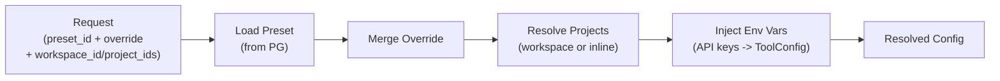
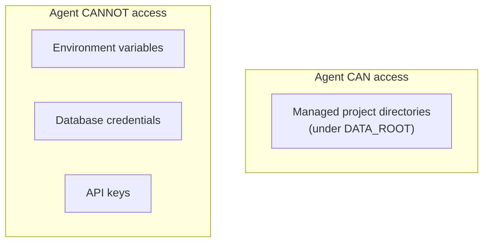

# 02 - Configuration

Agent preset management and service configuration. Service secrets come from environment variables. Agent presets are stored in PostgreSQL with JSON fields, manageable via API and admin UI.

## Configuration Layers

**Principle**: Agent presets contain no secrets. All credentials come from environment variables, never exposed to agent tools.

## Authentication

Simple token-based authentication for all API endpoints.

| Variable     | Description                                                                  |
| ------------ | ---------------------------------------------------------------------------- |
| `AUTH_TOKEN` | Bearer token for API access. If empty, auto-generated and logged at startup. |

All requests must include `Authorization: Bearer {token}` header. The runtime validates the token against `AUTH_TOKEN`. No user system -- a single shared token protects the service.

Auto-generation behavior: if `AUTH_TOKEN` is not set or empty, the runtime generates a random token at startup and logs it at `WARNING` level so the operator can retrieve it from the console output.

## Service Configuration (Environment Variables)

### Infrastructure

| Variable        | Required | Description                                  |
| --------------- | -------- | -------------------------------------------- |
| `DATABASE_URL`  | Yes      | PostgreSQL connection string                 |
| `REDIS_URL`     | Yes      | Redis connection string                      |
| `DATA_ROOT`     | No       | Unified data directory (default: `./data`)   |
| `DATA_PREFIX`   | No       | Optional namespace prefix for all data paths |
| `STATE_STORE`   | No       | `local` (default) or `s3`                    |
| `S3_ENDPOINT`   | No       | S3 endpoint URL                              |
| `S3_BUCKET`     | No       | S3 bucket name                               |
| `S3_REGION`     | No       | S3 region name                               |
| `S3_ACCESS_KEY` | No       | S3 access key                                |
| `S3_SECRET_KEY` | No       | S3 secret key                                |
| `S3_PATH_STYLE` | No       | Use path-style addressing (default: false)   |

### LLM Providers

| Variable             | Description                                      |
| -------------------- | ------------------------------------------------ |
| `OPENAI_API_KEY`     | OpenAI API key                                   |
| `ANTHROPIC_API_KEY`  | Anthropic API key                                |
| `{GATEWAY}_API_KEY`  | Custom gateway API key (ya-agent-sdk convention) |
| `{GATEWAY}_BASE_URL` | Custom gateway base URL                          |

### Tool API Keys

| Variable                | Description          |
| ----------------------- | -------------------- |
| `TAVILY_API_KEY`        | Web search           |
| `FIRECRAWL_API_KEY`     | Web scraping         |
| `GOOGLE_SEARCH_API_KEY` | Google search        |
| `GOOGLE_SEARCH_CX`      | Google search engine |

### Service Options

| Variable     | Default     | Description    |
| ------------ | ----------- | -------------- |
| `AUTH_TOKEN` | (generated) | API auth token |
| `HOST`       | `0.0.0.0`   | Listen address |
| `PORT`       | `8000`      | Listen port    |

## Agent Preset (Database)

Agent presets are stored in PostgreSQL with structured JSON columns. Manageable via admin API and UI.

### Schema

| Column        | Type        | Description                                     |
| ------------- | ----------- | ----------------------------------------------- |
| preset_id     | string (PK) | Unique identifier (slug)                        |
| name          | string      | Human-readable display name                     |
| description   | string?     | Preset description                              |
| model         | JSONB       | Model selection and settings (ModelPreset)      |
| system_prompt | text        | System prompt (Jinja2 template)                 |
| toolsets      | JSONB       | Enabled toolsets and config (list[ToolsetSpec]) |
| environment   | JSONB       | Shell mode and project config (EnvironmentSpec) |
| subagents     | JSONB       | Subagent configuration (SubagentSpec)           |
| is_default    | bool        | Whether this is the default preset              |
| created_at    | timestamp   | Creation time                                   |
| updated_at    | timestamp   | Last modification time                          |

At most one preset has `is_default = true`. This is used when a conversation or request does not specify a preset_id.

### ModelPreset (JSON)

| Field          | Type   | Description                                                 |
| -------------- | ------ | ----------------------------------------------------------- |
| name           | string | Provider-qualified name (e.g., `anthropic:claude-sonnet-4`) |
| context_window | int?   | Override context window size                                |
| temperature    | float? | Sampling temperature                                        |
| max_tokens     | int?   | Max output tokens                                           |

### ToolsetSpec (JSON)

Declares which tool groups are enabled. Maps to ya-agent-sdk built-in tools.

| Field         | Type         | Description               |
| ------------- | ------------ | ------------------------- |
| toolset_name  | string       | Toolset identifier        |
| enabled       | bool         | Whether active            |
| exclude_tools | list[string] | Specific tools to exclude |

Available toolsets:

| Toolset    | Tools                                         |
| ---------- | --------------------------------------------- |
| core       | view, edit, multi_edit, write, ls, glob, grep |
| filesystem | mkdir, move, copy                             |
| shell      | shell                                         |
| web        | search, scrape, fetch, download               |
| media      | load_media_url, read_video                    |
| document   | pdf_convert, office_to_markdown               |
| task       | task_create, task_update, task_list, task_get |
| context    | thinking, handoff                             |

### EnvironmentSpec (JSON)

| Field             | Type          | Default | Description                                                               |
| ----------------- | ------------- | ------- | ------------------------------------------------------------------------- |
| shell_mode        | enum          | `local` | `local` or `docker`                                                       |
| workspace_id      | string?       | null    | Reference to a saved workspace (mutually exclusive with project_ids)      |
| project_ids       | list[string]? | null    | Inline project list for ad-hoc use (mutually exclusive with workspace_id) |
| container_id      | string?       | null    | Docker container ID (required for docker mode)                            |
| container_workdir | string?       | null    | Working directory inside container                                        |

`workspace_id` and `project_ids` are mutually exclusive. If neither is set, the agent has no file system access (pure conversation mode).

At runtime, projects resolve to managed directories:

- `project_ids[0]` -> default working directory (shell pwd)
- `project_ids[1:]` -> additional allowed paths
- Storage: `{DATA_ROOT}/{DATA_PREFIX}/projects/{project_id}/` (auto-created on first access)

In docker mode, the user is responsible for mounting `DATA_ROOT` into the container. The runtime only executes commands via `docker exec`.

### SubagentSpec (JSON)

| Field           | Type              | Description                                    |
| --------------- | ----------------- | ---------------------------------------------- |
| include_builtin | bool              | Include SDK builtin subagents (debugger, etc.) |
| async_enabled   | bool              | Enable async_delegate tool                     |
| refs            | list[SubagentRef] | References to other presets                    |

#### SubagentRef

| Field       | Type    | Description                          |
| ----------- | ------- | ------------------------------------ |
| preset_id   | string  | Referenced preset's preset_id        |
| name        | string  | Delegation name                      |
| description | string  | When to use (shown to LLM)           |
| instruction | string? | Injected into parent's system prompt |

## Workspace (Database)

A workspace is a named, reusable grouping of project references -- analogous to a VS Code `.code-workspace` file. Stored in PostgreSQL for persistence and API management.

| Column       | Type         | Description                          |
| ------------ | ------------ | ------------------------------------ |
| workspace_id | string (PK)  | Unique identifier (slug)             |
| name         | string?      | Human-readable display name          |
| projects     | list[string] | Ordered project_ids, first = default |
| metadata     | JSONB        | Client-defined metadata (opaque)     |
| created_at   | timestamp    | Creation time                        |
| updated_at   | timestamp    | Last modification time               |

Workspaces are optional. Callers can always pass `project_ids` directly in the request for ad-hoc use without creating a workspace.

`project_id` is not a registered entity -- it is purely a storage mapping key. Any valid slug used as a `project_id` automatically maps to `{DATA_ROOT}/{DATA_PREFIX}/projects/{project_id}/`, with the directory created on first access.

## Config Resolver

1. Load the referenced preset from PostgreSQL (or default preset if unspecified)
2. Merge per-request inline overrides (override wins)
3. Resolve project list: request `workspace_id` / `project_ids` overrides preset default; workspace_id is resolved from PG; for continue/fork, parent session's `project_ids` is the fallback
4. Inject environment variable values (API keys into ToolConfig)
5. Produce resolved config for execution

## Security Boundary

- All secrets live in environment variables, not exposed through agent tools
- Shell tool does not inherit the runtime process's environment; only explicitly allowed variables are passed
- Preset data in PG contains no secrets (model names, prompts, toolset selection)
