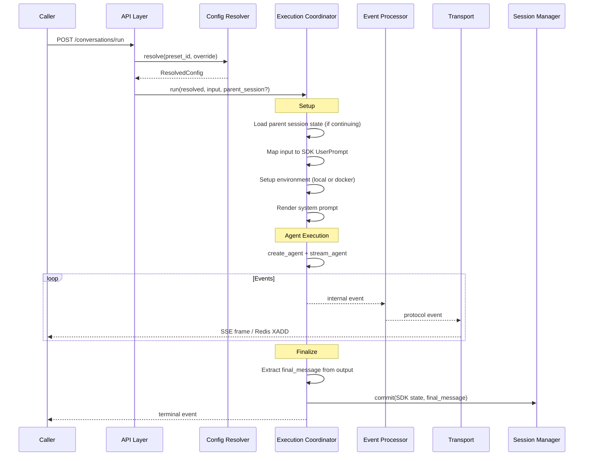
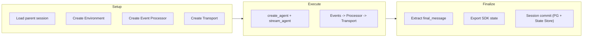
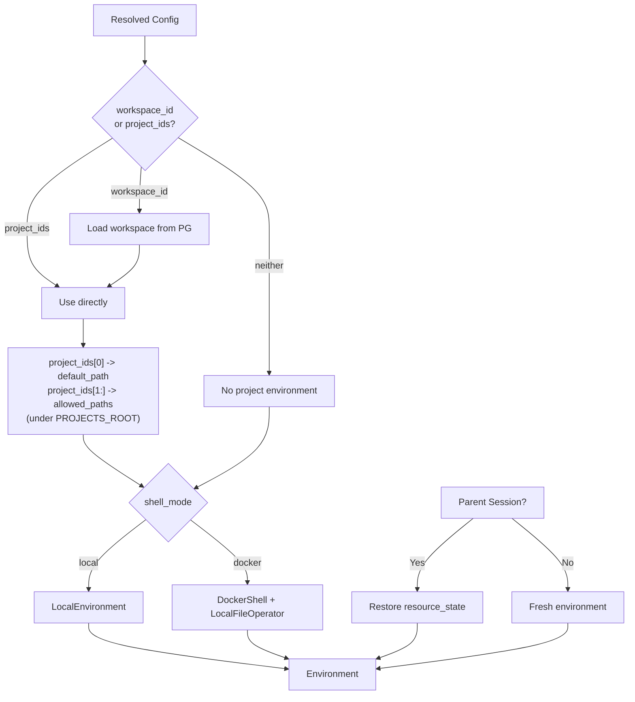
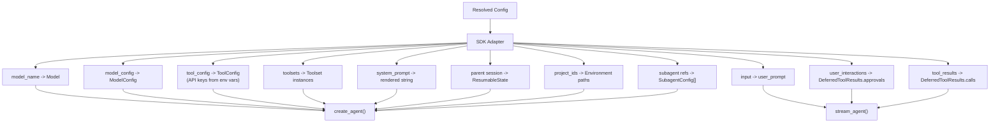

# 03 - Execution

The execution coordinator manages a single agent run: environment setup, agent execution, event processing, and session commit.

## Execution Flow

## Execution Coordinator

The coordinator wires together all components for a single run.

Responsibilities:

- **Setup**: Load parent state, create environment, instantiate transport
- **Execute**: Run the agent, pipe events through processor to transport
- **Finalize**: Extract final model output, export SDK state, commit session

Pipeline execution and transport delivery are decoupled. The agent runs to completion regardless of consumer speed or disconnection.

## Environment Setup

- **Project resolution**: `workspace_id` is resolved from PG to a `project_ids` list; inline `project_ids` are used directly. Each project_id maps to `{PROJECTS_ROOT}/{project_id}/`, auto-created on first access.
- **Local mode**: `LocalEnvironment` with resolved project paths
- **Docker mode**: `LocalFileOperator` for file operations + `DockerShell` targeting the configured container. File operations remain on the host; shell commands execute inside the container via `docker exec`

When continuing a session, environment resource state is restored from the parent session's `environment_state`.

## SDK Integration

The coordinator maps resolved config to SDK primitives.

## Input Mapping

Input is a list of content parts, mapped to SDK UserPrompt. Each non-text part has a `mode` that controls how it is delivered to the model.

### Content Mode

| Mode     | Behavior                                                        | Risk            |
| -------- | --------------------------------------------------------------- | --------------- |
| `file`   | Download/write to environment, reference as file path (default) | None            |
| `inline` | Pass directly into model context (image URL, base64, etc.)      | Model-dependent |

Default is `file` (always safe). Callers opt into `inline` per-part when they know the model supports it. If `inline` is requested but the model does not support the content type, execution fails with an error (no silent fallback).

### Part Type Mapping

| Part Type | mode=file (default)           | mode=inline                                 |
| --------- | ----------------------------- | ------------------------------------------- |
| text      | Pass through as string        | Pass through as string                      |
| url       | Download to environment       | Pass URL directly into model context        |
| file      | Resolve project path          | Read file into model context                |
| binary    | Write to environment temp dir | Decode and pass directly into model context |

Inline mode passes content directly to the model via pydantic-ai's multimodal UserPrompt. Whether the model accepts a given content type (image, video, audio, PDF, etc.) depends on the model's capabilities. If the model does not support the content type, execution fails with an error -- the runtime does not silently fall back to file mode.

### Deferred Tool Feedback

When continuing from a session with status `awaiting_tool_results`:

| Request Field       | SDK Target                      | Semantics                        |
| ------------------- | ------------------------------- | -------------------------------- |
| `user_interactions` | `DeferredToolResults.approvals` | HITL approval (tool re-executes) |
| `tool_results`      | `DeferredToolResults.calls`     | External result provided         |

Pending deferred tools not covered by feedback are auto-denied/auto-failed.

## Session Commit

After execution completes:

1. Export `context_state` and `message_history` from SDK
2. Export `environment_state` from Environment
3. Extract `final_message` (last model text output)
4. Write `state.json` (context_state + message_history + environment_state) to State Store
5. Update PG session index (status -> committed, final_message, run_summary)

If state write fails, session status is set to `failed`.
