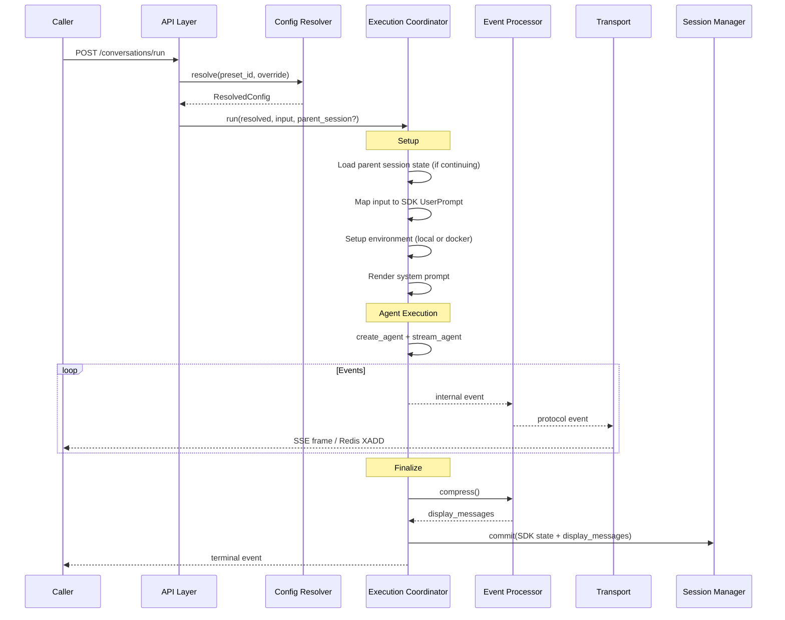
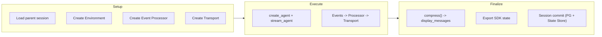
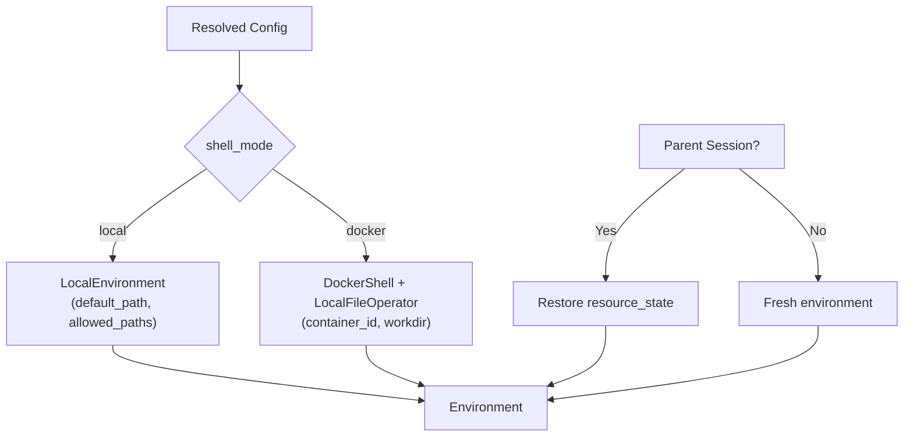
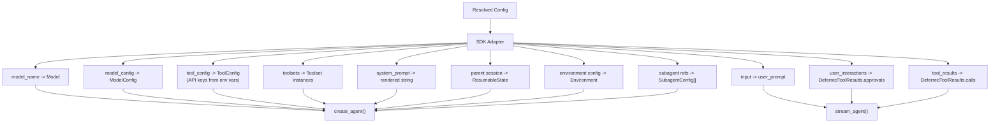

# 03 - Execution

The execution coordinator manages a single agent run: environment setup, agent execution, event processing, and session commit.

## Execution Flow

## Execution Coordinator

The coordinator wires together all components for a single run.

Responsibilities:

- **Setup**: Load parent state, create environment, instantiate transport
- **Execute**: Run the agent, pipe events through processor to transport
- **Finalize**: Compress events, export SDK state, commit session

Pipeline execution and transport delivery are decoupled. The agent runs to completion regardless of consumer speed or disconnection.

## Environment Setup

- **Local mode**: `LocalEnvironment` with configured paths
- **Docker mode**: `LocalFileOperator` for file operations + `DockerShell` targeting the configured container. File operations remain on the host; shell commands execute inside the container via `docker exec`

When continuing a session, environment resource state is restored from the parent session's `environment_state`.

## SDK Integration

The coordinator maps resolved config to SDK primitives.

## Input Mapping

Input is a list of content parts, mapped to SDK UserPrompt.

| Part Type | Description                   | Mapping                       |
| --------- | ----------------------------- | ----------------------------- |
| text      | Plain text                    | Pass through as string        |
| url       | Remote resource (image, etc.) | Download to environment       |
| file      | Local file reference          | Resolve workspace path        |
| binary    | Base64-encoded content        | Write to environment temp dir |

Input mapping uses `user_prompt_factory` for lazy execution at agent start time.

### Deferred Tool Feedback

When continuing from a session with status `awaiting_tool_results`:

| Request Field       | SDK Target                      | Semantics                        |
| ------------------- | ------------------------------- | -------------------------------- |
| `user_interactions` | `DeferredToolResults.approvals` | HITL approval (tool re-executes) |
| `tool_results`      | `DeferredToolResults.calls`     | External result provided         |

Pending deferred tools not covered by feedback are auto-denied/auto-failed.

## Session Commit

After execution completes:

1. Export `context_state` and `message_history` from SDK
2. Export `environment_state` from Environment
3. Compress protocol events into `display_messages`
4. Write `state.json` and `display_messages.json` to State Store
5. Update PG session index (status -> committed, run_summary)

If state write fails, session status is set to `failed`. Display messages failure is non-fatal (session is still restorable).
