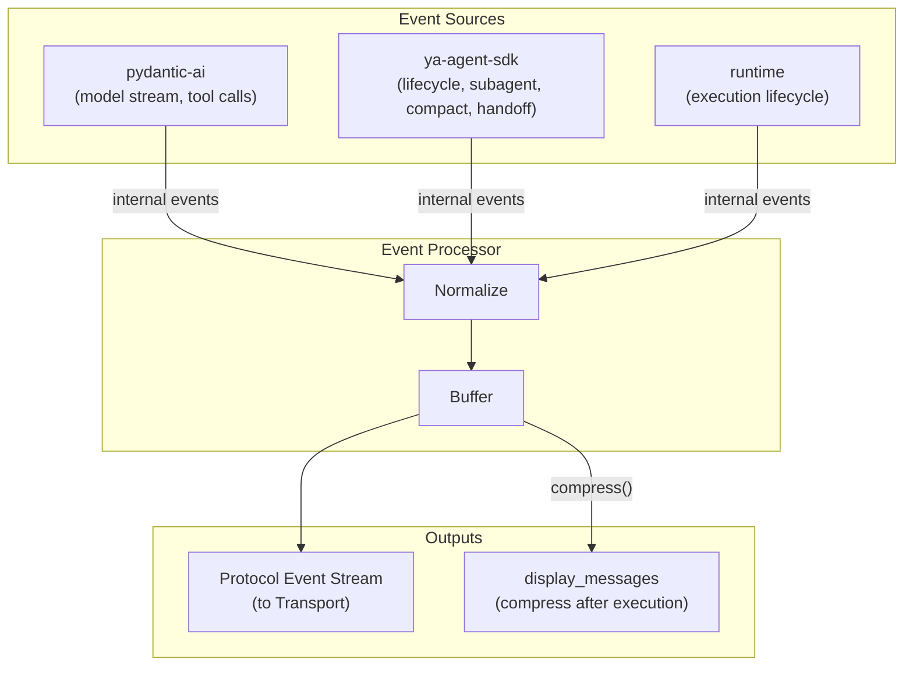
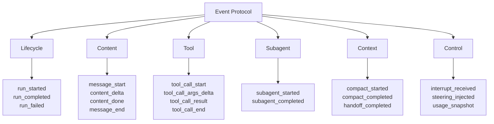
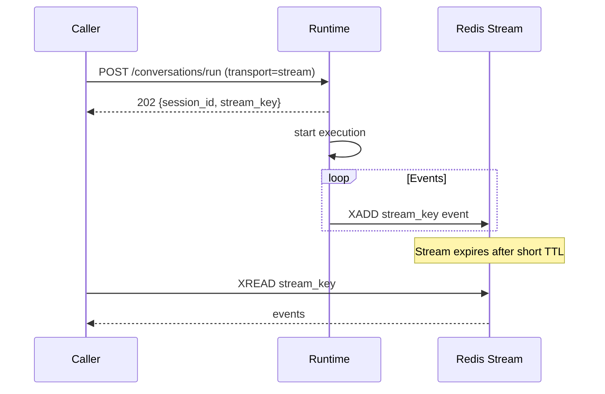

# 04 - Events and Streaming

Event protocol and transport layer. Internal events are normalized into a stable protocol, then delivered via SSE or Redis Stream.

## Event Layers



## Protocol Events

### Event Envelope

| Field      | Type     | Description                       |
| ---------- | -------- | --------------------------------- |
| event_id   | string   | Unique event identifier           |
| event_type | string   | Event type                        |
| session_id | string   | Producing session                 |
| timestamp  | ISO 8601 | When produced                     |
| agent_id   | string   | Agent identity (main or subagent) |
| payload    | object   | Event-specific data               |

### Event Types



### Source Mapping

| Protocol Event     | Source      | Internal Event                    |
| ------------------ | ----------- | --------------------------------- |
| run_started        | runtime     | Execution begins                  |
| run_completed      | runtime     | Execution succeeds                |
| run_failed         | runtime     | Execution fails                   |
| message_start      | pydantic-ai | First model stream event          |
| content_delta      | pydantic-ai | Text/thinking delta               |
| content_done       | pydantic-ai | End of content block              |
| message_end        | pydantic-ai | End of model response             |
| tool_call_start    | pydantic-ai | Tool call from model              |
| tool_call_result   | pydantic-ai | Tool return                       |
| tool_call_end      | pydantic-ai | Tool call complete                |
| subagent_started   | SDK         | SubagentStartEvent                |
| subagent_completed | SDK         | SubagentCompleteEvent             |
| compact_started    | SDK         | CompactStartEvent                 |
| compact_completed  | SDK         | CompactCompleteEvent              |
| handoff_completed  | SDK         | HandoffCompleteEvent              |
| interrupt_received | runtime     | Interrupt signal processed        |
| steering_injected  | runtime     | Steering message bridged          |
| usage_snapshot     | runtime     | Aggregated usage after model call |

### Terminal Events

`run_completed` and `run_failed` are terminal. No further events after them. Transport uses terminal events to close connections or signal stream end.

## Event Processor

Single component handling normalization, buffering, and compression.

- **Normalize**: Map internal events to protocol events (single coupling point)
- **Buffer**: Accumulate for real-time delivery and post-execution compression
- **Compress**: After execution, collapse event stream into structured `display_messages` for UI rendering

## Transport

Transport selection is per-request. Both deliver identical event sequences.

| Transport    | Delivery    | Use Case                           |
| ------------ | ----------- | ---------------------------------- |
| SSE          | Pull (HTTP) | Direct API callers, simple UIs     |
| Redis Stream | Push (XADD) | IM gateway, multi-consumer, replay |

### SSE Transport

Standard Server-Sent Events over HTTP. Caller holds an open connection.

```
event: {event_type}
data: {event envelope JSON}

```

Connection closes after terminal event. No built-in resume support; use Redis Stream transport for resumable streaming.

### Redis Stream Transport

Events published to a Redis Stream keyed by session. Short TTL -- streams are ephemeral buffers, not durable storage. Display messages are persisted in the State Store at session commit time.



Stream TTL is short (minutes, not hours). Redis is purely a live buffer during execution, not a data source. After a session commits, callers should retrieve `display_messages` from the State Store -- this is the preferred access path for completed sessions.

### Stream-to-SSE Bridge

Converts a Redis Stream into an SSE connection with resume support via `Last-Event-ID`.

```
GET /sessions/{session_id}/events
GET /conversations/{conversation_id}/events
Accept: text/event-stream
Last-Event-ID: {cursor}
```

| Run State                          | Last-Event-ID | Behavior                                 |
| ---------------------------------- | ------------- | ---------------------------------------- |
| Active, stream exists              | absent        | Replay from beginning + live events      |
| Active, stream exists              | present       | Replay from cursor + live events         |
| Completed, stream in TTL           | any           | Replay remaining + terminal + close      |
| Session committed / stream expired | any           | 410 Gone; use `display_messages` instead |

For completed sessions, `display_messages` from the State Store is the canonical source. The bridge is only useful during live execution.

This enables callers to consume async runs with SSE semantics during live execution.

## Access Patterns

| Timing           | Method                                                                                  | Data Source                    |
| ---------------- | --------------------------------------------------------------------------------------- | ------------------------------ |
| During execution | SSE or Redis Stream (live events)                                                       | Redis Stream                   |
| After commit     | `GET /sessions/{id}/get`                                                                | State Store (display_messages) |
| Reconnect        | Check session status; if committed, use display_messages; if running, attach via bridge | Both                           |

## Guaranteed Delivery

Execution runs to completion (including session commit) regardless of transport failures. SSE disconnections and slow Redis consumers do not affect session integrity.
