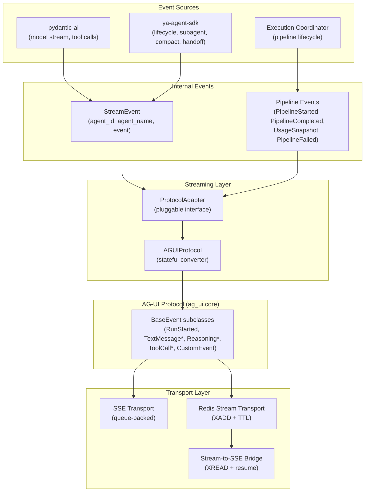
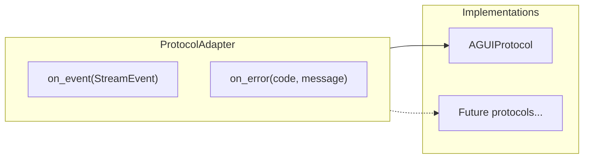
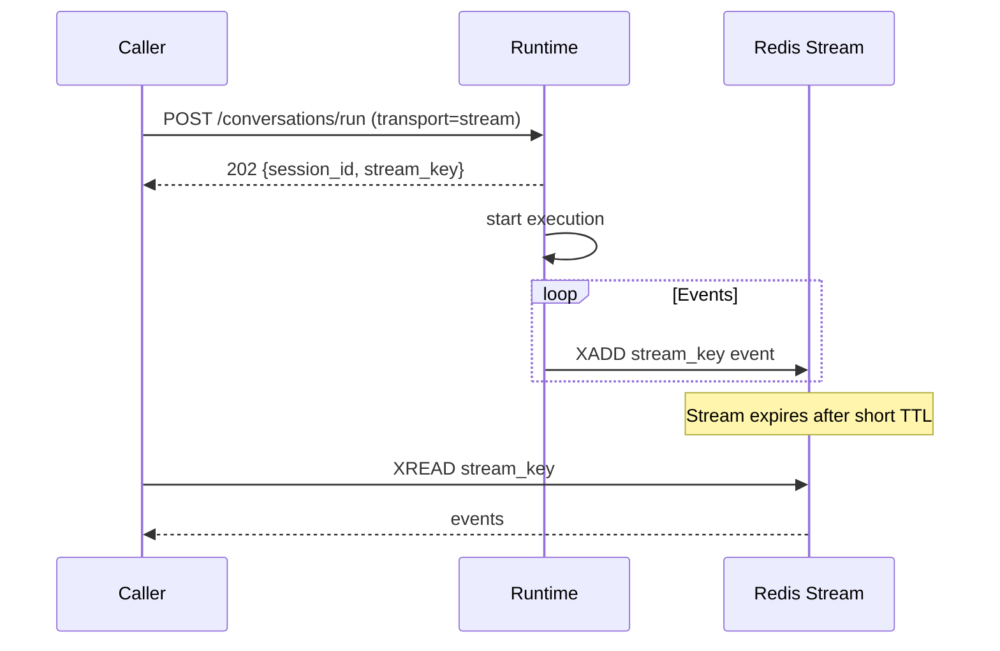
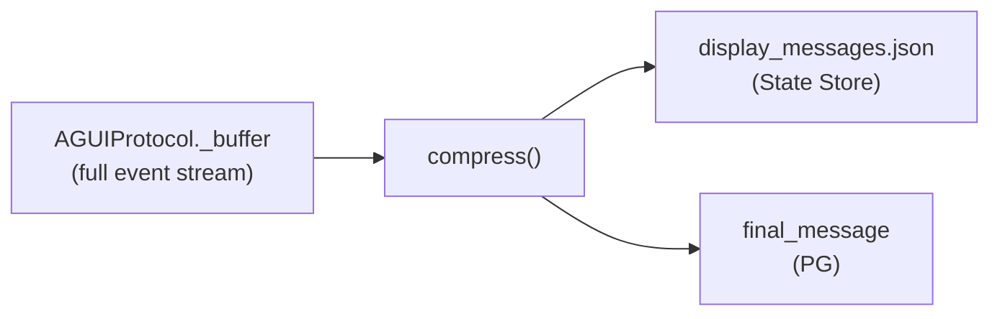

# 04 - Events and Streaming

Two-layer event architecture with explicit internal/external separation. Internal events flow through the SDK streamer and are converted by a protocol adapter into AG-UI events, delivered via SSE or Redis Stream.

## Architecture


```mermaid
flowchart TB
    subgraph Sources["Event Sources"]
        PAI["pydantic-ai<br/>(model stream, tool calls)"]
        SDK["ya-agent-sdk<br/>(lifecycle, subagent, compact, handoff)"]
        RT["Execution Coordinator<br/>(pipeline lifecycle)"]
    end

    subgraph Internal["Internal Events"]
        SE["StreamEvent<br/>(agent_id, agent_name, event)"]
        PE["Pipeline Events<br/>(PipelineStarted, PipelineCompleted,<br/>UsageSnapshot, PipelineFailed)"]
    end

    subgraph Streaming["Streaming Layer"]
        PA["ProtocolAdapter<br/>(pluggable interface)"]
        AGUI["AGUIProtocol<br/>(stateful converter)"]
    end

    subgraph External["AG-UI Protocol (ag_ui.core)"]
        EVT["BaseEvent subclasses<br/>(RunStarted, TextMessage*, Reasoning*,<br/>ToolCall*, CustomEvent)"]
    end

    subgraph Transport["Transport Layer"]
        SSE["SSE Transport<br/>(queue-backed)"]
        RDS["Redis Stream Transport<br/>(XADD + TTL)"]
        BRG["Stream-to-SSE Bridge<br/>(XREAD + resume)"]
    end

    PAI & SDK --> SE
    RT --> PE
    SE & PE --> PA --> AGUI --> EVT
    EVT --> SSE & RDS
    RDS --> BRG
```

## Internal Events

Internal events are the raw event stream produced during agent execution. They consist of two categories that flow through the same `StreamEvent` channel.

### SDK Events (from ya-agent-sdk)

`StreamEvent(agent_id, agent_name, event)` where `event` is:

| Category        | Event Types                                                                                                                                                                      | Source       |
| --------------- | -------------------------------------------------------------------------------------------------------------------------------------------------------------------------------- | ------------ |
| Model streaming | PartStartEvent, PartDeltaEvent, PartEndEvent                                                                                                                                     | pydantic-ai  |
| Tool lifecycle  | FunctionToolCallEvent, FunctionToolResultEvent                                                                                                                                   | pydantic-ai  |
| Agent lifecycle | AgentExecutionStartEvent, ModelRequestStartEvent, ModelRequestCompleteEvent, ToolCallsStartEvent, ToolCallsCompleteEvent, AgentExecutionCompleteEvent, AgentExecutionFailedEvent | ya-agent-sdk |
| Sideband        | SubagentStartEvent, SubagentCompleteEvent, CompactStartEvent, CompactCompleteEvent, HandoffCompleteEvent, MessageReceivedEvent                                                   | ya-agent-sdk |

### Pipeline Events (from Execution Coordinator)

Custom events extending `ya-agent-sdk.events.AgentEvent`. Emitted by the coordinator to mark pipeline-level milestones.

| Event             | Fields                        | When Emitted             |
| ----------------- | ----------------------------- | ------------------------ |
| PipelineStarted   | session_id, conversation_id   | Execution begins         |
| PipelineCompleted | session_id, reply, usage      | Execution succeeds       |
| PipelineFailed    | session_id, error, error_type | Execution fails          |
| UsageSnapshot     | session_id, usage             | After each model request |

### Design Principle

Internal events are an implementation detail. They are never exposed to external consumers. Their structure may change across versions without breaking the external protocol. The protocol adapter is the sole coupling point.

## Protocol Adapter

The protocol adapter converts internal events to an external protocol. It is a pluggable interface, allowing different output formats without modifying the execution pipeline.


```mermaid
flowchart LR
    subgraph Interface["ProtocolAdapter"]
        ON_EVENT["on_event(StreamEvent)"]
        ON_ERROR["on_error(code, message)"]
    end

    subgraph Implementations
        AGUI["AGUIProtocol"]
        FUTURE["Future protocols..."]
    end

    Interface --> AGUI
    Interface -.-> FUTURE
```

### Interface

| Method   | When Called                                     | Yields                    |
| -------- | ----------------------------------------------- | ------------------------- |
| on_event | For each StreamEvent (SDK + pipeline lifecycle) | Zero or more AG-UI events |
| on_error | On execution failure (from except block)        | AG-UI RunErrorEvent       |

All events -- SDK streaming, sideband, and pipeline lifecycle -- flow through the unified `on_event()` method. The adapter inspects the inner event type and produces the appropriate AG-UI output. The only separate path is `on_error()`, which handles execution failures from the except block where no StreamEvent can be injected.

## AG-UI Protocol (External Events)

The `AGUIProtocol` adapter converts internal events to events from the `ag-ui-protocol` package (`ag_ui.core`). Standard AG-UI event types are used directly; runtime extensions use `CustomEvent`.

### Standard AG-UI Events

Used directly from `ag_ui.core`:

| Category     | Event Types                                                                                                                          |
| ------------ | ------------------------------------------------------------------------------------------------------------------------------------ |
| Lifecycle    | `RunStartedEvent`, `RunFinishedEvent`, `RunErrorEvent`                                                                               |
| Text content | `TextMessageStartEvent`, `TextMessageContentEvent`, `TextMessageEndEvent`                                                            |
| Reasoning    | `ReasoningStartEvent`, `ReasoningMessageStartEvent`, `ReasoningMessageContentEvent`, `ReasoningMessageEndEvent`, `ReasoningEndEvent` |
| Tool calls   | `ToolCallStartEvent`, `ToolCallArgsEvent`, `ToolCallEndEvent`, `ToolCallResultEvent`                                                 |

### Runtime Extension Events

Delivered via `ag_ui.core.CustomEvent` with a descriptive `name` field:

| CustomEvent name   | Internal Source                | Value Fields                                                                                                                             |
| ------------------ | ------------------------------ | ---------------------------------------------------------------------------------------------------------------------------------------- |
| subagent_started   | SubagentStartEvent             | sub_agent_id, sub_agent_name, prompt_preview                                                                                             |
| subagent_completed | SubagentCompleteEvent          | sub_agent_id, sub_agent_name, success, result_preview, error, duration_seconds                                                           |
| compact_started    | CompactStartEvent              | message_count                                                                                                                            |
| compact_completed  | CompactCompleteEvent           | original_message_count, compacted_message_count                                                                                          |
| handoff_completed  | HandoffCompleteEvent           | original_message_count                                                                                                                   |
| steering_received  | MessageReceivedEvent           | message_count                                                                                                                            |
| usage_snapshot     | UsageSnapshot (post_node_hook) | model_usages: {model_id: {input_tokens, output_tokens, cache_read_tokens, cache_write_tokens, reasoning_tokens, total_tokens, requests}} |

### Source Mapping

The AGUIProtocol adapter tracks streaming state (open text/reasoning/tool_call streams) to produce properly bracketed AG-UI events.

| AG-UI Event                  | Internal Source                           |
| ---------------------------- | ----------------------------------------- |
| RunStartedEvent              | PipelineStarted                           |
| RunFinishedEvent             | PipelineCompleted                         |
| RunErrorEvent                | adapter.on_error()                        |
| TextMessageStartEvent        | PartStartEvent(TextPart)                  |
| TextMessageContentEvent      | PartDeltaEvent(TextPartDelta)             |
| TextMessageEndEvent          | PartEndEvent(TextPart)                    |
| ReasoningStartEvent          | PartStartEvent(ThinkingPart)              |
| ReasoningMessageStartEvent   | PartStartEvent(ThinkingPart) with content |
| ReasoningMessageContentEvent | PartDeltaEvent(ThinkingPartDelta)         |
| ReasoningMessageEndEvent     | PartEndEvent(ThinkingPart)                |
| ReasoningEndEvent            | PartEndEvent(ThinkingPart)                |
| ToolCallStartEvent           | PartStartEvent(ToolCallPart)              |
| ToolCallArgsEvent            | PartDeltaEvent(ToolCallPartDelta)         |
| ToolCallEndEvent             | PartEndEvent(ToolCallPart)                |
| ToolCallResultEvent          | FunctionToolResultEvent                   |

### ToolCallResult Status

`ToolCallResultEvent` includes an extra `status` field (via AG-UI's `extra='allow'` config) to indicate the outcome:

| Status     | Meaning                                      |
| ---------- | -------------------------------------------- |
| `complete` | Tool executed successfully (ToolReturnPart)  |
| `retry`    | Tool execution triggered retry (RetryPrompt) |
| `cancel`   | Tool call cancelled (interrupt/cleanup)      |

### Terminal Events

`RunFinishedEvent` and `RunErrorEvent` are terminal. No further events after them. Transport uses terminal events to close connections or signal stream end.

### Stream Cleanup

On interrupt or error, the adapter closes any open streams (text, reasoning, tool calls) before emitting the terminal event. Open tool calls receive a `ToolCallEndEvent` + `ToolCallResultEvent(content="")`.

## Transport

Transport selection is per-request. Both deliver identical AG-UI event sequences.

| Transport    | Delivery    | Use Case                           |
| ------------ | ----------- | ---------------------------------- |
| SSE          | Pull (HTTP) | Direct API callers, Web UI         |
| Redis Stream | Push (XADD) | IM gateway, multi-consumer, replay |

### SSE Transport

Queue-backed Server-Sent Events over HTTP. An `asyncio.Queue` decouples the execution pipeline (producer) from the HTTP response (consumer). The agent runs to completion regardless of consumer speed or disconnection.

SSE wire format follows AG-UI conventions with an `id` field for reconnection:

```
id: {event_id}
data: {AG-UI event JSON (camelCase)}

```

AG-UI events serialize with `model_dump_json(by_alias=True, exclude_none=True)`, producing camelCase field names per the protocol spec.

Connection closes after terminal event.

### Redis Stream Transport

Events published to a Redis Stream keyed by session. Short TTL -- streams are ephemeral buffers, not durable storage.

All Redis keys use the `nether:` application prefix. Stream keys follow `nether:stream:{session_id}`.


```mermaid
sequenceDiagram
    participant C as Caller
    participant RT as Runtime
    participant RD as Redis Stream

    C->>RT: POST /conversations/run (transport=stream)
    RT-->>C: 202 {session_id, stream_key}
    RT->>RT: start execution

    loop Events
        RT->>RD: XADD stream_key event
    end

    Note over RD: Stream expires after short TTL
    C->>RD: XREAD stream_key
    RD-->>C: events
```

Stream TTL is short (minutes). After session commit, callers retrieve `final_message` from the session index (PG).

### Stream-to-SSE Bridge

Converts a Redis Stream into an SSE connection with resume support via `Last-Event-ID`.

```
GET /sessions/{session_id}/events
GET /conversations/{conversation_id}/events
Accept: text/event-stream
Last-Event-ID: {cursor}
```

The bridge uses Redis stream entry IDs as the SSE `id:` field, enabling direct reconnection. For direct SSE transport, unique UUIDs are used.

| Run State                          | Last-Event-ID | Behavior                            |
| ---------------------------------- | ------------- | ----------------------------------- |
| Active, stream exists              | absent        | Replay from beginning + live events |
| Active, stream exists              | present       | Replay from cursor + live events    |
| Completed, stream in TTL           | any           | Replay remaining + terminal + close |
| Session committed / stream expired | any           | 410 Gone; use session index instead |

### Usage Tracking

Real-time token usage is tracked via the SDK's `post_node_hook` mechanism. After each model request completes, a `UsageSnapshotEmitter` reads `ctx.run.usage()` and injects a `UsageSnapshot` event into the SDK's `output_queue` as a `StreamEvent`. This event flows through the adapter like any other event and is converted to a `CustomEvent(usage_snapshot)` with per-model token counts.

Usage is aggregated by `model_id` because different models have different pricing. The main agent's model_id comes from `config.model.name`. Extra usages from subagents, compact filters, and image understanding are collected from `runtime.ctx.extra_usages` at run completion.

During streaming, `UsageSnapshot` contains only the main model's usage (subagent/compact usage is only available at run end). The final `RunSummary` (stored in PG) contains the full aggregated usage across all models.

Token fields per model (aligned with `pydantic_ai.RunUsage`):

| Field              | Source in RunUsage           |
| ------------------ | ---------------------------- |
| input_tokens       | input_tokens                 |
| output_tokens      | output_tokens                |
| cache_read_tokens  | cache_read_tokens            |
| cache_write_tokens | cache_write_tokens           |
| reasoning_tokens   | details["reasoning_tokens"]  |
| total_tokens       | input_tokens + output_tokens |
| requests           | requests                     |

## Project Structure

```
agent_runtime/
  execution/
    events.py          # Internal pipeline events (PipelineStarted, etc.)
    hooks.py           # Usage tracking hooks (UsageSnapshotEmitter)
    coordinator.py     # Emits internal events, calls protocol adapter
  streaming/
    protocols/
      base.py          # ProtocolAdapter abstract interface (on_event + on_error)
      agui.py          # AGUIProtocol implementation (ag_ui.core types)
  transport/
    base.py            # EventTransport protocol
    sse.py             # SSE transport (queue-backed)
    redis_stream.py    # Redis Stream transport (XADD)
    bridge.py          # Stream-to-SSE bridge (XREAD + resume)
  models/
    events.py          # AG-UI re-exports, extension event names, helpers
```

## Dependencies

- `ag-ui-protocol`: AG-UI event types and SSE encoder
- `sse-starlette`: SSE response for FastAPI
- `redis`: Redis Stream transport

## Display Messages (Event Compression)

At commit time, the protocol adapter's event buffer is compressed into a compact chunk list and written to the State Store as `display_messages.json`. This enables UI clients to reconstruct the full conversation view (tool calls, reasoning, custom events) from history without replaying the raw event stream.

### Compression

The coordinator calls a compression function that walks the `AGUIProtocol.buffer` and collapses streaming triplets into AG-UI chunk events:

| Original Events                                          | Compressed To         | Fields                                                          |
| -------------------------------------------------------- | --------------------- | --------------------------------------------------------------- |
| TextMessageStart + TextMessageContent\* + TextMessageEnd | TextMessageChunk      | messageId, role, delta (concatenated)                           |
| ToolCallStart + ToolCallArgs\* + ToolCallEnd             | ToolCallChunk         | toolCallId, toolCallName, parentMessageId, delta (concatenated) |
| ReasoningStart + ReasoningMessage\* + ReasoningEnd       | ReasoningMessageChunk | messageId, delta (concatenated)                                 |
| ToolCallResult                                           | Kept as-is            | Already atomic                                                  |
| CustomEvent                                              | Kept as-is            | Already atomic                                                  |
| RunStarted, RunFinished, RunError                        | Dropped               | Derivable from session index                                    |
| StepStarted, StepFinished                                | Dropped               | Real-time only                                                  |

### Data Flow


```mermaid
flowchart LR
    BUF["AGUIProtocol._buffer<br/>(full event stream)"] --> CMP["compress()"]
    CMP --> DM["display_messages.json<br/>(State Store)"]
    CMP --> FM["final_message<br/>(PG)"]
```

The compression runs inside the coordinator's finalize phase, after the agent stream is fully consumed but before the session is committed. Both `display_messages.json` and `state.json` are written during the same commit operation.

### Storage

`display_messages.json` is a separate file in the State Store, alongside `state.json`:

```
{base}/sessions/{session_id}/state.json
{base}/sessions/{session_id}/display_messages.json
```

The file is optional. It may be absent for failed sessions or when compression is disabled.

## Access Patterns

| Timing           | Method                                                                               | Data Source                         |
| ---------------- | ------------------------------------------------------------------------------------ | ----------------------------------- |
| During execution | SSE or Redis Stream (live events)                                                    | Redis Stream                        |
| After commit     | `GET /sessions/{id}/get`                                                             | PG + State Store (display_messages) |
| History browse   | `GET /conversations/{id}/turns?include_display=true`                                 | PG + State Store                    |
| Reconnect        | Check session status; if committed, use session index; if running, attach via bridge | Both                                |

## Guaranteed Delivery

Execution runs to completion (including session commit) regardless of transport failures. SSE disconnections and slow Redis consumers do not affect session integrity.
