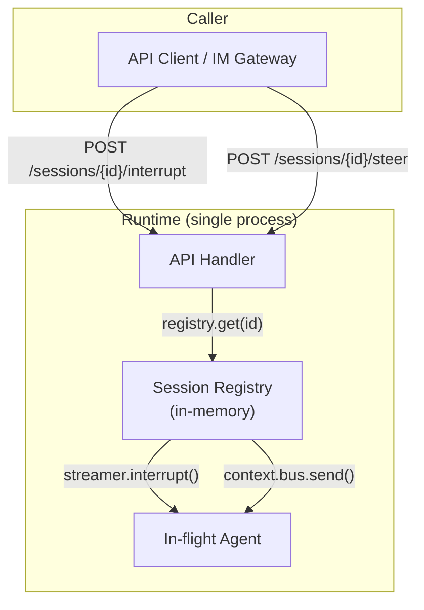
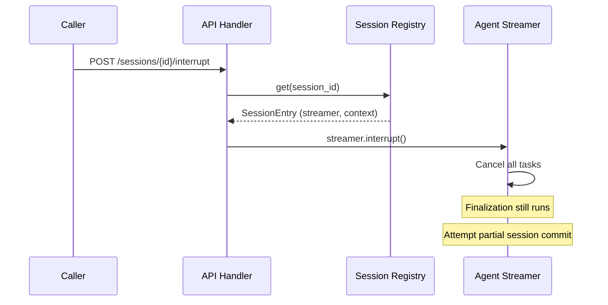
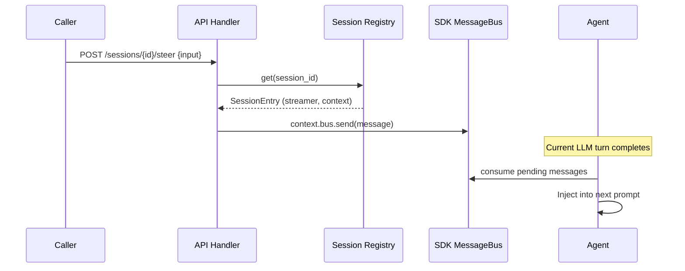

# 05 - Control

Interrupt provides hard cancellation. Steering provides soft guidance injection. Both operate in-process via the Session Registry -- no Redis broker needed for a single-instance service.

## Overview



Since the API handler and the agent runner share the same process, the Session Registry provides direct object references. No external broker is needed.

## Session Registry

The registry is the central in-process index of active sessions. See [01-session.md](01-session.md) for the data model.

Query path for control operations:

```
1. registry.get(session_id)
2. If found -> session is running, use live references
3. If not found -> session is not running (404 for control operations)
```

Status query path:

```
1. registry.get(session_id)
2. If found -> "executing"
3. If not found -> query PG for durable status (committed / failed / ...)
```

## Interrupt

Hard cancellation. The agent is stopped as soon as possible.



- Running tasks are cancelled via `asyncio.Task.cancel()`
- Finalization (event compression, session commit) still runs after interrupt
- If the agent produced meaningful output, a partial session is committed
- Interrupt is idempotent
- Returns 404 if session is not in the registry (not running)

## Steering

Soft injection of guidance into a running agent. Messages are consumed at the next LLM turn boundary without interrupting current execution.



Steering messages use the same input format as the API (text, multimodal parts). The SDK MessageBus deduplicates by message_id and ensures the agent processes all steering messages before completing (via `message_bus_guard`).

## Conversation-Level Control

Convenience wrappers that resolve active sessions within a conversation.

| Endpoint                             | Method | Behavior                                                 |
| ------------------------------------ | ------ | -------------------------------------------------------- |
| `POST /conversations/{id}/interrupt` | POST   | Find all active sessions in conversation, interrupt each |
| `POST /conversations/{id}/steer`     | POST   | Find active `session_type=agent` session, steer it       |

"Active" means present in the Session Registry. Conversation-level interrupt iterates all registry entries matching the conversation_id. Conversation-level steer targets the single active agent session (returns 404 if none).

## Design Rationale

The production reference uses Redis PubSub for interrupt and Redis Stream for steering to support multi-instance horizontal scaling. In our single-instance architecture:

- API handler and agent runner share the same process
- Direct method calls replace Redis round-trips
- Lower latency, simpler failure modes, fewer dependencies
- Redis remains solely as an event stream buffer for external consumers (IM gateway)
