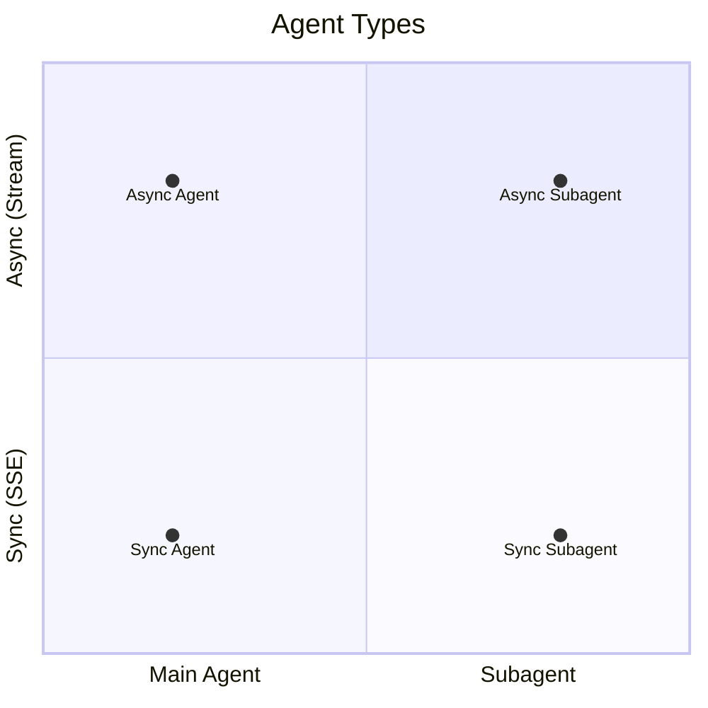
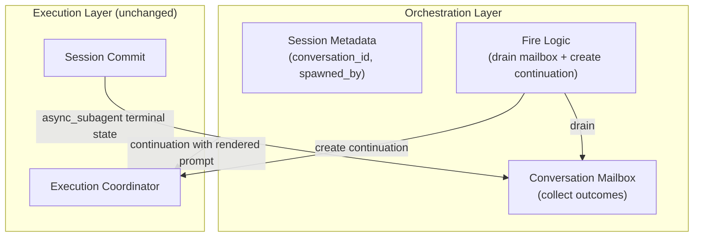
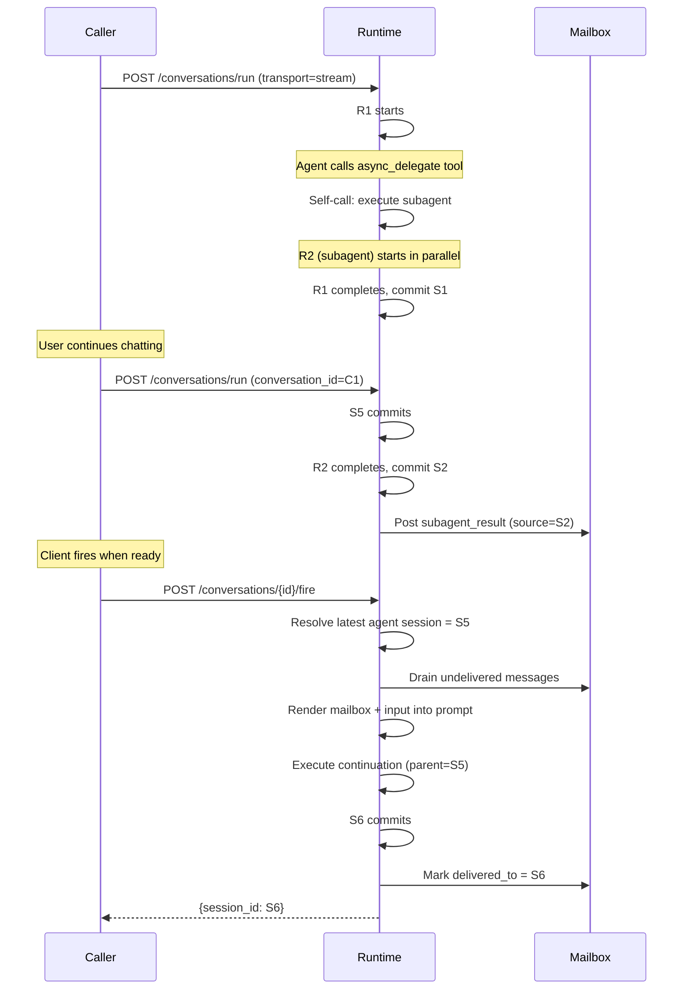
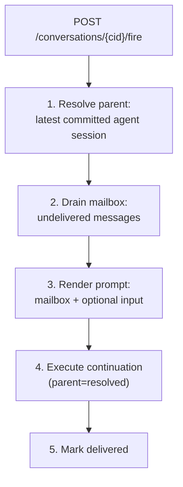
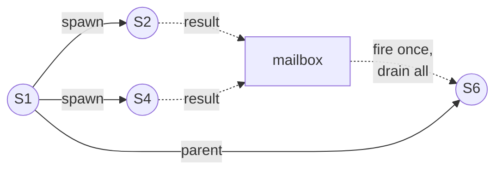

# 06 - Async Agents

Agent classification based on delivery mode and invocation origin. Four agent types, with async subagent as the key extension requiring orchestration support.

## Agent Taxonomy

Two axes: delivery (sync/async) and invocation (main/subagent).



| Type           | Transport    | Initiated by | Session          | Description                            |
| -------------- | ------------ | ------------ | ---------------- | -------------------------------------- |
| Sync Agent     | SSE          | Caller       | Own              | Standard request-response              |
| Async Agent    | Redis Stream | Caller       | Own              | Detachable, caller attaches at will    |
| Sync Subagent  | Parent's     | Parent agent | In parent        | Inline execution within parent (SDK)   |
| Async Subagent | Redis Stream | Orchestrator | Own, independent | Parallel execution, result via mailbox |

### Sync Agent

Caller sends `POST /conversations/run` with `transport=sse`, blocks on SSE until agent completes.

### Async Agent

Same as sync agent but with `transport=stream`. Events flow through Redis Stream; caller can attach/detach/reattach. Architecturally identical -- only the transport differs.

### Sync Subagent

Existing SDK model. Parent calls `delegate` tool; subagent runs inline as nested `Agent.iter()`. No separate session. Invisible to the runtime service.

### Async Subagent

Independent execution with its own session. Spawned by the `async_delegate` tool. Result delivered back via conversation mailbox.

| Aspect          | Sync Subagent              | Async Subagent                  |
| --------------- | -------------------------- | ------------------------------- |
| Execution       | Inline within parent       | Independent, own execution      |
| Session         | No (state in parent)       | Yes, own session                |
| Concurrency     | Sequential (blocks parent) | Parallel (parent continues)     |
| Result delivery | Tool return value          | Mailbox message in continuation |
| Environment     | Shares parent in-process   | Shares via environment state    |

## Orchestration



The orchestration layer relates, collects, and bridges. The execution layer is unchanged -- async subagents go through the identical execution path as any other run.

## Lifecycle



## Session Creation Matrix

| Scenario                | parent_session_id  | session_type   | conversation_id           | spawned_by |
| ----------------------- | ------------------ | -------------- | ------------------------- | ---------- |
| Root                    | null               | agent          | = session_id              | null       |
| Continuation            | = previous session | agent          | = parent.conversation_id  | null       |
| Fork                    | = historical       | agent          | = session_id (new)        | null       |
| Async subagent (fresh)  | null               | async_subagent | = spawner.conversation_id | = spawner  |
| Async subagent (resume) | = prev sub session | async_subagent | = parent.conversation_id  | = spawner  |

## Conversation Mailbox

Persistent message store (PostgreSQL) collecting subagent outcomes within a conversation.

### MailboxMessage

| Field             | Type      | Description                                 |
| ----------------- | --------- | ------------------------------------------- |
| message_id        | string    | Unique identifier                           |
| conversation_id   | string    | Owning conversation                         |
| source_session_id | string    | Session that produced the outcome           |
| source_type       | enum      | `subagent_result` / `subagent_failed`       |
| subagent_name     | string    | Display name                                |
| created_at        | timestamp | When posted                                 |
| delivered_to      | string?   | Session that consumed this (null = pending) |

Messages are lightweight references. Full content is retrieved from the source session's `display_messages` at render time.

### Production Rules

| Event                    | source_type     |
| ------------------------ | --------------- |
| Subagent session commits | subagent_result |
| Subagent execution fails | subagent_failed |

### Delivery Tracking

`delivered_to` prevents duplicate delivery. A fire operation atomically drains all pending messages and marks them with the new session's ID.

## Fire Logic (Manual Only)

Client explicitly fires via `POST /conversations/{conversation_id}/fire`.



Rejects with `422` if mailbox is empty.

### Message Rendering

Single result:

```
Async subagent '{name}' (session: {id}) completed:
{display_messages content}
```

Multiple results:

```
Async subagent results:

## {name_1} [completed] (session: {id_1})
{result_1}

## {name_2} [failed] (session: {id_2})
Error: {error_2}
```

## Async Delegate Tool

Available when the agent preset enables async subagents.

1. Read `async_subagent_registry` from AgentContext to check for existing subagent
2. Self-call: execute subagent session (subagent preset, `transport=stream`, same `conversation_id`)
3. Write dispatch info to registry
4. Return: "Task dispatched to '{name}' (session: {session_id})"

Resume: if registry has an existing session for the subagent name, the new execution continues from that session (`parent_session_id = previous`).

## Fan-out / Fan-in



Client can wait for all subagents, then fire once. All mailbox messages drain into a single continuation prompt.

## Failure Handling

| Scenario                        | Behavior                                    |
| ------------------------------- | ------------------------------------------- |
| Subagent fails                  | Failed message posted to mailbox            |
| Main agent fails after dispatch | Subagents continue; results land in mailbox |
| Fire with empty mailbox         | Rejected (422)                              |
| Interrupted subagent            | Partial commit = result; no commit = failed |

No automatic cascading interrupt. Main agent failure does not kill running subagents.
