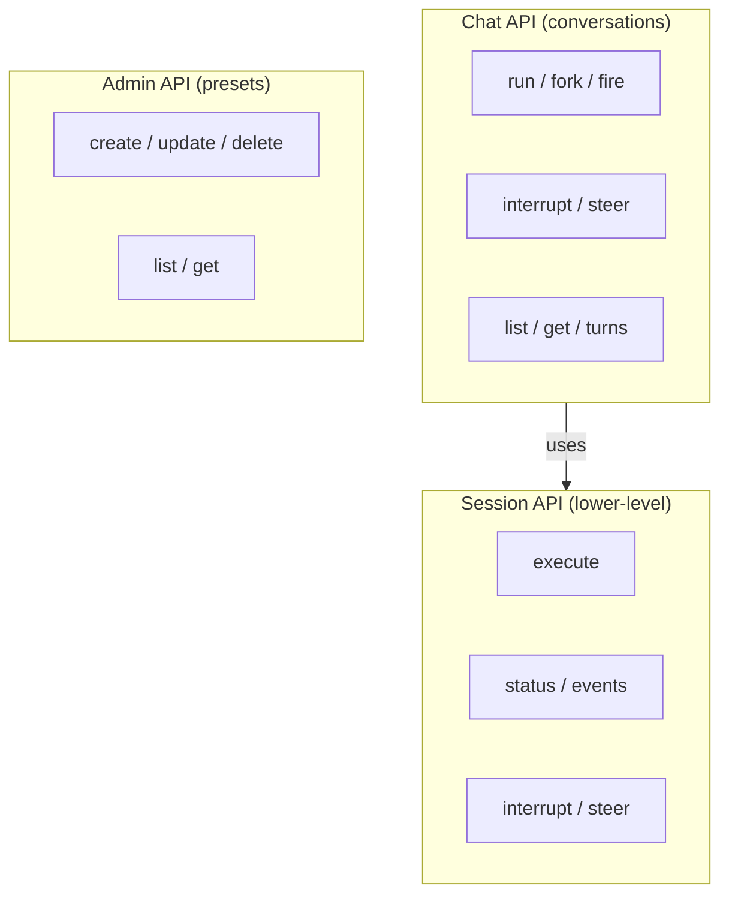
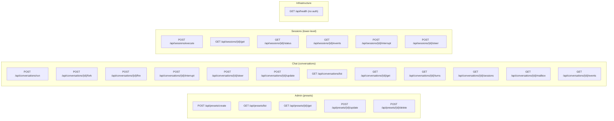

# 07 - API

RPC-style API surface. GET for reads, POST for all writes. All endpoints live under the `/api` prefix. Three tiers: Conversations (chat), Presets (admin), and Sessions (lower-level).

The root path (`/`) serves the built-in web UI (static SPA). API and UI share the same origin with no CORS concerns.

## Authentication

All endpoints require `Authorization: Bearer {token}` header. The token is configured via `AUTH_TOKEN` environment variable. If unset, a random token is generated at startup and logged.

No user system. A single shared token protects the entire API.

## API Tiers



- **Chat API**: Conversation-centric operations for IM gateways and chat UIs
- **Admin API**: Preset management for configuration UIs
- **Session API**: Lower-level building block, used internally and for advanced use cases

## Presets (Admin)

### POST /api/presets/create

Create a new agent preset.

| Field         | Type    | Required | Description                                                 |
| ------------- | ------- | -------- | ----------------------------------------------------------- |
| preset_id     | string  | Yes      | Unique slug identifier                                      |
| name          | string  | Yes      | Display name                                                |
| description   | string? | No       | Description                                                 |
| model         | JSON    | Yes      | ModelPreset (name, context_window, temperature, max_tokens) |
| system_prompt | string  | Yes      | System prompt (Jinja2 template)                             |
| toolsets      | JSON    | Yes      | list[ToolsetSpec]                                           |
| environment   | JSON?   | No       | EnvironmentSpec (shell_mode, paths)                         |
| subagents     | JSON?   | No       | SubagentSpec                                                |
| is_default    | bool    | No       | Set as default preset (default: false)                      |

### GET /api/presets/list

List all presets.

### GET /api/presets/{preset_id}/get

Get a single preset by ID.

### POST /api/presets/{preset_id}/update

Update a preset. Only provided fields are updated.

| Field         | Type    | Required | Description          |
| ------------- | ------- | -------- | -------------------- |
| name          | string? | No       | Update display name  |
| description   | string? | No       | Update description   |
| model         | JSON?   | No       | Update model config  |
| system_prompt | string? | No       | Update system prompt |
| toolsets      | JSON?   | No       | Update toolsets      |
| environment   | JSON?   | No       | Update environment   |
| subagents     | JSON?   | No       | Update subagents     |
| is_default    | bool?   | No       | Set as default       |

### POST /api/presets/{preset_id}/delete

Delete a preset. Returns 409 if preset is referenced by active conversations.

## Conversations (Chat)

### POST /api/conversations/run

Main entry point. Create a new conversation or continue an existing one.

| Field             | Type    | Required | Description                                                |
| ----------------- | ------- | -------- | ---------------------------------------------------------- |
| conversation_id   | string? | No       | Existing conversation to continue. Null = new conversation |
| preset_id         | string? | No       | Agent preset. Required for new conversation                |
| config_override   | JSON?   | No       | Per-request overrides (model, toolsets)                    |
| input             | JSON?   | Cond.    | User input (content parts)                                 |
| user_interactions | JSON?   | Cond.    | HITL approval feedback                                     |
| tool_results      | JSON?   | Cond.    | External tool execution results                            |
| transport         | enum    | No       | `sse` (default) / `stream`                                 |

At least one of `input`, `user_interactions`, `tool_results` must be provided.

| conversation_id | Behavior                                                                |
| --------------- | ----------------------------------------------------------------------- |
| null            | New conversation. `conversation_id = session_id`. `preset_id` required. |
| set             | Continue. Resolves latest committed agent session as parent.            |

**Response (transport=sse)**: SSE event stream.

**Response (transport=stream)**:

```
202 Accepted
{
  session_id: "S1",
  conversation_id: "C1",
  stream_key: "stream:S1"
}
```

**409 Conflict**: Conversation already has a running agent session.

```
{
  error: "conversation_busy",
  active_session: { session_id, stream_key, transport }
}
```

### POST /api/conversations/{conversation_id}/fork

Fork a new conversation from a session in this conversation.

| Field           | Type    | Required | Description                                   |
| --------------- | ------- | -------- | --------------------------------------------- |
| preset_id       | string  | Yes      | Agent preset                                  |
| input           | JSON    | Yes      | User input                                    |
| from_session_id | string? | No       | Fork point. Default: latest committed session |
| config_override | JSON?   | No       | Per-request overrides                         |
| transport       | enum    | No       | `sse` (default) / `stream`                    |

Creates a new conversation (`conversation_id = new session_id`).

### POST /api/conversations/{conversation_id}/fire

Drain mailbox and create continuation. See [06-async-agents.md](06-async-agents.md).

| Field             | Type    | Required | Description                                             |
| ----------------- | ------- | -------- | ------------------------------------------------------- |
| preset_id         | string? | No       | Agent preset. Default: conversation's default_preset_id |
| input             | JSON?   | No       | Optional additional user input                          |
| user_interactions | JSON?   | No       | Optional HITL feedback                                  |
| tool_results      | JSON?   | No       | Optional external tool results                          |
| config_override   | JSON?   | No       | Per-request overrides                                   |
| transport         | enum    | No       | `stream` (default) / `sse`                              |

Rejects with `422` if mailbox is empty.

### POST /api/conversations/{conversation_id}/interrupt

Interrupt all active sessions in the conversation.

### POST /api/conversations/{conversation_id}/steer

Steer the active agent session. Returns 404 if no active agent session.

| Field | Type | Required | Description    |
| ----- | ---- | -------- | -------------- |
| input | JSON | Yes      | Steering input |

### GET /api/conversations/{conversation_id}/events

Stream-to-SSE bridge for the active agent session. Supports `Last-Event-ID` for resume.

### GET /api/conversations/list

List conversations ordered by last activity.

| Query Param | Type  | Description               |
| ----------- | ----- | ------------------------- |
| status      | enum? | Filter: active / archived |
| limit       | int?  | Page size (default: 20)   |
| offset      | int?  | Page offset               |

### GET /api/conversations/{conversation_id}/get

Get conversation state: metadata, latest session, active execution, mailbox summary.

```json
{
  "conversation_id": "C1",
  "status": "active",
  "title": "Fix auth tests",
  "default_preset_id": "coding-agent",
  "created_at": "...",
  "updated_at": "...",
  "latest_session": {
    "session_id": "S5",
    "status": "committed"
  },
  "active_session": {
    "session_id": "S6",
    "stream_key": "stream:S6",
    "transport": "stream"
  },
  "mailbox": {
    "pending_count": 1
  }
}
```

### GET /api/conversations/{conversation_id}/turns

Retrieve display messages across sessions, ordered chronologically.

| Query Param  | Type  | Description                    |
| ------------ | ----- | ------------------------------ |
| session_type | enum? | Filter: agent / async_subagent |
| limit        | int?  | Page size                      |
| offset       | int?  | Page offset                    |

### GET /api/conversations/{conversation_id}/sessions

List all sessions in a conversation with status.

### GET /api/conversations/{conversation_id}/mailbox

Query mailbox messages with delivery status.

### POST /api/conversations/{conversation_id}/update

Update mutable conversation metadata.

| Field             | Type    | Required | Description           |
| ----------------- | ------- | -------- | --------------------- |
| title             | string? | No       | Update title          |
| default_preset_id | string? | No       | Update default preset |
| status            | enum?   | No       | active / archived     |

## Sessions

Lower-level session management for advanced use and internal dispatch.

### POST /api/sessions/execute

Direct session execution with explicit parameters. Building block for conversation-level APIs.

| Field             | Type    | Required | Description                            |
| ----------------- | ------- | -------- | -------------------------------------- |
| preset_id         | string  | Yes      | Agent preset                           |
| parent_session_id | string? | No       | Continue or fork from this session     |
| fork              | bool    | No       | If true, start new conversation branch |
| config_override   | JSON?   | No       | Per-request overrides                  |
| input             | JSON?   | Cond.    | User input                             |
| user_interactions | JSON?   | Cond.    | HITL approval feedback                 |
| tool_results      | JSON?   | Cond.    | External tool results                  |
| transport         | enum    | No       | `sse` (default) / `stream`             |

### GET /api/sessions/{session_id}/get

Returns session index (PG) with optional display messages.

| Query Param              | Type | Description                              |
| ------------------------ | ---- | ---------------------------------------- |
| include_display_messages | bool | Include display_messages (default: true) |

### GET /api/sessions/{session_id}/status

Current execution status. Checks Redis first, falls back to PG.

### GET /api/sessions/{session_id}/events

Stream-to-SSE bridge with `Last-Event-ID` resume support.

### POST /api/sessions/{session_id}/interrupt

Interrupt a running session.

### POST /api/sessions/{session_id}/steer

Send steering input to a running session.

## Health

### GET /api/health

Service health check (no auth required).

```json
{
  "status": "ok",
  "postgres": "connected",
  "redis": "connected"
}
```

## Endpoint Summary



| Tier               | Scope                  | Primary Consumer    | Description                                     |
| ------------------ | ---------------------- | ------------------- | ----------------------------------------------- |
| **Admin**          | `/api/presets/*`       | Admin UI            | Preset CRUD, configuration management           |
| **Chat**           | `/api/conversations/*` | IM gateway, Chat UI | Conversation lifecycle, streaming, control      |
| **Sessions**       | `/api/sessions/*`      | Internal, advanced  | Explicit session DAG control, in-flight control |
| **Infrastructure** | `/api/health`          | Monitoring          | Health check (no auth)                          |
| **UI**             | `/` (root)             | Browser             | Built-in web UI (static SPA)                    |
