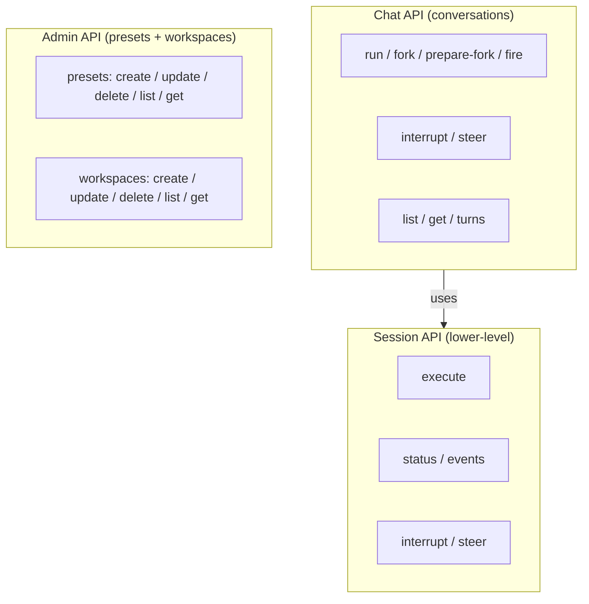
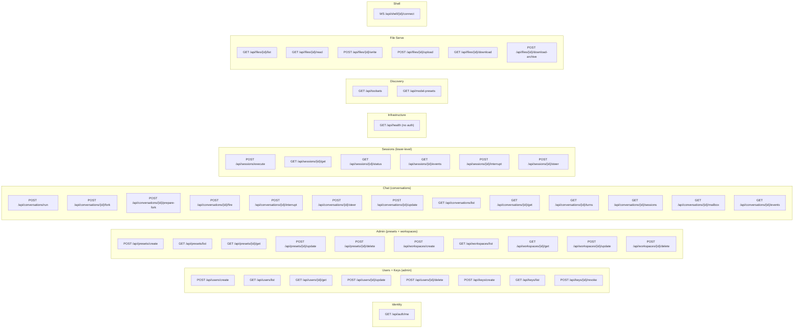

# 07 - API

RPC-style API surface. GET for reads, POST for all writes. All endpoints live under the `/api` prefix. Four tiers: Conversations (chat), Presets (admin), Workspaces (admin), and Sessions (lower-level).

The root path (`/`) serves the built-in web UI (static SPA). API and UI share the same origin with no CORS concerns.

## Authentication

All endpoints require `Authorization: Bearer {token}` header. See [08-multi-tenancy.md](08-multi-tenancy.md) for the full authentication and authorization model (users, API keys, roles).

Summary: API keys resolve to users with `admin` or `user` roles. The `NETHER_AUTH_TOKEN` env var serves as a root admin recovery token. Resource access is scoped by role and ownership.

## API Tiers


```mermaid
flowchart TB
    subgraph Chat["Chat API (conversations)"]
        direction LR
        C1["run / fork / prepare-fork / fire"]
        C2["interrupt / steer"]
        C3["list / get / turns"]
    end

    subgraph Admin["Admin API (presets + workspaces)"]
        direction LR
        A1["presets: create / update / delete / list / get"]
        A2["workspaces: create / update / delete / list / get"]
    end

    subgraph Low["Session API (lower-level)"]
        direction LR
        S1["execute"]
        S2["status / events"]
        S3["interrupt / steer"]
    end

    Chat --> |"uses"| Low
```

- **Chat API**: Conversation-centric operations for IM gateways and chat UIs
- **Admin API**: Preset and workspace management for configuration UIs
- **Session API**: Lower-level building block, used internally and for advanced use cases

## Presets (Admin)

### POST /api/presets/create

Create a new agent preset.

| Field         | Type    | Required | Description                                                                                            |
| ------------- | ------- | -------- | ------------------------------------------------------------------------------------------------------ |
| preset_id     | string  | Yes      | Unique slug identifier                                                                                 |
| name          | string  | Yes      | Display name                                                                                           |
| description   | string? | No       | Description                                                                                            |
| model         | JSON    | Yes      | ModelPreset (name, model_settings_preset, model_settings, model_config_preset, model_config_overrides) |
| system_prompt | string  | Yes      | System prompt (Jinja2 template)                                                                        |
| toolsets      | JSON    | Yes      | list[ToolsetSpec]                                                                                      |
| environment   | JSON?   | No       | EnvironmentSpec (mode, workspace_id/project_ids)                                                       |
| subagents     | JSON?   | No       | SubagentSpec                                                                                           |
| mcp_servers   | JSON?   | No       | list[McpServerSpec] (external MCP server connections)                                                  |
| is_default    | bool    | No       | Set as default preset (default: false)                                                                 |

### GET /api/presets/list

List all presets.

### GET /api/presets/{preset_id}/get

Get a single preset by ID.

### POST /api/presets/{preset_id}/update

Update a preset. Only provided fields are updated.

| Field         | Type    | Required | Description          |
| ------------- | ------- | -------- | -------------------- |
| name          | string? | No       | Update display name  |
| description   | string? | No       | Update description   |
| model         | JSON?   | No       | Update model config  |
| system_prompt | string? | No       | Update system prompt |
| toolsets      | JSON?   | No       | Update toolsets      |
| environment   | JSON?   | No       | Update environment   |
| subagents     | JSON?   | No       | Update subagents     |
| mcp_servers   | JSON?   | No       | Update MCP servers   |
| is_default    | bool?   | No       | Set as default       |

### POST /api/presets/{preset_id}/delete

Delete a preset. Returns 409 if preset is referenced by active conversations.

## Workspaces (Admin)

### POST /api/workspaces/create

Create a named workspace.

| Field        | Type         | Required | Description                          |
| ------------ | ------------ | -------- | ------------------------------------ |
| workspace_id | string       | Yes      | Unique slug identifier               |
| name         | string?      | No       | Display name                         |
| projects     | list[string] | Yes      | Ordered project_ids, first = default |
| metadata     | JSON?        | No       | Client-defined metadata (opaque)     |

Project directories are auto-created under `DATA_ROOT` on first access.

### GET /api/workspaces/list

List workspaces with optional metadata filter.

| Query Param | Type  | Description                                        |
| ----------- | ----- | -------------------------------------------------- |
| metadata    | JSON? | Filter by metadata containment (PG `@>` semantics) |
| limit       | int?  | Page size (default: 50)                            |
| offset      | int?  | Page offset                                        |

### GET /api/workspaces/{workspace_id}/get

Get a single workspace by ID.

### POST /api/workspaces/{workspace_id}/update

Update a workspace.

| Field    | Type          | Required | Description                      |
| -------- | ------------- | -------- | -------------------------------- |
| name     | string?       | No       | Update display name              |
| projects | list[string]? | No       | Update project list              |
| metadata | JSON?         | No       | Merge or replace client metadata |

### POST /api/workspaces/{workspace_id}/delete

Delete a workspace. Does not delete project directories.

## Input Format

Used by `run`, `fork`, `fire`, `execute`, and `steer` endpoints.

Input is a list of content parts (`list[Part]`). Each part has a `type` and optional `mode` to control delivery.

### Part

| Field   | Type    | Required | Description                                                   |
| ------- | ------- | -------- | ------------------------------------------------------------- |
| type    | enum    | Yes      | `text` / `url` / `file` / `binary`                            |
| text    | string  | Cond.    | Text content (type=text)                                      |
| url     | string  | Cond.    | Resource URL (type=url)                                       |
| path    | string  | Cond.    | Project-relative file path (type=file)                        |
| data    | string  | Cond.    | Base64-encoded content (type=binary)                          |
| mime    | string? | No       | MIME type hint (for url/binary)                               |
| storage | enum?   | No       | Storage mode: `ephemeral` (default) / `persistent` / `inline` |

Default storage is `ephemeral` (always safe). Callers opt into `persistent` for files that should survive sessions, or `inline` per-part when they know the model supports it. See [03-execution.md](03-execution.md) for mapping behavior.

## Conversations (Chat)

### POST /api/conversations/run

Main entry point. Create a new conversation or continue an existing one.

| Field             | Type    | Required | Description                                                          |
| ----------------- | ------- | -------- | -------------------------------------------------------------------- |
| conversation_id   | string? | No       | Existing conversation to continue. Null = new conversation           |
| preset_id         | string? | No       | Agent preset. Required for new conversation                          |
| workspace_id      | string? | No       | Workspace reference (mutually exclusive with project_ids)            |
| project_ids       | list?   | No       | Ad-hoc project list (mutually exclusive with workspace_id)           |
| metadata          | JSON?   | No       | Client-defined metadata (new conversation only, ignored on continue) |
| config_override   | JSON?   | No       | Per-request overrides (model, toolsets)                              |
| input             | JSON?   | Cond.    | User input (see Input Format)                                        |
| user_interactions | JSON?   | Cond.    | HITL approval feedback                                               |
| tool_results      | JSON?   | Cond.    | External tool execution results                                      |
| external_tools    | JSON?   | No       | Client-injected callback tools (see External Tools)                  |
| transport         | enum    | No       | `sse` (default) / `stream`                                           |

At least one of `input`, `user_interactions`, `tool_results` must be provided.

| conversation_id | Behavior                                                                |
| --------------- | ----------------------------------------------------------------------- |
| null            | New conversation. `conversation_id = session_id`. `preset_id` required. |
| set             | Continue. Resolves latest committed agent session as parent.            |

**Response (transport=sse)**: SSE event stream.

**Response (transport=stream)**:

```
202 Accepted
{
  session_id: "S1",
  conversation_id: "C1",
  stream_key: "nether:stream:S1"
}
```

**409 Conflict**: Conversation already has a running agent session.

```
{
  error: "conversation_busy",
  active_session: { session_id, stream_key, transport }
}
```

### POST /api/conversations/{conversation_id}/fork

Fork a new conversation from a session in this conversation.

| Field           | Type    | Required | Description                                         |
| --------------- | ------- | -------- | --------------------------------------------------- |
| preset_id       | string  | Yes      | Agent preset                                        |
| input           | JSON    | Yes      | User input (see Input Format)                       |
| from_session_id | string? | No       | Fork point. Default: latest committed session       |
| workspace_id    | string? | No       | Workspace reference (overrides fork-point env)      |
| project_ids     | list?   | No       | Ad-hoc project list (overrides fork-point env)      |
| metadata        | JSON?   | No       | Client-defined metadata for the new conversation    |
| config_override | JSON?   | No       | Per-request overrides                               |
| external_tools  | JSON?   | No       | Client-injected callback tools (see External Tools) |
| transport       | enum    | No       | `sse` (default) / `stream`                          |

Creates a new conversation (`conversation_id = new session_id`).

### POST /api/conversations/{conversation_id}/prepare-fork

Prepare a forked conversation without launching execution. Creates the new conversation with a committed session that copies state from the fork point. The caller can then use `run` on the new conversation to continue.

| Field           | Type    | Required | Description                                      |
| --------------- | ------- | -------- | ------------------------------------------------ |
| from_session_id | string? | No       | Fork point. Default: latest committed session    |
| metadata        | JSON?   | No       | Client-defined metadata for the new conversation |

**Response**:

```json
{
  "conversation_id": "new-conv-id"
}
```

The new conversation inherits the source conversation's `title` (with " (fork)" suffix) and `default_preset_id`. Subsequent `run` calls on the new conversation continue from the copied state.

### POST /api/conversations/{conversation_id}/fire

Drain mailbox and create continuation. See [06-async-agents.md](06-async-agents.md).

| Field             | Type    | Required | Description                                             |
| ----------------- | ------- | -------- | ------------------------------------------------------- |
| preset_id         | string? | No       | Agent preset. Default: conversation's default_preset_id |
| input             | JSON?   | No       | Optional additional user input (see Input Format)       |
| workspace_id      | string? | No       | Workspace reference (overrides current env)             |
| project_ids       | list?   | No       | Ad-hoc project list (overrides current env)             |
| user_interactions | JSON?   | No       | Optional HITL feedback                                  |
| tool_results      | JSON?   | No       | Optional external tool results                          |
| config_override   | JSON?   | No       | Per-request overrides                                   |
| external_tools    | JSON?   | No       | Client-injected callback tools (see External Tools)     |
| transport         | enum    | No       | `stream` (default) / `sse`                              |

Rejects with `422` if mailbox is empty.

### POST /api/conversations/{conversation_id}/interrupt

Interrupt all active sessions in the conversation.

### POST /api/conversations/{conversation_id}/steer

Steer the active agent session. Returns 404 if no active agent session.

| Field | Type | Required | Description    |
| ----- | ---- | -------- | -------------- |
| input | JSON | Yes      | Steering input |

### GET /api/conversations/{conversation_id}/events

Stream-to-SSE bridge for the active agent session. Supports `Last-Event-ID` for resume.

### GET /api/conversations/list

List conversations ordered by last activity.

| Query Param | Type  | Description                                        |
| ----------- | ----- | -------------------------------------------------- |
| status      | enum? | Filter: active / archived                          |
| metadata    | JSON? | Filter by metadata containment (PG `@>` semantics) |
| limit       | int?  | Page size (default: 20)                            |
| offset      | int?  | Page offset                                        |

Metadata query uses JSON containment: `?metadata={"platform":"discord"}` matches any conversation whose metadata contains that key-value pair.

### GET /api/conversations/{conversation_id}/get

Get conversation state: metadata, latest session, active execution, mailbox summary.

```json
{
  "conversation_id": "C1",
  "status": "active",
  "title": "Fix auth tests",
  "default_preset_id": "coding-agent",
  "metadata": {"platform": "discord", "thread_id": "123456"},
  "created_at": "...",
  "updated_at": "...",
  "latest_session": {
    "session_id": "S5",
    "status": "committed",
    "project_ids": ["my-project", "shared-lib"]
  },
  "active_session": {
    "session_id": "S6",
    "stream_key": "nether:stream:S6",
    "transport": "stream"
  },
  "mailbox": {
    "pending_count": 1
  }
}
```

### GET /api/conversations/{conversation_id}/turns

Retrieve display messages across sessions, ordered chronologically.

| Query Param     | Type  | Description                                                      |
| --------------- | ----- | ---------------------------------------------------------------- |
| session_type    | enum? | Filter: agent / async_subagent                                   |
| include_display | bool  | Include compressed display_messages per session (default: false) |
| limit           | int?  | Page size                                                        |
| offset          | int?  | Page offset                                                      |

When `include_display=false` (default), each turn contains `input` and `final_message` from PG only. When `include_display=true`, each turn additionally includes `display_messages` loaded from the State Store -- a compressed AG-UI chunk list that enables full conversation rendering (tool calls, reasoning, etc.).

### GET /api/conversations/{conversation_id}/sessions

List all sessions in a conversation with status.

### GET /api/conversations/{conversation_id}/mailbox

Query mailbox messages with delivery status.

### POST /api/conversations/{conversation_id}/update

Update mutable conversation metadata.

| Field             | Type    | Required | Description                            |
| ----------------- | ------- | -------- | -------------------------------------- |
| title             | string? | No       | Update title                           |
| default_preset_id | string? | No       | Update default preset                  |
| metadata          | JSON?   | No       | Merge into existing metadata (shallow) |
| status            | enum?   | No       | active / archived                      |

Metadata merge semantics: keys with `null` values are removed from existing metadata. Pass top-level `metadata: null` to clear all metadata.

## Sessions

Lower-level session management for advanced use and internal dispatch.

### POST /api/sessions/execute

Direct session execution with explicit parameters. Building block for conversation-level APIs.

| Field             | Type    | Required | Description                            |
| ----------------- | ------- | -------- | -------------------------------------- |
| preset_id         | string  | Yes      | Agent preset                           |
| parent_session_id | string? | No       | Continue or fork from this session     |
| fork              | bool    | No       | If true, start new conversation branch |
| workspace_id      | string? | No       | Workspace reference                    |
| project_ids       | list?   | No       | Ad-hoc project list                    |
| config_override   | JSON?   | No       | Per-request overrides                  |
| external_tools    | JSON?   | No       | Client-injected callback tools         |
| input             | JSON?   | Cond.    | User input (see Input Format)          |
| user_interactions | JSON?   | Cond.    | HITL approval feedback                 |
| tool_results      | JSON?   | Cond.    | External tool results                  |
| transport         | enum    | No       | `sse` (default) / `stream`             |

### GET /api/sessions/{session_id}/get

Returns session index (PG) with display messages and optional SDK state. Session index always includes `input`, `final_message`, and `display_messages`.

| Query Param   | Type | Description                                  |
| ------------- | ---- | -------------------------------------------- |
| include_state | bool | Include full SDK state blob (default: false) |

`display_messages` is loaded from the State Store by default. It contains compressed AG-UI chunk events for full conversation rendering. The field is `null` when display messages were not captured (e.g., failed sessions).

### GET /api/sessions/{session_id}/status

Current execution status. Checks Redis first, falls back to PG.

### GET /api/sessions/{session_id}/events

Stream-to-SSE bridge with `Last-Event-ID` resume support.

### POST /api/sessions/{session_id}/interrupt

Interrupt a running session.

### POST /api/sessions/{session_id}/steer

Send steering input to a running session.

## Health

### GET /api/health

Service health check (no auth required).

```json
{
  "status": "ok",
  "postgres": "connected",
  "redis": "connected"
}
```

## Discovery

Stateless capability-discovery endpoints. No database access; responses reflect the server's built-in registries.

### GET /api/toolsets

List available toolsets and their constituent tools. (Existing endpoint.)

### GET /api/model-presets

List available SDK ModelSettings and ModelConfig presets. Returns preset names, descriptions, and the raw settings dict for each. Enables the UI to present preset options dynamically without hardcoding names.

Response structure:

```json
{
  "model_settings_presets": [
    {
      "name": "anthropic_high",
      "settings": { "max_tokens": 21504, "anthropic_thinking": { "type": "enabled", "budget_tokens": 32768 }, ... }
    },
    ...
  ],
  "model_settings_aliases": {
    "anthropic": "anthropic_default",
    "high": "anthropic_high",
    ...
  },
  "model_config_presets": [
    {
      "name": "claude_200k",
      "config": { "context_window": 200000, "max_images": 20, ... }
    },
    ...
  ],
  "model_config_aliases": {
    "claude": "claude_200k",
    "anthropic": "claude_200k",
    ...
  }
}
```

## File Serve

File browsing, preview, editing, upload, and download for managed project directories. No database involvement -- pure filesystem operations scoped by `project_id`. Full specification in [09-fileserve.md](09-fileserve.md).

### GET /api/files/{project_id}/list

List directory contents (flat, one level).

| Query Param | Type   | Default | Description                      |
| ----------- | ------ | ------- | -------------------------------- |
| path        | string | ""      | Relative path within the project |

### GET /api/files/{project_id}/read

Read text file content with binary detection and size truncation.

| Query Param | Type   | Default    | Description        |
| ----------- | ------ | ---------- | ------------------ |
| path        | string | (required) | Relative file path |
| max_size    | int    | 1048576    | Max bytes to read  |

### POST /api/files/{project_id}/write

Write text content to a file (atomic write, auto-create parent directories).

### POST /api/files/{project_id}/upload

Upload files via multipart form data. Accepts multiple files and a target directory path.

### GET /api/files/{project_id}/download

Download a single file as a streaming response.

| Query Param | Type   | Default    | Description        |
| ----------- | ------ | ---------- | ------------------ |
| path        | string | (required) | Relative file path |

### POST /api/files/{project_id}/download-archive

Package multiple files/directories into a zip archive for download.

## Shell

Interactive terminal access via WebSocket. Spawns a PTY in the project directory, respecting the environment model (local or sandbox/Docker). Full specification in [09-fileserve.md](09-fileserve.md).

### WebSocket /api/shell/{project_id}/connect

Establishes a PTY session. Authentication via query parameter (`?token=...`). Optional `preset_id` query parameter to resolve environment mode (local vs sandbox).

Protocol: binary frames for PTY I/O, JSON text frames for control (resize, exit).

## Endpoint Summary


```mermaid
flowchart LR
    subgraph Identity["Identity"]
        I1["GET /api/auth/me"]
    end

    subgraph UserMgmt["Users + Keys (admin)"]
        U1["POST /api/users/create"]
        U2["GET /api/users/list"]
        U3["GET /api/users/{id}/get"]
        U4["POST /api/users/{id}/update"]
        U5["POST /api/users/{id}/delete"]
        K1["POST /api/keys/create"]
        K2["GET /api/keys/list"]
        K3["POST /api/keys/{id}/revoke"]
    end

    subgraph Admin["Admin (presets + workspaces)"]
        A1["POST /api/presets/create"]
        A2["GET /api/presets/list"]
        A3["GET /api/presets/{id}/get"]
        A4["POST /api/presets/{id}/update"]
        A5["POST /api/presets/{id}/delete"]
        W1["POST /api/workspaces/create"]
        W2["GET /api/workspaces/list"]
        W3["GET /api/workspaces/{id}/get"]
        W4["POST /api/workspaces/{id}/update"]
        W5["POST /api/workspaces/{id}/delete"]
    end

    subgraph Chat["Chat (conversations)"]
        C1["POST /api/conversations/run"]
        C2["POST /api/conversations/{id}/fork"]
        C2b["POST /api/conversations/{id}/prepare-fork"]
        C3["POST /api/conversations/{id}/fire"]
        C4["POST /api/conversations/{id}/interrupt"]
        C5["POST /api/conversations/{id}/steer"]
        C6["POST /api/conversations/{id}/update"]
        C7["GET /api/conversations/list"]
        C8["GET /api/conversations/{id}/get"]
        C9["GET /api/conversations/{id}/turns"]
        C10["GET /api/conversations/{id}/sessions"]
        C11["GET /api/conversations/{id}/mailbox"]
        C12["GET /api/conversations/{id}/events"]
    end

    subgraph Sessions["Sessions (lower-level)"]
        S1["POST /api/sessions/execute"]
        S2["GET /api/sessions/{id}/get"]
        S3["GET /api/sessions/{id}/status"]
        S4["GET /api/sessions/{id}/events"]
        S5["POST /api/sessions/{id}/interrupt"]
        S6["POST /api/sessions/{id}/steer"]
    end

    subgraph Infra["Infrastructure"]
        H1["GET /api/health (no auth)"]
    end

    subgraph Discovery["Discovery"]
        D1["GET /api/toolsets"]
        D2["GET /api/model-presets"]
    end

    subgraph Files["File Serve"]
        F1["GET /api/files/{id}/list"]
        F2["GET /api/files/{id}/read"]
        F3["POST /api/files/{id}/write"]
        F4["POST /api/files/{id}/upload"]
        F5["GET /api/files/{id}/download"]
        F6["POST /api/files/{id}/download-archive"]
    end

    subgraph Shell["Shell"]
        SH1["WS /api/shell/{id}/connect"]
    end
```

| Tier               | Scope                  | Access                    | Description                                     |
| ------------------ | ---------------------- | ------------------------- | ----------------------------------------------- |
| **Identity**       | `/api/auth/*`          | Any authenticated         | Current user info                               |
| **Users**          | `/api/users/*`         | Admin only                | User CRUD                                       |
| **Keys**           | `/api/keys/*`          | Self + Admin              | API key lifecycle                               |
| **Admin**          | `/api/presets/*`       | Admin (write), All (read) | Preset CRUD, configuration management           |
| **Admin**          | `/api/workspaces/*`    | Admin (write), All (read) | Workspace CRUD, project grouping                |
| **Chat**           | `/api/conversations/*` | User-scoped               | Conversation lifecycle, streaming, control      |
| **Sessions**       | `/api/sessions/*`      | User-scoped               | Explicit session DAG control, in-flight control |
| **Infrastructure** | `/api/health`          | No auth                   | Health check                                    |
| **Discovery**      | `/api/toolsets`        | Any authenticated         | Available toolsets and tools                    |
| **Discovery**      | `/api/model-presets`   | Any authenticated         | Available model settings and config presets     |
| **File Serve**     | `/api/files/*`         | Any authenticated         | File browsing, read, write, upload, download    |
| **Shell**          | `/api/shell/*`         | Any authenticated         | Interactive terminal (WebSocket PTY)            |
| **UI**             | `/` (root)             | Browser                   | Built-in web UI (static SPA)                    |
