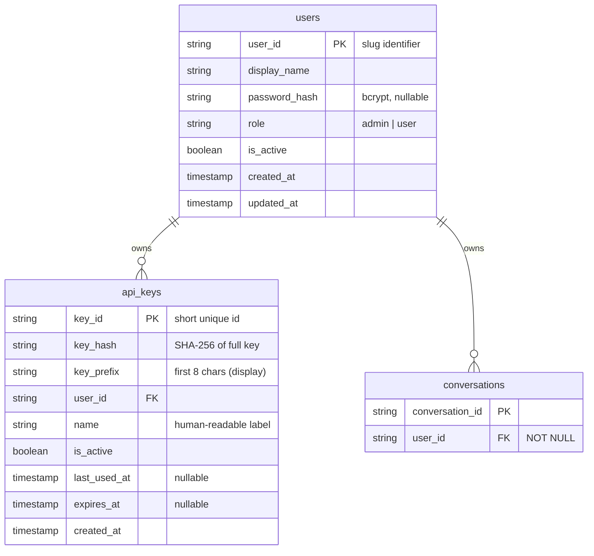
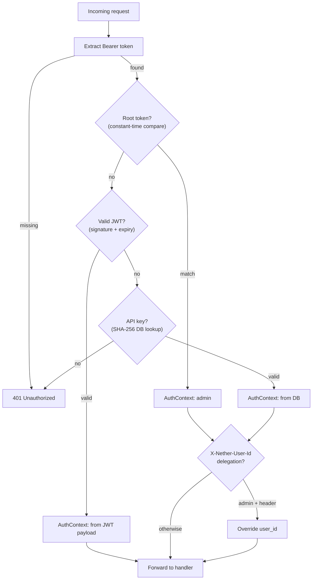
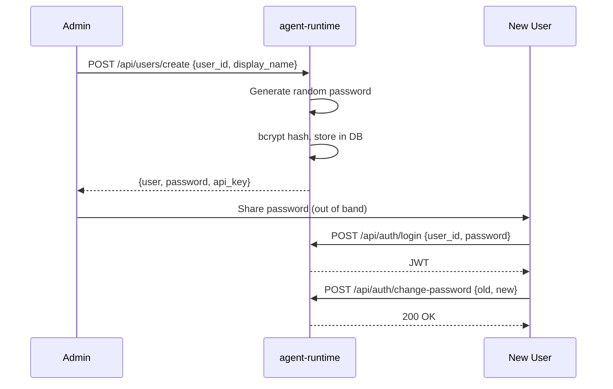
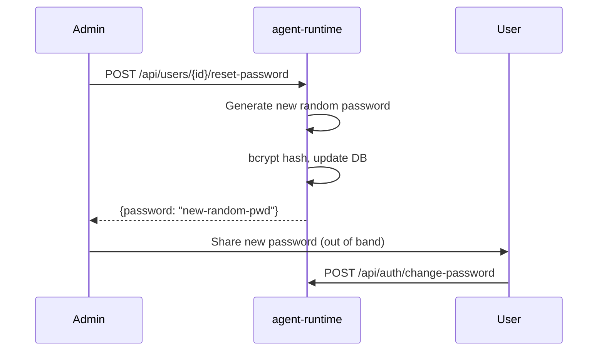
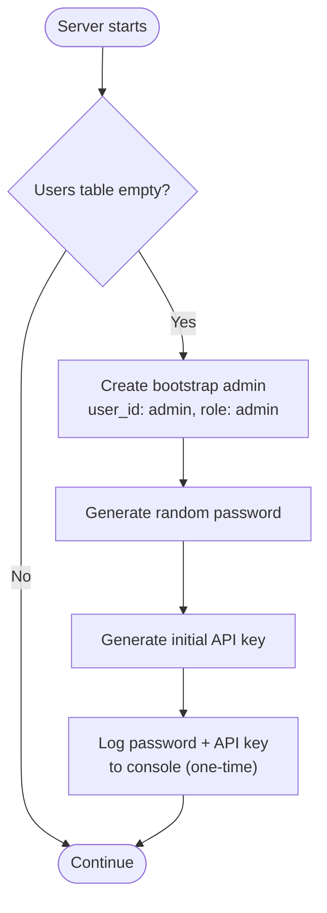

# 08 - Multi-Tenancy

User accounts and authentication for shared homelab deployments. Separates admin (system owner) from regular users (friends, family, teammates) with resource isolation.

## Goals

- Minimal user system: admin and user roles, no complex RBAC
- Password-based login for web UI (family-friendly)
- API key authentication for programmatic access (IM gateways, scripts)
- JWT sessions for stateless web UI authentication
- Conversation isolation between users
- No billing or usage quotas (homelab-first)

## Data Model



### users

| Column        | Type      | Description                                    |
| ------------- | --------- | ---------------------------------------------- |
| user_id       | string PK | Slug identifier (e.g. `alice`, `bob`)          |
| display_name  | string    | Display name for UI                            |
| password_hash | string?   | Bcrypt hash (nullable; no password = key-only) |
| role          | enum      | `admin` or `user`                              |
| is_active     | bool      | Soft-disable (rejected at auth layer)          |
| created_at    | timestamp |                                                |
| updated_at    | timestamp |                                                |

Users with `password_hash = NULL` can only authenticate via API key (service accounts, IM gateways).

### api_keys

| Column       | Type      | Description                                           |
| ------------ | --------- | ----------------------------------------------------- |
| key_id       | string PK | Short identifier for display and revocation           |
| key_hash     | string    | SHA-256 hash of the full API key (indexed for lookup) |
| key_prefix   | string    | First 8 characters of the key (for UI display)        |
| user_id      | string FK | Owner                                                 |
| name         | string    | Human-readable label (e.g. "laptop", "telegram-bot")  |
| is_active    | bool      | Revocation flag                                       |
| last_used_at | timestamp | Updated on each authenticated request (nullable)      |
| expires_at   | timestamp | Optional expiration (nullable = never expires)        |
| created_at   | timestamp |                                                       |

Key format: `nb_{key_id}_{random}` (e.g. `nb_k7x9m2_a3bF...`). The prefix `nb_` makes keys recognizable. The `key_id` segment enables quick visual identification without DB lookup.

### conversations (modified)

Add `user_id` column (FK to users, NOT NULL). All conversations must have an owner. The foreign key has no cascade; users are soft-deleted (deactivated) rather than removed.

## Authentication

Three authentication methods, tried in order by the middleware:



### Token Types

| Token      | Source                    | Stateless? | Purpose                          |
| ---------- | ------------------------- | ---------- | -------------------------------- |
| Root token | `NETHER_AUTH_TOKEN` env   | Yes        | Recovery, bootstrap, CI/CD       |
| JWT        | `POST /api/auth/login`    | Yes        | Web UI sessions                  |
| API key    | Database (api_keys table) | No         | IM gateways, scripts, automation |

### Root Token

Constant-time comparison, no DB lookup. Always maps to `user_id="admin"`, `role=admin`. Guarantees access even when database is corrupted or all credentials are lost.

### JWT

Signed tokens for web UI sessions. Payload:

| Claim   | Type   | Description              |
| ------- | ------ | ------------------------ |
| user_id | string | Authenticated user       |
| role    | string | `admin` or `user`        |
| iat     | int    | Issued-at (Unix seconds) |
| exp     | int    | Expiry (Unix seconds)    |

#### JWT Secret Management

| Priority | Source                         | Description                       |
| -------- | ------------------------------ | --------------------------------- |
| 1        | `NETHER_JWT_SECRET` env var    | Explicit configuration            |
| 2        | `{DATA_ROOT}/.jwt_secret` file | Auto-generated, persisted to disk |

On startup: if env var is set, use it. Otherwise, read from file. If file does not exist, generate a random 32-byte secret, write to file, and use it. This ensures zero-config for homelab while surviving restarts.

#### JWT Expiry

Default: 7 days. Configurable via `NETHER_JWT_EXPIRY_DAYS` env var. Homelab scenario does not need short-lived tokens.

### API Key

SHA-256 hash lookup in the `api_keys` table. Joined with `users` to check `is_active` on both key and user. Updates `last_used_at` on each use (best-effort).

### AuthContext

Every authenticated request carries an `AuthContext` on the request state:

| Field   | Type   | Description                                         |
| ------- | ------ | --------------------------------------------------- |
| user_id | string | Authenticated user                                  |
| role    | enum   | `admin` or `user`                                   |
| key_id  | string | API key id, `"root"` for env token, `"jwt"` for JWT |

### Delegation (Admin Only)

Admin tokens (root or API key) may include an `X-Nether-User-Id` header to act on behalf of another user. The `AuthContext.user_id` is overridden to the target user while `role` remains `admin`. This enables IM gateways to create user-scoped conversations without per-user gateway configuration.

Non-admin callers with this header receive `403 Forbidden`.

## Authorization

### Role Permissions

| Resource      | Admin                         | User                              |
| ------------- | ----------------------------- | --------------------------------- |
| Presets       | Full CRUD                     | Read (list, get)                  |
| Workspaces    | Full CRUD                     | Read (list, get)                  |
| Conversations | All conversations             | Own conversations only            |
| Sessions      | All sessions                  | Own sessions (via conversation)   |
| Users         | Full CRUD + reset-password    | Read/update self, change-password |
| API Keys      | All keys, create for any user | Own keys only                     |
| Toolsets      | Read                          | Read                              |

### Resource Scoping

Conversation-level resources (sessions, mailbox, turns) inherit the conversation's `user_id` scope. A user can only access sessions belonging to their own conversations.

Non-owner access returns `404` (not `403`) to avoid leaking resource existence.

## Password Management

All passwords are server-generated. Users cannot choose their own password during creation.

### Creation Flow



1. Admin creates user -- server generates random password and initial API key
2. Response includes plaintext password and API key (shown once, never stored)
3. Admin copies password and sends to user out of band
4. User logs in, then changes password to something they choose

### Password Reset (Admin)



Admin triggers reset, gets a new random password, shares with user. No "forgot password" self-service (homelab: just ask the admin).

## Bootstrap

### First Startup



1. If `users` table is empty, create bootstrap admin (`user_id: admin`, `role: admin`)
2. Generate random password and initial API key
3. Log both to console (one-time display)
4. If `NETHER_AUTH_TOKEN` is set, it always works as root admin access (no bootstrap credentials needed)

### Recovery

If all credentials are lost, set `NETHER_AUTH_TOKEN` env var and restart. This provides guaranteed admin access to reset passwords or create new API keys.

## API

### Auth

#### POST /api/auth/login

Authenticate with user_id + password. Returns JWT and user profile.

| Field    | Type   | Required | Description   |
| -------- | ------ | -------- | ------------- |
| user_id  | string | Yes      | User ID       |
| password | string | Yes      | User password |

Response:

```json
{
  "token": "eyJhbGciOiJIUzI1NiIs...",
  "user": {
    "user_id": "alice",
    "display_name": "Alice",
    "role": "user",
    "is_active": true
  }
}
```

Returns `401` for invalid credentials. Returns `403` for deactivated accounts.

#### GET /api/auth/me

Return the authenticated user's profile and role. Useful for UI to determine what to render.

#### POST /api/auth/change-password

Self-service password change. Any authenticated user.

| Field        | Type   | Required | Description |
| ------------ | ------ | -------- | ----------- |
| old_password | string | Yes      | Current pwd |
| new_password | string | Yes      | New pwd     |

Returns `401` if old_password is wrong. Returns `422` if new_password fails validation (min length).

### Users (Admin Only)

#### POST /api/users/create

Create a new user. Server generates a random password and initial API key.

| Field        | Type   | Required | Description                       |
| ------------ | ------ | -------- | --------------------------------- |
| user_id      | string | Yes      | Unique slug identifier            |
| display_name | string | Yes      | Display name                      |
| role         | enum   | No       | `admin` or `user` (default: user) |

Response includes plaintext password and API key (shown once):

```json
{
  "user": {
    "user_id": "alice",
    "display_name": "Alice",
    "role": "user",
    "is_active": true,
    "created_at": "..."
  },
  "password": "xK9mP2wL",
  "api_key": {
    "key_id": "k7x9m2",
    "key": "nb_k7x9m2_a3bFcD...",
    "name": "initial"
  }
}
```

#### GET /api/users/list

List all users. Admin only.

#### GET /api/users/{user_id}/get

Get user details. Admin sees any user; user sees only self.

#### POST /api/users/{user_id}/update

Update user properties. Admin only (except self display_name).

| Field        | Type   | Required | Description            |
| ------------ | ------ | -------- | ---------------------- |
| display_name | string | No       | Update display name    |
| role         | enum   | No       | Change role            |
| is_active    | bool   | No       | Enable/disable account |

Deactivating a user (`is_active: false`) immediately invalidates all their sessions and API keys at the auth layer.

#### POST /api/users/{user_id}/deactivate

Soft-delete a user by setting `is_active` to `false`. Conversations are preserved for audit. Admin only. Cannot deactivate self.

#### POST /api/users/{user_id}/reset-password

Generate a new random password for a user. Admin only.

Response includes the new plaintext password (shown once):

```json
{
  "user_id": "alice",
  "password": "nW3kR8pJ"
}
```

### API Keys

#### POST /api/keys/create

Create a new API key. Users create keys for themselves; admins can specify `user_id`.

| Field           | Type   | Required | Description                             |
| --------------- | ------ | -------- | --------------------------------------- |
| name            | string | Yes      | Human-readable label                    |
| user_id         | string | No       | Target user (admin only, default: self) |
| expires_in_days | int    | No       | Days until expiration (default: never)  |

Response includes the full API key in plaintext (only time it is visible).

#### GET /api/keys/list

List API keys (metadata only, never the full key). Users see own keys; admins see all (or filter by `user_id` query param).

#### POST /api/keys/{key_id}/revoke

Revoke an API key. Users can revoke own keys; admins can revoke any key. Revocation is immediate and permanent.

## IM Gateway Integration

The IM gateway authenticates with a single API key (typically belonging to an admin or a dedicated service user). To create conversations scoped to individual IM users:

**Option A -- Admin delegation** (recommended): Gateway uses an admin API key with `X-Nether-User-Id` header. Each IM user maps to a Netherbrain user. Admin pre-creates user accounts for IM users or auto-provisions them.

**Option B -- Shared account**: Gateway uses a single user account. All IM conversations belong to that account, differentiated by conversation metadata (`platform`, `im_user_id`). Simpler but no per-user isolation.

## Settings

| Setting             | Env Var                  | Default   | Description                |
| ------------------- | ------------------------ | --------- | -------------------------- |
| JWT secret          | `NETHER_JWT_SECRET`      | Auto-file | Signing key for JWT tokens |
| JWT expiry (days)   | `NETHER_JWT_EXPIRY_DAYS` | `7`       | Token lifetime             |
| Root admin token    | `NETHER_AUTH_TOKEN`      | None      | Recovery/bootstrap access  |
| Min password length | --                       | `8`       | Hardcoded minimum          |

## Endpoint Summary

| Tier         | Scope                  | Access                      | Description               |
| ------------ | ---------------------- | --------------------------- | ------------------------- |
| **Auth**     | `/api/auth/*`          | Public (login) / Any authed | Login, identity, password |
| **Users**    | `/api/users/*`         | Admin only                  | User CRUD, password reset |
| **Keys**     | `/api/keys/*`          | Self + Admin                | API key lifecycle         |
| **Admin**    | `/api/presets/*`       | Admin (write), All (read)   | Preset management         |
| **Admin**    | `/api/workspaces/*`    | Admin (write), All (read)   | Workspace management      |
| **Chat**     | `/api/conversations/*` | User-scoped                 | Conversation lifecycle    |
| **Sessions** | `/api/sessions/*`      | User-scoped                 | Session control           |
