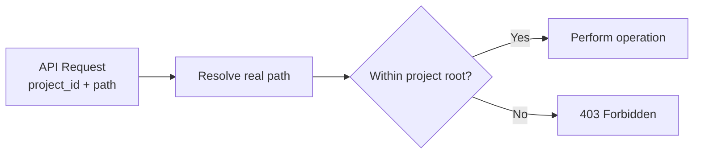
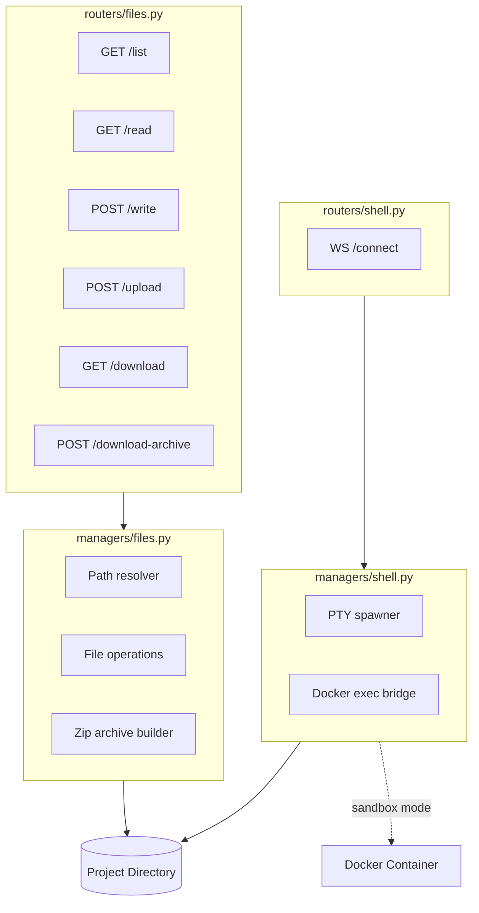
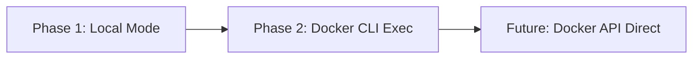

# 09 - File Serve

HTTP file access and shell access for managed project directories. Provides browsing, preview, text editing, upload, download, and interactive terminal capabilities.

## Motivation

Agent sessions produce and modify files in project directories. Users need a way to browse, inspect, edit, upload, and retrieve these files without SSH or direct filesystem access. An interactive shell further enables quick manual operations. This is especially important for homelab deployments where the runtime may be the only access point.

## Scope

| In Scope                          | Out of Scope                          |
| --------------------------------- | ------------------------------------- |
| List directory contents           | Real-time file watching / live reload |
| Read text file content            | Version history / diff                |
| Write (save) text files           | Rename / move / delete (phase 2)      |
| Upload files                      |                                       |
| Single file download              |                                       |
| Batch download (zip archive)      |                                       |
| Interactive shell (WebSocket PTY) |                                       |
| Manual refresh                    |                                       |

## Security Model

- All file operations are scoped to a single `project_id`
- Paths are resolved relative to the project root: `{DATA_ROOT}/{DATA_PREFIX}/projects/{project_id}/`
- Path traversal is blocked: any resolved path outside the project root returns 403
- Symlinks pointing outside the project root are rejected
- Shell sessions are scoped to the project's default directory (no escape to arbitrary host paths)
- Authentication reuses the existing bearer token middleware (HTTP and WebSocket)
- Authorization: all authenticated users can access files and shell (no per-project ACL for now)



## File API

All endpoints live under `/api/files/{project_id}`. The `project_id` maps to the managed directory. If the project directory does not exist, endpoints return 404.

### GET /api/files/{project_id}/list

List directory contents. Returns flat entries for the requested directory.

| Query Param | Type   | Default | Description                                             |
| ----------- | ------ | ------- | ------------------------------------------------------- |
| path        | string | ""      | Relative path within the project (empty = project root) |

Response:

```json
{
  "project_id": "my-project",
  "path": "src",
  "entries": [
    {
      "name": "main.py",
      "path": "src/main.py",
      "type": "file",
      "size": 1234,
      "modified": "2025-01-15T10:30:00Z"
    },
    {
      "name": "utils",
      "path": "src/utils",
      "type": "directory",
      "modified": "2025-01-15T09:00:00Z"
    }
  ]
}
```

Entries are sorted: directories first (alphabetical), then files (alphabetical).

### GET /api/files/{project_id}/read

Read text file content. Intended for preview and editing.

| Query Param | Type   | Default    | Description                      |
| ----------- | ------ | ---------- | -------------------------------- |
| path        | string | (required) | Relative file path               |
| max_size    | int    | 1048576    | Max bytes to read (default 1 MB) |

Response:

```json
{
  "project_id": "my-project",
  "path": "src/main.py",
  "content": "import sys\n...",
  "size": 1234,
  "modified": "2025-01-15T10:30:00Z",
  "truncated": false,
  "encoding": "utf-8"
}
```

Returns 422 if the file appears to be binary (contains null bytes in the first 8 KB). Returns 413 if file exceeds `max_size` (with `truncated: true` and partial content up to the limit).

### POST /api/files/{project_id}/write

Write text content to an existing file or create a new file.

Request body:

```json
{
  "path": "src/main.py",
  "content": "import sys\n..."
}
```

Response:

```json
{
  "project_id": "my-project",
  "path": "src/main.py",
  "size": 1234,
  "modified": "2025-01-15T10:30:00Z"
}
```

Parent directories are auto-created. Write is atomic (write to temp file, then rename).

### POST /api/files/{project_id}/upload

Upload one or more files via multipart form data.

| Form Field | Type   | Description                                |
| ---------- | ------ | ------------------------------------------ |
| path       | string | Target directory (relative, default: root) |
| files      | File[] | One or more files to upload                |

Each uploaded file is saved to `{project_root}/{path}/{filename}`. Parent directories are auto-created. Existing files with the same name are overwritten.

Response:

```json
{
  "project_id": "my-project",
  "uploaded": [
    {"path": "data/input.csv", "size": 45678},
    {"path": "data/config.yaml", "size": 234}
  ]
}
```

Size guard: individual file limit (default 100 MB), total request limit (default 500 MB).

### GET /api/files/{project_id}/download

Download a single file. Returns the raw file with appropriate `Content-Type` and `Content-Disposition: attachment` headers.

| Query Param | Type   | Default    | Description        |
| ----------- | ------ | ---------- | ------------------ |
| path        | string | (required) | Relative file path |

Returns the file as a streaming response. MIME type is guessed from the file extension.

### POST /api/files/{project_id}/download-archive

Package multiple files into a zip archive for download.

Request body:

```json
{
  "paths": ["src/main.py", "src/utils/", "README.md"]
}
```

If a path points to a directory, all files within it are included recursively. The zip preserves relative path structure.

Response: streaming `application/zip` with `Content-Disposition: attachment; filename="{project_id}.zip"`.

Size guard: the endpoint calculates total uncompressed size before archiving. If it exceeds a threshold (default 500 MB), returns 413.

## Shell API

Interactive shell access via WebSocket. Connects to the project's default directory with environment-aware execution (local host or Docker container).

### WebSocket /api/shell/{project_id}/connect

Establishes a PTY session in the project directory.

Authentication: token passed as query parameter (`?token=...`) since WebSocket does not support custom headers in browsers.

#### Environment Modes

The shell respects the same environment model as agent execution:

| Mode    | Shell Target                     | Working Directory                                  |
| ------- | -------------------------------- | -------------------------------------------------- |
| local   | Host PTY (bash/sh)               | `{DATA_ROOT}/{DATA_PREFIX}/projects/{project_id}/` |
| sandbox | `docker exec -it {container_id}` | `{container_workdir}/{project_id}/`                |

In local mode, the shell process is restricted to the project directory as its initial cwd. The user can `cd` freely (shell is interactive, not sandboxed beyond initial cwd).

In sandbox mode, the runtime executes `docker exec -it {container_id} /bin/sh -c "cd {workdir} && exec $SHELL"`. The container provides the sandboxing boundary.

#### Protocol

Binary WebSocket frames carrying raw PTY I/O, plus JSON control frames:

| Direction        | Type        | Payload                                      |
| ---------------- | ----------- | -------------------------------------------- |
| Client -> Server | binary      | Terminal input (keystrokes)                  |
| Server -> Client | binary      | Terminal output                              |
| Client -> Server | text (JSON) | `{"type": "resize", "cols": 80, "rows": 24}` |
| Server -> Client | text (JSON) | `{"type": "exit", "code": 0}`                |

#### Lifecycle

1. Client opens WebSocket with auth token
2. Server resolves project path, spawns PTY process
3. Bidirectional I/O until process exits or client disconnects
4. Server sends exit frame, closes WebSocket

#### Environment Resolution

The shell needs to know the environment mode and container_id. Since these are configured per-preset (via EnvironmentSpec), the shell endpoint accepts an optional `preset_id` query parameter to resolve the environment:

| Query Param | Type    | Default    | Description                        |
| ----------- | ------- | ---------- | ---------------------------------- |
| token       | string  | (required) | Auth token                         |
| preset_id   | string? | null       | Preset to resolve environment from |

If `preset_id` is not provided, local mode is used. If provided, the endpoint reads the preset's `environment` config to determine mode and container_id.

## Architecture



### Path Resolver

Central security component. Used by all file operations.

```
resolve(project_id, relative_path) -> real_path

1. base = Path(DATA_ROOT) / DATA_PREFIX / "projects" / project_id
2. Verify base exists (404 if not)
3. target = (base / relative_path).resolve()
4. Verify target starts with base.resolve() (403 if not)
5. Verify target is not a symlink escaping base (403 if so)
6. Return target
```

### Layering

Follows the existing three-layer pattern:

- **Router** (`routers/files.py`, `routers/shell.py`): Parse params, call manager, translate exceptions
- **Manager** (`managers/files.py`): Path resolution, file I/O, archive generation. Raises `LookupError` (-> 404), `PermissionError` (-> 403), `ValueError` (-> 422)
- **Manager** (`managers/shell.py`): PTY lifecycle, Docker exec bridge. Stateless per-connection.

No database involvement for file operations. Shell may read preset config from DB (for environment resolution).

## Shell Implementation Notes

Technical decisions recorded during design review.

### PTY Backend

Use `os.openpty()` + `subprocess.Popen` for real PTY support. `asyncio.create_subprocess_exec` only provides pipes (no TTY), which breaks `isatty()` checks in programs like vim, htop, etc.

Async I/O on the master fd uses `loop.add_reader()` (Linux epoll). This is the same approach used by JupyterLab's terminado. No extra threads, scales to many concurrent sessions with just fd watchers.

Process exit is detected via `os.read(master_fd)` returning `OSError(EIO)` or empty bytes (all slave fd holders exited), followed by `os.waitpid()` for the exit code.

Resize uses `fcntl.ioctl(master_fd, termios.TIOCSWINSZ, struct.pack(...))`. The kernel automatically sends SIGWINCH to the foreground process group.

### Phased Delivery



**Phase 1** (local mode): PTY spawns `/bin/bash` (or `$SHELL`) in the project directory. Linux only. Global connection limit (max 10 concurrent shells). Cleanup via app lifespan shutdown hook.

**Phase 2** (Docker CLI exec): Same PTY mechanism, spawn command changes to `docker exec -it {container_id} /bin/sh -c "cd {workdir} && exec $SHELL"`. Requires Docker CLI binary in the Netherbrain image (`COPY --from=docker:27-cli`) and Docker socket mount. No new code paths in the PTY manager -- just a different command.

**Future** (Docker API direct): Replace CLI shelling-out with raw Docker Engine API via Unix socket. Eliminates Docker CLI dependency. Uses HTTP 101 hijack for attach stream (not WebSocket). Only pursued if CLI approach reveals practical issues.

### Manager Interface

The manager exposes a `PtyProcess` class implementing an async context manager:

- `read() -> bytes` via `loop.add_reader()`
- `write(data: bytes)` via `os.write(master_fd)`
- `resize(cols, rows)` via ioctl
- `close() -> exit_code` with SIGHUP -> waitpid -> SIGKILL fallback
- `__del__` safety net for fd cleanup

A global `ShellRegistry` (similar to `SessionRegistry`) tracks active shells for connection limiting and shutdown cleanup.

### Security

Shell is interactive and not sandboxed beyond the initial working directory. This is by design for the homelab use case where authenticated users are administrators. Mitigations: authentication required (existing middleware), connection count limit, audit logging.
