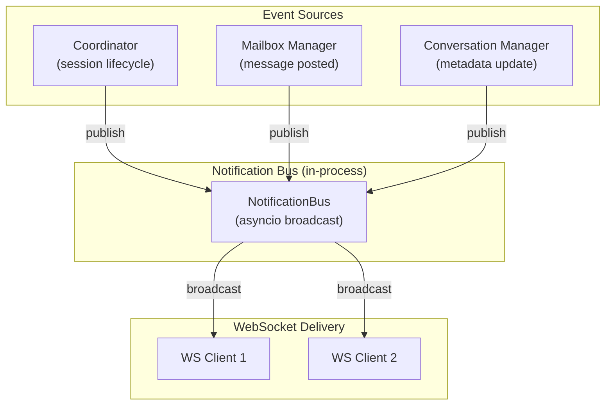
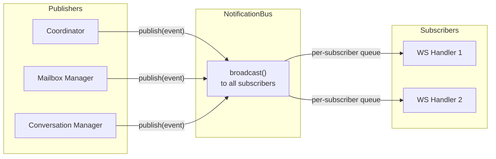
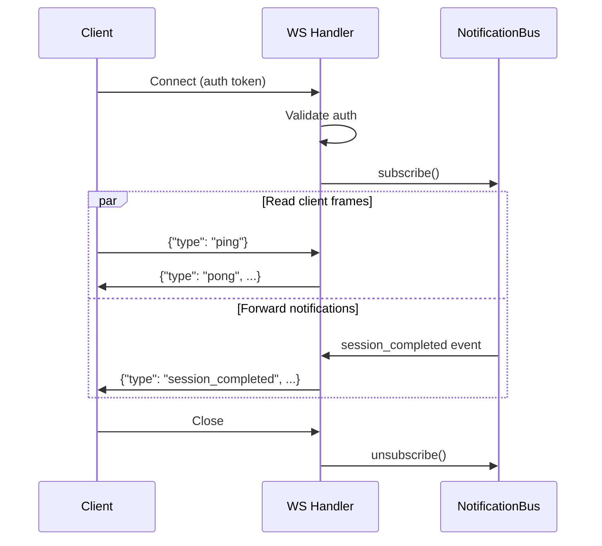

# 10 - Notifications

Real-time notification WebSocket for frontend clients. Lightweight push channel for state changes -- separate from the AG-UI event stream used for execution streaming.

## Motivation

The AG-UI SSE/Redis stream delivers fine-grained execution events (token deltas, tool calls) for a single active session. But the frontend also needs awareness of background activity:

- Async subagent sessions completing (mailbox updates)
- Session status transitions visible in the conversation list
- Conversation metadata changes (auto-title, status)

Without a push channel, the frontend must poll. A single WebSocket per client replaces all polling with instant notifications.

## Architecture



### Separation from AG-UI Streaming

| Aspect      | AG-UI Stream (04)              | Notification WS (this spec)       |
| ----------- | ------------------------------ | --------------------------------- |
| Scope       | Single session                 | All conversations                 |
| Content     | Token deltas, tool args, usage | State change summaries            |
| Granularity | Fine (per-token)               | Coarse (per-event)                |
| Transport   | SSE or Redis Stream            | WebSocket                         |
| Lifecycle   | Tied to session execution      | Tied to client connection         |
| Purpose     | Render streaming output        | Trigger UI updates (list, badges) |

## Endpoint

### WebSocket /api/notifications

Single connection per client. No subscription management -- all conversation activity is broadcast to every connected client.

```
ws://host:port/api/notifications?token={auth_token}
```

Authentication via query parameter, same as the shell WebSocket: validated against the three-method auth chain (root token, JWT, API key). Connection rejected with 403 if invalid.

## Protocol

JSON text frames in both directions. Each frame is a JSON object with a `type` field.

### Client -> Server

#### ping

Client keepalive. Server responds with `pong`.

```json
{ "type": "ping" }
```

Unknown command types are ignored with a warning log.

### Server -> Client

All notifications include `type`, `conversation_id`, and `timestamp`.

#### session_started

A new session began executing.

```json
{
  "type": "session_started",
  "conversation_id": "C1",
  "session_id": "S5",
  "session_type": "agent",
  "transport": "sse",
  "timestamp": "2026-03-22T13:00:00Z"
}
```

#### session_completed

A session committed successfully.

```json
{
  "type": "session_completed",
  "conversation_id": "C1",
  "session_id": "S5",
  "session_type": "agent",
  "final_message_preview": "Here is the analysis...",
  "timestamp": "2026-03-22T13:01:00Z"
}
```

#### session_failed

A session failed.

```json
{
  "type": "session_failed",
  "conversation_id": "C1",
  "session_id": "S5",
  "session_type": "async_subagent",
  "error": "Model returned empty response",
  "timestamp": "2026-03-22T13:01:00Z"
}
```

#### mailbox_updated

A new message was posted to a conversation mailbox.

```json
{
  "type": "mailbox_updated",
  "conversation_id": "C1",
  "message_id": "M1",
  "source_session_id": "S3",
  "source_type": "subagent_result",
  "subagent_name": "researcher",
  "pending_count": 2,
  "timestamp": "2026-03-22T13:01:30Z"
}
```

`pending_count` is the total undelivered messages after this post, enabling badge counts in the UI.

#### conversation_updated

Conversation metadata changed (title, status, default_preset_id).

```json
{
  "type": "conversation_updated",
  "conversation_id": "C1",
  "changes": ["title"],
  "timestamp": "2026-03-22T13:02:00Z"
}
```

`changes` lists which fields were modified so the client can decide whether to re-fetch.

#### pong

Response to client `ping`.

```json
{
  "type": "pong",
  "timestamp": "2026-03-22T13:00:00Z"
}
```

#### error

Protocol-level error. Non-fatal -- the connection stays open.

```json
{
  "type": "error",
  "message": "Invalid frame format",
  "timestamp": "2026-03-22T13:00:00Z"
}
```

## Notification Bus

In-process asyncio broadcast. No external dependencies required for the single-instance architecture. Redis Pub/Sub can be added later for multi-instance scaling.



### Interface

| Method      | Description                                                |
| ----------- | ---------------------------------------------------------- |
| subscribe   | Register a subscriber, returns an async iterator of events |
| unsubscribe | Remove a subscriber                                        |
| publish     | Broadcast a notification to all subscribers                |

Each subscriber gets its own bounded `asyncio.Queue`. On publish, the bus puts the event into every subscriber queue. If a queue is full (slow consumer), the oldest event is dropped with a warning.

### Integration Points

| Source               | Notification         | Trigger                                     |
| -------------------- | -------------------- | ------------------------------------------- |
| Coordinator          | session_started      | After session is registered in registry     |
| Coordinator          | session_completed    | After session commit succeeds               |
| Coordinator          | session_failed       | After session failure is recorded           |
| Mailbox Manager      | mailbox_updated      | After `post_message` inserts a row          |
| Conversation Manager | conversation_updated | After `update_conversation` modifies fields |

Publishers import the bus via FastAPI dependency injection (same pattern as SessionRegistry). The bus is initialized in `app.py` lifespan and stored on `app.state`.

## WebSocket Handler



The handler maintains two concurrent tasks:

1. **Reader**: Receives client frames (ping, future commands). Responds to ping with pong.
2. **Writer**: Reads from the bus subscription queue, serializes events as JSON, sends to client.

### Connection Lifecycle

- Connection rejected immediately on auth failure (403).
- On disconnect, the handler unsubscribes from the bus and cleans up.
- Server tolerates unknown command types (ignores with warning log).
- No automatic reconnection logic server-side; the client handles reconnection.

## Failure Handling

| Scenario           | Behavior                                         |
| ------------------ | ------------------------------------------------ |
| Client disconnects | Handler unsubscribes, resources freed            |
| Slow consumer      | Oldest events dropped from per-subscriber queue  |
| No subscribers     | Publish is a no-op                               |
| Auth token revoked | Next ping triggers close with 4401 code          |
| Server shutdown    | All WS connections closed with 1001 (going away) |

## Project Structure

```
agent_runtime/
  notifications/
    bus.py          # NotificationBus (asyncio broadcast, subscribe/publish)
    events.py       # Notification event dataclasses
    handler.py      # WebSocket connection handler (reader + writer tasks)
  routers/
    notifications.py  # WebSocket endpoint mount
  deps.py           # Add NotificationBus dependency
```
