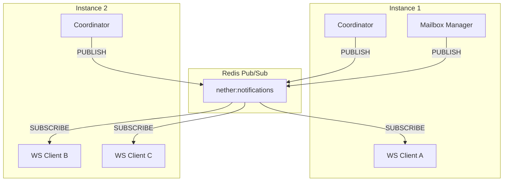
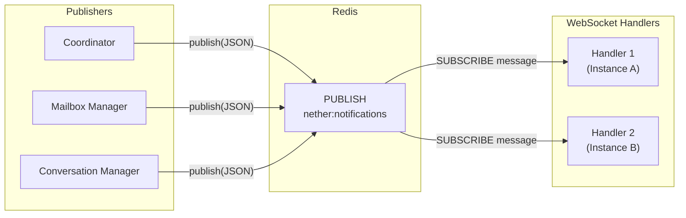
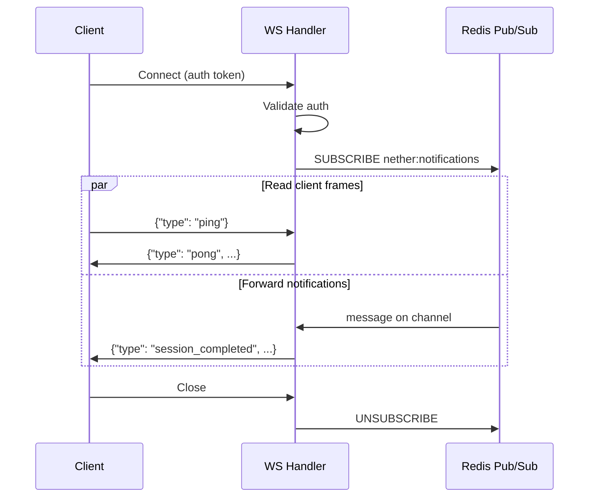

# 10 - Notifications

Real-time notification WebSocket for frontend clients. Lightweight push channel for state changes -- separate from the AG-UI event stream used for execution streaming.

## Motivation

The AG-UI SSE/Redis stream delivers fine-grained execution events (token deltas, tool calls) for a single active session. But the frontend also needs awareness of background activity:

- Async subagent sessions completing (mailbox updates)
- Session status transitions visible in the conversation list
- Conversation metadata changes (auto-title, status)

Without a push channel, the frontend must poll. A single WebSocket per client replaces all polling with instant notifications.

## Architecture



Notifications flow through Redis Pub/Sub, making the system multi-instance safe. Any instance can publish; all WebSocket handlers on all instances receive the notification. Redis Pub/Sub is fire-and-forget -- no persistence, no replay -- which matches notification semantics (transient signals, not durable state).

### Separation from AG-UI Streaming

| Aspect      | AG-UI Stream (04)              | Notification WS (this spec)       |
| ----------- | ------------------------------ | --------------------------------- |
| Scope       | Single session                 | All conversations                 |
| Content     | Token deltas, tool args, usage | State change summaries            |
| Granularity | Fine (per-token)               | Coarse (per-event)                |
| Transport   | SSE or Redis Stream            | WebSocket via Redis Pub/Sub       |
| Lifecycle   | Tied to session execution      | Tied to client connection         |
| Persistence | Stream (short TTL)             | None (fire-and-forget)            |
| Purpose     | Render streaming output        | Trigger UI updates (list, badges) |

### Relationship to Redis Streams

Redis Streams (`nether:stream:{session_id}`) deliver ordered, replayable AG-UI events for a single session. Redis Pub/Sub (`nether:notifications`) broadcasts ephemeral notifications across all instances. Different Redis primitives for different purposes -- no overlap.

## Endpoint

### WebSocket /api/notifications

Single connection per client. No subscription management -- all conversation activity is broadcast to every connected client.

```
ws://host:port/api/notifications?token={auth_token}
```

Authentication via query parameter, same as the shell WebSocket: validated against the three-method auth chain (root token, JWT, API key). Connection rejected with 403 if invalid.

## Protocol

JSON text frames in both directions. Each frame is a JSON object with a `type` field.

### Client -> Server

#### ping

Client keepalive. Server responds with `pong`.

```json
{ "type": "ping" }
```

Unknown command types are ignored with a warning log.

### Server -> Client

All notifications include `type`, `conversation_id`, and `timestamp`.

#### session_started

A new session began executing.

```json
{
  "type": "session_started",
  "conversation_id": "C1",
  "session_id": "S5",
  "session_type": "agent",
  "transport": "sse",
  "timestamp": "2026-03-22T13:00:00Z"
}
```

#### session_completed

A session committed successfully.

```json
{
  "type": "session_completed",
  "conversation_id": "C1",
  "session_id": "S5",
  "session_type": "agent",
  "final_message_preview": "Here is the analysis...",
  "timestamp": "2026-03-22T13:01:00Z"
}
```

#### session_failed

A session failed.

```json
{
  "type": "session_failed",
  "conversation_id": "C1",
  "session_id": "S5",
  "session_type": "async_subagent",
  "error": "Model returned empty response",
  "timestamp": "2026-03-22T13:01:00Z"
}
```

#### mailbox_updated

A new message was posted to a conversation mailbox.

```json
{
  "type": "mailbox_updated",
  "conversation_id": "C1",
  "message_id": "M1",
  "source_session_id": "S3",
  "source_type": "subagent_result",
  "subagent_name": "researcher",
  "pending_count": 2,
  "timestamp": "2026-03-22T13:01:30Z"
}
```

`pending_count` is the total undelivered messages after this post, enabling badge counts in the UI.

#### conversation_updated

Conversation metadata changed (title, status, default_preset_id).

```json
{
  "type": "conversation_updated",
  "conversation_id": "C1",
  "changes": ["title"],
  "timestamp": "2026-03-22T13:02:00Z"
}
```

`changes` lists which fields were modified so the client can decide whether to re-fetch.

#### pong

Response to client `ping`.

```json
{
  "type": "pong",
  "timestamp": "2026-03-22T13:00:00Z"
}
```

#### error

Protocol-level error. Non-fatal -- the connection stays open.

```json
{
  "type": "error",
  "message": "Invalid frame format",
  "timestamp": "2026-03-22T13:00:00Z"
}
```

## Notification Bus (Redis Pub/Sub)

All notifications flow through a single Redis Pub/Sub channel: `nether:notifications`.



### Publish

Publishers serialize the notification event as JSON and call `PUBLISH nether:notifications {json}`. This is a single async Redis call -- no waiting for subscribers, no delivery guarantees. If no one is listening, the message is silently dropped.

All Redis keys use the `nether:` application prefix, consistent with stream keys (`nether:stream:{session_id}`).

### Subscribe

Each WebSocket handler creates a dedicated Redis Pub/Sub subscription on connect and tears it down on disconnect. The handler reads messages from the subscription in a loop and forwards them to the WebSocket client.

### Integration Points

| Source               | Notification         | Trigger                                     |
| -------------------- | -------------------- | ------------------------------------------- |
| Coordinator          | session_started      | After session is registered in registry     |
| Coordinator          | session_completed    | After session commit succeeds               |
| Coordinator          | session_failed       | After session failure is recorded           |
| Mailbox Manager      | mailbox_updated      | After `post_message` inserts a row          |
| Conversation Manager | conversation_updated | After `update_conversation` modifies fields |

Publishers use the shared Redis client from FastAPI dependency injection (same `redis.asyncio` client used elsewhere). No new singleton needed -- just a `publish_notification(redis, event)` helper function.

## WebSocket Handler



The handler maintains two concurrent tasks:

1. **Reader**: Receives client frames (ping). Responds to ping with pong.
2. **Writer**: Reads from the Redis Pub/Sub subscription, forwards messages as WebSocket text frames.

### Redis Pub/Sub Connection

Each WebSocket handler needs its own Redis Pub/Sub connection because `redis-py`'s Pub/Sub operates in a dedicated mode -- a connection in subscribe mode cannot execute other commands. The handler creates a new `redis.asyncio.client.PubSub` instance from the shared Redis client pool on connect and closes it on disconnect.

### Connection Lifecycle

- Connection rejected immediately on auth failure (403).
- On disconnect, the handler unsubscribes and closes the Pub/Sub connection.
- Server tolerates unknown command types (ignores with warning log).
- No automatic reconnection logic server-side; the client handles reconnection.

## Failure Handling

| Scenario             | Behavior                                         |
| -------------------- | ------------------------------------------------ |
| Client disconnects   | Handler unsubscribes, Pub/Sub connection closed  |
| Redis unavailable    | Publish is best-effort (log warning, continue)   |
| Redis reconnects     | Pub/Sub auto-resubscribes (redis-py built-in)    |
| No WebSocket clients | Publish is a no-op (Redis drops unheard msgs)    |
| Server shutdown      | All WS connections closed with 1001 (going away) |

## Project Structure

```
agent_runtime/
  notifications/
    events.py       # Notification event dataclasses + JSON serialization
    publish.py      # publish_notification(redis, event) helper
    handler.py      # WebSocket connection handler (reader + writer tasks)
  routers/
    notifications.py  # WebSocket endpoint mount
```
