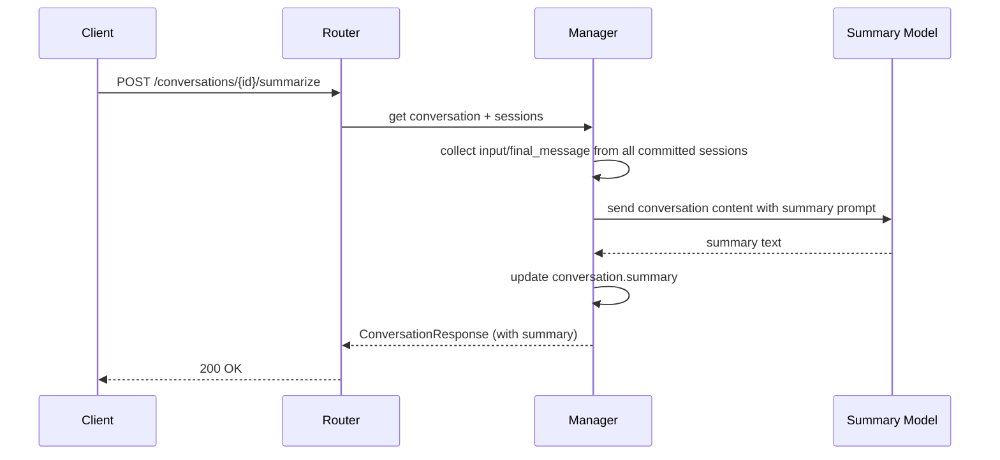
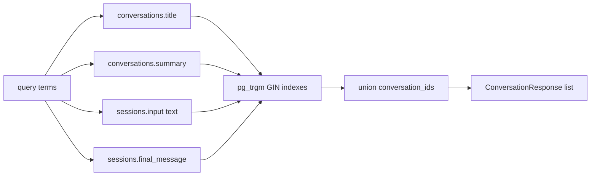

# 11 - Conversation Summary and Search

Adds two capabilities: LLM-powered conversation summarization and keyword-based search across conversation history.

## Motivation

- **Title**: Currently derived from the first 50 characters of the first text input. Not descriptive for long or multi-turn conversations.
- **Search**: Client-side title filtering only. No ability to search message content or recall past context.
- **Agent recall**: No way for a running agent to search the user's conversation history for context.

## Summary

### Data Model

New field on the `conversations` table:

| Column  | Type | Default | Description                        |
| ------- | ---- | ------- | ---------------------------------- |
| summary | TEXT | NULL    | LLM-generated conversation summary |

The `summary` field is updated on demand (user-triggered or API call), not automatically after every session. This avoids unnecessary LLM calls and keeps costs predictable.

### Model Configuration

Follow the `image_understanding_model` pattern from `ToolConfigSpec` -- a dedicated model name + settings pair, configured at the **service level** (NetherSettings) since summarization is an operational concern independent of any specific preset.

New settings:

| Env Var                       | Type    | Default | Description                                 |
| ----------------------------- | ------- | ------- | ------------------------------------------- |
| NETHER_SUMMARY_MODEL          | string? | null    | Provider-qualified model name for summaries |
| NETHER_SUMMARY_MODEL_SETTINGS | JSON?   | null    | ModelSettings overrides (JSON string)       |

When `NETHER_SUMMARY_MODEL` is not set, the summarize endpoint returns `501 Not Implemented`. This makes summary an opt-in feature that requires explicit model configuration.

The per-request body can override the model for one-off use:

```
POST /api/conversations/{id}/summarize
{
  "model": "openai:gpt-4.1-mini",          // optional override
  "model_settings": { "temperature": 0.3 }  // optional override
}
```

Resolution order: request body -> NetherSettings -> 501.

### Summarize Endpoint

```
POST /api/conversations/{conversation_id}/summarize
```

| Field          | Type    | Required | Description             |
| -------------- | ------- | -------- | ----------------------- |
| model          | string? | No       | Override summary model  |
| model_settings | JSON?   | No       | Override model settings |

**Flow**:



**Content collection and size handling**:

Collect all committed sessions' input text and final_message in chronological order. The total content may exceed model context limits for long-running conversations.

Size budget: **128 KB** of raw text (configurable constant). When content exceeds the budget:

1. Always include the **first session** (captures the original intent).
2. Always include the **last N sessions** (captures recent context).
3. Fill remaining budget from the middle, newest-first.
4. Insert a `[... N sessions omitted ...]` marker where content was dropped.

This ensures the summary model sees both the conversation origin and the most recent activity, which are the most informative for generating a good summary.

**Summary prompt construction**: Prepend a system instruction asking for a concise summary (under 200 characters, capturing the main topic and outcome). The prompt is kept simple and non-configurable initially.

**Responses**:

- `200`: Summary generated and stored. Returns updated `ConversationResponse`.
- `404`: Conversation not found.
- `422`: Conversation has no committed sessions (nothing to summarize).
- `501`: No summary model configured (neither in settings nor request body).

**Auth**: Scoped by ownership -- users can only summarize their own conversations. Admins can summarize any.

### Response Schema Changes

`ConversationResponse` and `ConversationDetailResponse` gain a `summary` field:

```
{
  "conversation_id": "C1",
  "title": "Fix auth tests",
  "summary": "Debugged JWT validation failures in auth middleware. Root cause was missing timezone handling in token expiry comparison. Fixed by normalizing all timestamps to UTC.",
  ...
}
```

### Frontend Behavior

- **Sidebar**: Display `summary ?? title ?? "New conversation"` as the conversation label.
- **ConversationHeader**: Add a "Summarize" button (icon) that calls the summarize endpoint. Show loading state during the LLM call.
- **Auto-trigger**: Optionally, the frontend can auto-trigger summarization when streaming finishes and the conversation has no summary yet. This is a client-side decision, not enforced by the backend.

## Search

### Endpoint

```
GET /api/conversations/search
```

| Query Param | Type   | Default | Description                 |
| ----------- | ------ | ------- | --------------------------- |
| q           | string | (req.)  | Search query (keywords)     |
| limit       | int?   | 20      | Max conversations to return |
| offset      | int?   | 0       | Pagination offset           |

**Behavior**: Search across the user's conversations and their committed sessions. Match against:

1. `conversations.title`
2. `conversations.summary`
3. `sessions.input` (text parts extracted from JSONB)
4. `sessions.final_message`

Use PostgreSQL `pg_trgm` extension with GIN indexes for efficient substring matching. The query string is split by whitespace into terms; all terms must match (AND semantics) within any of the four fields above.

**Scoping**: Users see only their own conversations. Admins see all.



### Response

```json
{
  "conversations": [
    {
      "conversation_id": "C1",
      "title": "Fix auth tests",
      "summary": "Debugged JWT validation...",
      "match_source": "session_content",
      "created_at": "...",
      "updated_at": "..."
    }
  ],
  "total": 42,
  "has_more": true
}
```

`match_source` indicates where the best match was found: `title`, `summary`, or `session_content`. This helps the UI hint at why a result matched.

### Query Implementation

Requires PostgreSQL `pg_trgm` extension (enabled via migration: `CREATE EXTENSION IF NOT EXISTS pg_trgm`).

Two-phase approach to keep it simple and avoid expensive JOINs on large tables:

**Phase 1**: Find matching conversation IDs using `ILIKE` (accelerated by trigram GIN indexes).

```sql
-- Direct conversation matches (title, summary)
SELECT conversation_id FROM conversations
WHERE user_id = :uid
  AND (title ILIKE :pattern OR summary ILIKE :pattern)

UNION

-- Session content matches (input text, final_message)
SELECT DISTINCT conversation_id FROM sessions
WHERE conversation_id IN (SELECT conversation_id FROM conversations WHERE user_id = :uid)
  AND status = 'committed'
  AND (final_message ILIKE :pattern
       OR input::text ILIKE :pattern)
```

**Phase 2**: Load full `ConversationResponse` for the matched IDs, ordered by `updated_at DESC`.

### GIN Indexes

Trigram GIN indexes accelerate `ILIKE '%term%'` queries by decomposing strings into 3-character grams and indexing them.

```sql
CREATE INDEX ix_conversations_title_trgm ON conversations
  USING gin (title gin_trgm_ops);

CREATE INDEX ix_conversations_summary_trgm ON conversations
  USING gin (summary gin_trgm_ops);

CREATE INDEX ix_sessions_final_message_trgm ON sessions
  USING gin (final_message gin_trgm_ops);
```

The `sessions.input` column is JSONB, so trigram indexing does not apply directly. For input search, cast to text (`input::text ILIKE :pattern`) without a dedicated index. This is acceptable because:

- Session input text is typically short (user messages).
- The query is already narrowed by `conversation_id IN (user's conversations)` and `status = 'committed'`.

### Future: Full-Text Search

If trigram search proves insufficient for natural language queries, upgrade to `tsvector`/`tsquery` for ranked full-text search. This is out of scope for the initial implementation.

## API Summary

| Endpoint                            | Method | Description             |
| ----------------------------------- | ------ | ----------------------- |
| `/api/conversations/{id}/summarize` | POST   | Generate/update summary |
| `/api/conversations/search`         | GET    | Keyword search          |

## Migration

One Alembic migration:

- `CREATE EXTENSION IF NOT EXISTS pg_trgm` (required for GIN indexes).
- Add `summary TEXT` column to `conversations` table (nullable, no default).
- Create trigram GIN indexes on `conversations.title`, `conversations.summary`, and `sessions.final_message`.

No data migration needed -- existing conversations simply have `summary = NULL`. GIN indexes are built from existing data automatically.
