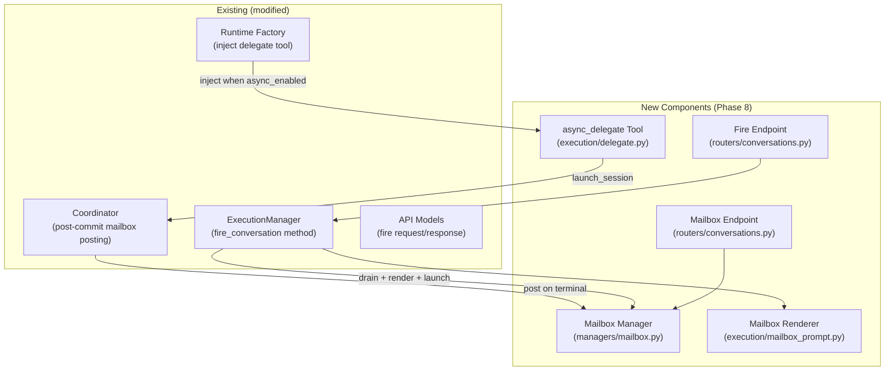
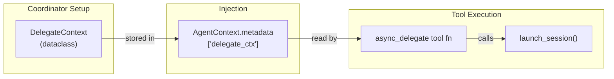
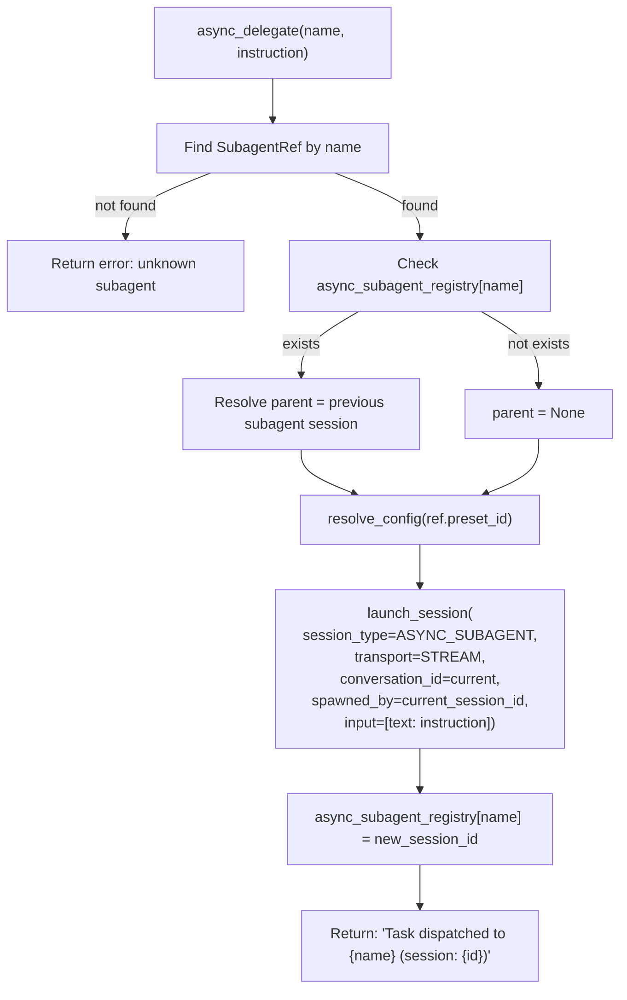
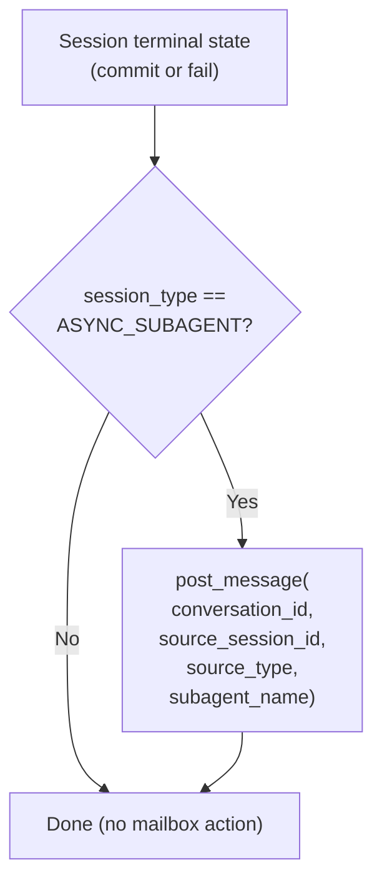
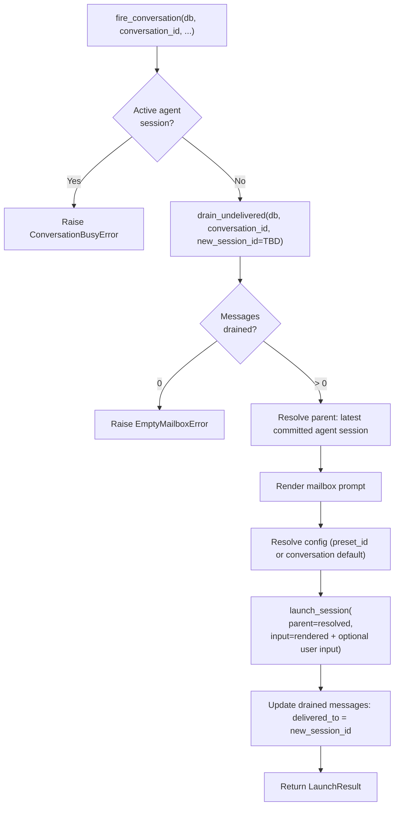
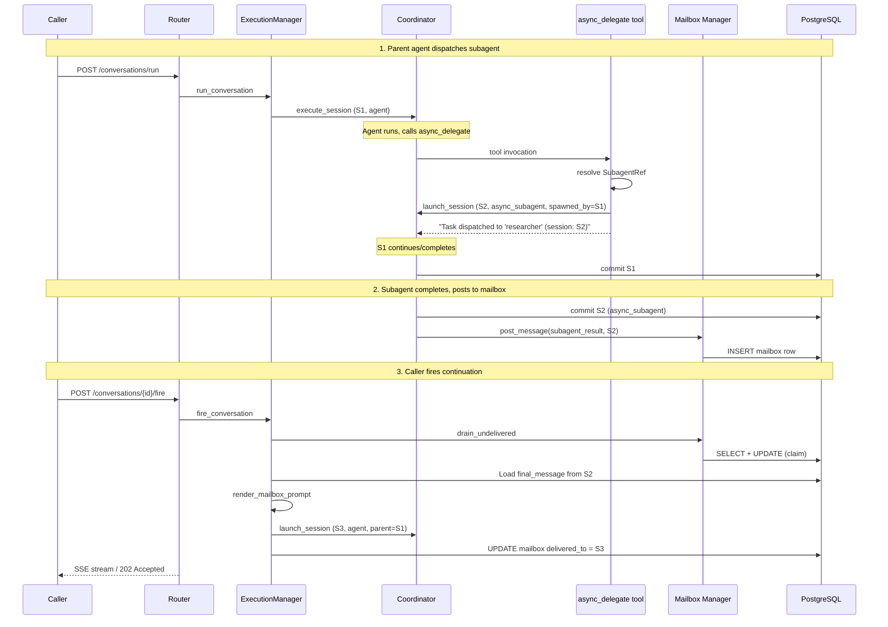
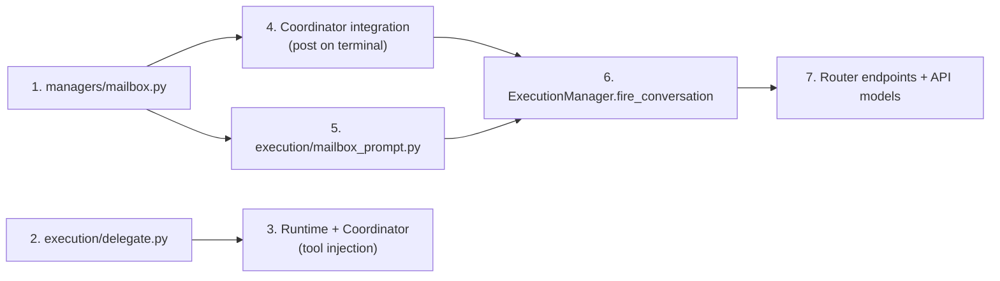

# Phase 8: Async Agents and Mailbox -- Detailed Design

Implementation design for async subagent orchestration. Derived from `spec/agent_runtime/06-async-agents.md` and aligned with existing codebase patterns.

## Goal

Enable a parent agent to spawn independent subagent sessions that run in parallel, with results collected in a conversation mailbox. The caller explicitly fires a continuation to consume those results.

## Scope (from TODO.md)

1. `async_delegate` tool (check registry, self-call execute, update registry)
2. Mailbox: post `subagent_result` / `subagent_failed` on subagent terminal state
3. `POST /api/conversations/{id}/fire` (drain mailbox, render prompt, execute continuation)
4. `GET /api/conversations/{id}/mailbox` (query messages with delivery status)
5. Mailbox message rendering (single and multi-result templates)
6. Delivery tracking (`delivered_to` prevents duplicate delivery)

## Existing Infrastructure

Already in place (no changes needed):

| Component                                | Location               | Status                                 |
| ---------------------------------------- | ---------------------- | -------------------------------------- |
| `MailboxMessage` table                   | `db/tables.py`         | Schema complete                        |
| `MailboxSourceType` enum                 | `models/enums.py`      | `subagent_result` / `subagent_failed`  |
| `SessionType.ASYNC_SUBAGENT`             | `models/enums.py`      | Ready                                  |
| `SubagentSpec` / `SubagentRef`           | `models/preset.py`     | `async_enabled`, `refs` fields         |
| `RuntimeSession.async_subagent_registry` | `context.py`           | `dict[str, str]` (name -> session_id)  |
| `launch_session` params                  | `execution/launch.py`  | `session_type`, `spawned_by` supported |
| `resolve_subagent_configs` stub          | `execution/runtime.py` | Returns `[]`, marked as Phase 8 TODO   |

## Architecture



## Component Design

### 1. Mailbox Manager (`managers/mailbox.py`)

New module. Stateless CRUD functions following the existing manager pattern (module-level async functions, `db: AsyncSession` as parameter).

```
post_message(db, conversation_id, source_session_id, source_type, subagent_name) -> MailboxMessage
    Generate UUID message_id, insert row, commit.

drain_undelivered(db, conversation_id, delivered_to) -> list[MailboxMessage]
    SELECT WHERE conversation_id = ? AND delivered_to IS NULL
    UPDATE SET delivered_to = ? (atomically in one statement)
    Return the drained messages.

query_mailbox(db, conversation_id, pending_only=False, limit=50, offset=0) -> list[MailboxMessage]
    SELECT with optional delivered_to IS NULL filter.
    Order by created_at ASC.

count_pending(db, conversation_id) -> int
    SELECT COUNT WHERE delivered_to IS NULL.
```

Design notes:

- `drain_undelivered` uses a single UPDATE...RETURNING statement to atomically claim messages, preventing duplicate delivery even under concurrent fire requests.
- No domain exceptions -- callers (ExecutionManager) handle empty-mailbox checks.

### 2. Async Delegate Tool (`execution/delegate.py`)

New module. Creates a pydantic-ai `Tool` instance as a closure over runtime infrastructure.

#### Dependency Injection Strategy

The `async_delegate` tool needs access to infrastructure that lives outside the SDK's tool context (session manager, registry, DB session factory, Redis, etc.). Since pydantic-ai tools receive `RunContext[AgentContext]`, we use **AgentContext metadata** as the injection point.



**DelegateContext** (dataclass):

| Field                   | Type               | Description                             |
| ----------------------- | ------------------ | --------------------------------------- |
| session_id              | str                | Current (parent) session ID             |
| conversation_id         | str                | Current conversation ID                 |
| subagent_refs           | list[SubagentRef]  | Available subagents from preset         |
| async_subagent_registry | dict[str, str]     | Shared mutable ref (name -> session_id) |
| session_manager         | SessionManager     | For state reads                         |
| registry                | SessionRegistry    | For checking active subagents           |
| settings                | NetherSettings     | Service settings                        |
| session_factory         | async_sessionmaker | For background DB sessions              |
| redis                   | Redis or None      | For stream transport                    |

The `async_subagent_registry` dict is the **same object** referenced by `RuntimeSession.async_subagent_registry`, ensuring the tool's writes are visible to the registry.

#### Tool Factory

```
create_async_delegate_tool(delegate_ctx: DelegateContext) -> Tool
```

Returns a pydantic-ai `Tool` wrapping an async function with signature:

```
async_delegate(ctx: RunContext, name: str, instruction: str) -> str
```

Parameters (exposed to LLM):

- `name`: Subagent name (must match a SubagentRef.name)
- `instruction`: Task description for the subagent

#### Tool Logic



Key behaviors:

- **Resume**: If `async_subagent_registry` already has an entry for `name`, the previous session becomes `parent_session_id` and its state is loaded for continuation.
- **Transport**: Always `stream` (async subagents have no direct SSE consumer).
- **Config resolution**: Uses the subagent's own `preset_id` from SubagentRef, resolved via the standard `resolve_config` path with a fresh DB session from `session_factory`.
- **Non-blocking**: `launch_session` spawns a background task and returns immediately. The parent agent continues execution.

#### Integration into Runtime Factory

In `execution/runtime.py`, modify `create_service_runtime` to accept an optional pre-built delegate tool:

```
create_service_runtime(
    config, settings, *,
    state=None, resource_state=None,
    extra_tools=None,          # <-- new: list[Tool] for delegate, etc.
) -> (AgentRuntime, ProjectPaths)
```

The `extra_tools` are passed to `create_agent(..., tools=[*all_tools], toolsets=[*mcp_toolsets, *extra_tools])` or via pydantic-ai's function tool mechanism.

In `coordinator.py`, the setup phase creates `DelegateContext` and calls `create_async_delegate_tool` when `config.subagents.async_enabled is True`.

### 3. Mailbox Posting (Coordinator Integration)

Modify `execution/coordinator.py` to post a mailbox message when an **async_subagent** session reaches a terminal state.

#### Where to Hook

After `session_manager.commit_session` or `session_manager.fail_session` succeeds, check if the session is an async_subagent and post accordingly.



Source type mapping:

- Committed -> `subagent_result`
- Failed -> `subagent_failed`
- Interrupted with partial commit -> `subagent_result`
- Interrupted without commit -> `subagent_failed`

#### Implementation

Add a helper to `coordinator.py`:

```
async def _post_mailbox_if_subagent(
    db, session_id, conversation_id, session_type, spawned_by, preset_id, status
)
```

Called at three points in `execute_session`:

1. After successful commit (normal completion)
2. After `_handle_interrupt` returns
3. In the `except Exception` block after `fail_session`

The `subagent_name` is resolved from the session's `preset_id` or stored on the session row. Since the coordinator has access to `config` (which includes the preset info), we can derive it. However, the subagent's own preset doesn't know its "name" in the parent's SubagentRef.

**Resolution**: Store `subagent_name` on the session row as part of metadata, or pass it through `launch_session`. The simplest approach: add an optional `subagent_name` field to `RuntimeSession` context and pass it through the launch pipeline.

Actually, looking more carefully at the data model -- the `spawned_by` field on the session row tells us which parent spawned it, and the `preset_id` is available. But the human-friendly `name` from SubagentRef is not stored anywhere on the subagent session.

**Decision**: Pass `subagent_name` through the launch pipeline as a new field. Add it to:

- `launch_session` parameter
- `RuntimeSession` dataclass (new optional field)
- `execute_session` parameter
- Use it when posting to mailbox

This keeps the coordinator self-contained without needing to look up the parent preset.

### 4. Fire Logic (`ExecutionManager.fire_conversation`)

New method on `ExecutionManager`. Implements the fire flow from spec 06.



**Atomicity concern**: We need to drain messages and mark `delivered_to` in one atomic operation. The `drain_undelivered` function handles this with UPDATE...RETURNING. But `delivered_to` should be the new session's ID, which we don't have until after `launch_session`. Two approaches:

**Approach A**: Two-step -- drain first (claim with a temporary marker), launch, then update with real session_id.
**Approach B**: Pre-generate the session_id, use it for both drain and launch.

**Decision**: Approach A with a temporary claim. Drain sets `delivered_to = 'claiming:{uuid}'` atomically, then after launch updates to the real session_id. If launch fails, reset the claim. This avoids coupling session ID generation with the drain step.

Actually, simpler: just drain (read + mark with a placeholder), launch, update. Or even simpler since this is single-instance and we hold the conversation lock (concurrency guard):

**Revised approach**: Since the concurrency guard ensures only one fire can run per conversation at a time (ConversationBusyError check), we can safely:

1. Query undelivered messages (SELECT)
2. Launch session (generates session_id)
3. Mark messages as delivered (UPDATE SET delivered_to = session_id)

The window between steps 1-3 is safe because no other fire can run concurrently for this conversation, and new subagent results that arrive between 1 and 3 will simply be undelivered (picked up by the next fire).

### 5. Mailbox Prompt Rendering (`execution/mailbox_prompt.py`)

New module. Renders mailbox messages into a text prompt for the continuation session.

```
render_mailbox_prompt(messages: list[MailboxMessageWithContent], user_input: str | None = None) -> str
```

**MailboxMessageWithContent**: A lightweight struct combining the mailbox message with the source session's `final_message` loaded from PG.

Templates (from spec):

Single result:

```
Async subagent '{name}' (session: {id}) completed:
{final_message content}
```

Single failure:

```
Async subagent '{name}' (session: {id}) failed.
```

Multiple results:

```
Async subagent results:

## {name_1} [completed] (session: {id_1})
{result_1}

## {name_2} [failed] (session: {id_2})
Error: {error_2}
```

If `user_input` is provided, it is appended after the mailbox section:

```
{mailbox_rendered}

---
User message:
{user_input}
```

Content loading: The fire method in ExecutionManager loads `final_message` from PG session rows for each `source_session_id` in the drained messages.

### 6. API Endpoints

#### POST /api/conversations/{conversation_id}/fire

New endpoint in `routers/conversations.py`.

Request model (`ConversationFireRequest`):

| Field             | Type                   | Required | Description                                             |
| ----------------- | ---------------------- | -------- | ------------------------------------------------------- |
| preset_id         | str?                   | No       | Agent preset. Default: conversation's default_preset_id |
| input             | list[InputPart]?       | No       | Optional additional user input                          |
| workspace_id      | str?                   | No       | Workspace reference                                     |
| project_ids       | list[str]?             | No       | Ad-hoc project list                                     |
| user_interactions | list[UserInteraction]? | No       | Optional HITL feedback                                  |
| tool_results      | list[ToolResult]?      | No       | Optional external tool results                          |
| config_override   | dict?                  | No       | Per-request overrides                                   |
| transport         | Transport              | No       | Default: `stream`                                       |

Response: Same as `run` -- SSE stream or 202 Accepted.

Error responses:

- 404: Conversation not found
- 409: Conversation busy (active agent session)
- 422: Mailbox empty, or no preset resolvable

#### GET /api/conversations/{conversation_id}/mailbox

New endpoint in `routers/conversations.py`.

Query params:

| Param        | Type | Default | Description                    |
| ------------ | ---- | ------- | ------------------------------ |
| pending_only | bool | false   | Only show undelivered messages |
| limit        | int  | 50      | Page size                      |
| offset       | int  | 0       | Page offset                    |

Response model (`MailboxMessageResponse`):

| Field             | Type              | Description                                 |
| ----------------- | ----------------- | ------------------------------------------- |
| message_id        | str               | Unique ID                                   |
| conversation_id   | str               | Owning conversation                         |
| source_session_id | str               | Session that produced the outcome           |
| source_type       | MailboxSourceType | `subagent_result` / `subagent_failed`       |
| subagent_name     | str               | Display name                                |
| created_at        | datetime          | When posted                                 |
| delivered_to      | str?              | Session that consumed this (null = pending) |

### 7. API Models (`models/api.py`)

New additions:

```
ConversationFireRequest(_ExecutionInputMixin):
    preset_id: str | None = None
    workspace_id: str | None = None
    project_ids: list[str] | None = None
    config_override: dict | None = None
    transport: Transport = Transport.STREAM   # default stream, not sse

MailboxMessageResponse(BaseModel):
    model_config = ConfigDict(from_attributes=True)
    message_id: str
    conversation_id: str
    source_session_id: str
    source_type: MailboxSourceType
    subagent_name: str
    created_at: datetime
    delivered_to: str | None = None
```

### 8. Domain Exceptions

New exceptions in `managers/execution.py`:

```
EmptyMailboxError(ValueError):
    "No pending mailbox messages for conversation '{conversation_id}'"

NoDefaultPresetError(ValueError):
    "No preset_id provided and conversation has no default_preset_id"
```

## Data Flow: Complete Lifecycle



## File Change Summary

### New Files

| File                          | Description                                                        |
| ----------------------------- | ------------------------------------------------------------------ |
| `managers/mailbox.py`         | Mailbox CRUD (post, drain, query, count)                           |
| `execution/delegate.py`       | `DelegateContext` dataclass + `create_async_delegate_tool` factory |
| `execution/mailbox_prompt.py` | Mailbox message rendering templates                                |

### Modified Files

| File                       | Changes                                                                                                                                   |
| -------------------------- | ----------------------------------------------------------------------------------------------------------------------------------------- |
| `execution/runtime.py`     | Accept `extra_tools` param; remove `resolve_subagent_configs` stub                                                                        |
| `execution/coordinator.py` | Create DelegateContext + delegate tool when async_enabled; post mailbox on subagent terminal state; pass `subagent_name` through pipeline |
| `execution/launch.py`      | Accept and forward `subagent_name` parameter                                                                                              |
| `context.py`               | Add \`subagent_name: str                                                                                                                  |
| `managers/execution.py`    | Add `fire_conversation` method; add `EmptyMailboxError`                                                                                   |
| `models/api.py`            | Add `ConversationFireRequest`, `MailboxMessageResponse`                                                                                   |
| `routers/conversations.py` | Add `/fire` and `/mailbox` endpoints                                                                                                      |
| `deps.py`                  | (No changes -- ExecutionMgr already injected)                                                                                             |
| `app.py`                   | Pass `session_factory` to ExecutionManager (already done)                                                                                 |

### Unchanged Files

| File               | Reason                                   |
| ------------------ | ---------------------------------------- |
| `db/tables.py`     | MailboxMessage table already exists      |
| `models/enums.py`  | All enums already defined                |
| `models/preset.py` | SubagentSpec/SubagentRef already defined |
| `registry.py`      | No changes needed                        |
| `store/`           | No changes needed                        |

## Implementation Order

Dependencies between components dictate the order:



**Step 1**: Mailbox manager (independent, testable in isolation)
**Step 2**: Delegate tool module (DelegateContext + tool factory)
**Step 3**: Runtime factory + coordinator wiring (inject delegate tool)
**Step 4**: Coordinator mailbox posting (subagent terminal state hook)
**Step 5**: Mailbox prompt renderer
**Step 6**: ExecutionManager.fire_conversation
**Step 7**: Router endpoints and API models

## Testing Strategy

| Test                                           | Type        | Coverage                    |
| ---------------------------------------------- | ----------- | --------------------------- |
| Mailbox CRUD (post, drain, query)              | Integration | managers/mailbox.py         |
| drain atomicity (no double-delivery)           | Integration | drain_undelivered           |
| Delegate tool (mock launch)                    | Unit        | execution/delegate.py       |
| Delegate tool unknown subagent                 | Unit        | Error path                  |
| Delegate tool resume (existing registry entry) | Unit        | Resume path                 |
| Coordinator mailbox posting                    | Unit (mock) | Post on commit/fail         |
| Mailbox prompt rendering (single/multi)        | Unit        | execution/mailbox_prompt.py |
| Fire endpoint (happy path)                     | Integration | Full flow                   |
| Fire with empty mailbox (422)                  | Integration | Error path                  |
| Fire with busy conversation (409)              | Integration | Concurrency guard           |
| Mailbox query endpoint                         | Integration | GET /mailbox                |

## Open Questions

1. **Subagent environment inheritance**: Should async subagents inherit the parent's `project_ids` by default, or always use the subagent preset's environment? The spec says "Shares via environment state" -- current design uses the subagent preset's config, which can reference the same workspace.

2. **Subagent concurrency limit**: The spec says "at most one running agent session per conversation" but async subagents are `session_type=async_subagent`, not `agent`. Multiple async subagents can run concurrently in the same conversation. No per-subagent-name concurrency limit is imposed (a second dispatch of the same name resumes from the previous session).

3. **Fire transport default**: The spec says `transport: stream (default)` for fire, unlike `run` which defaults to `sse`. This makes sense since fire results may take time to process and the caller likely wants to detach.
