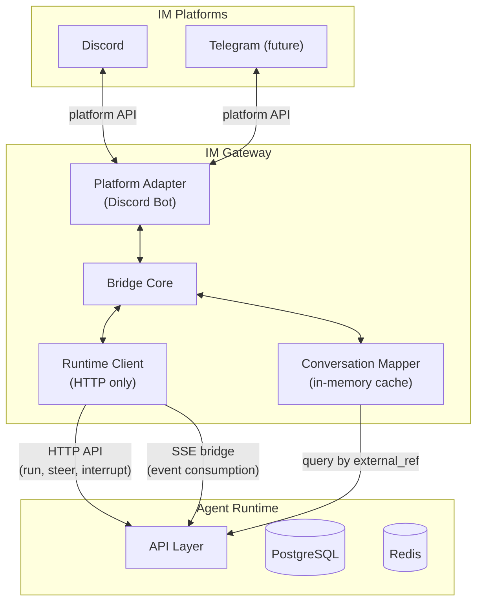

# IM Gateway Overview

## Definition

IM Gateway is a thin bridge between instant messaging platforms and the Agent Runtime. It translates platform-specific interactions into runtime API calls and renders agent responses back into platform-native messages.

The gateway holds no agent logic and no durable state. All intelligence, session management, and execution live in the agent-runtime. The gateway's sole job is protocol translation and UX adaptation.

## Design Principles

- **Thin bridge**: No agent logic; all state and execution in agent-runtime
- **HTTP-only**: Communicates with runtime exclusively via HTTP API (no direct PG or Redis access)
- **Stateless**: In-memory mapping cache only; recoverable from runtime on restart
- **Thread-per-conversation**: Each IM thread/DM maps to one runtime conversation; clean isolation
- **Graceful degradation**: Runtime unavailability surfaces as user-visible error messages, not silent failures

## Architecture



The gateway has no direct connection to PostgreSQL or Redis. All communication goes through the runtime's HTTP API, including event streaming via the SSE bridge endpoint.

## Components

| Component           | Role                                                                                           |
| ------------------- | ---------------------------------------------------------------------------------------------- |
| Platform Adapter    | Platform-specific bot (Discord.py, etc.); handles raw events                                   |
| Bridge Core         | Orchestrates message flow; coordinates adapter, client, mapper                                 |
| Runtime Client      | Wraps runtime HTTP API calls and SSE event consumption                                         |
| Conversation Mapper | In-memory cache of channel \<-> conversation mapping; recovers from runtime via `external_ref` |

## Configuration (Environment Variables)

| Variable             | Required | Description                         |
| -------------------- | -------- | ----------------------------------- |
| `RUNTIME_URL`        | Yes      | Agent runtime base URL              |
| `RUNTIME_AUTH_TOKEN` | Yes      | Bearer token for runtime API        |
| `DISCORD_BOT_TOKEN`  | Yes\*    | Discord bot token (\* per-platform) |
| `DEFAULT_PRESET_ID`  | No       | Fallback agent preset               |

No database or cache infrastructure required. The gateway is a pure HTTP client.

## Runtime API Usage

The gateway uses the runtime's conversation `metadata` field (JSONB, client-defined) for persistent mapping.

### Metadata Convention

When creating a conversation, the gateway sets metadata identifying the source platform and channel:

```json
{"platform": "discord", "thread_id": "123456789", "guild_id": "987654321"}
```

On recovery, the gateway queries by metadata containment:

```
GET /api/conversations/list?metadata={"platform":"discord","thread_id":"123456789"}
```

The runtime treats metadata as opaque JSONB -- no schema enforced. The gateway owns the structure.

## Boundary

| Concern                  | Owner         | Not Gateway's Job                  |
| ------------------------ | ------------- | ---------------------------------- |
| IM bot lifecycle         | Gateway       | -                                  |
| Protocol translation     | Gateway       | -                                  |
| Message rendering        | Gateway       | -                                  |
| In-memory mapping        | Gateway       | -                                  |
| Conversation persistence | Agent Runtime | Gateway stores nothing durably     |
| Agent execution          | Agent Runtime | Gateway never runs agents          |
| Session management       | Agent Runtime | Gateway only holds conversation_id |
| Preset management        | Agent Runtime | Gateway references presets by ID   |
| User authentication      | IM Platform   | Gateway trusts platform identity   |

## Section Index

| Section | Document                 | Topic                                           |
| ------- | ------------------------ | ----------------------------------------------- |
| 01      | [Bridge](01-bridge.md)   | Runtime client, conversation mapping, rendering |
| 02      | [Discord](02-discord.md) | Discord adapter design                          |
