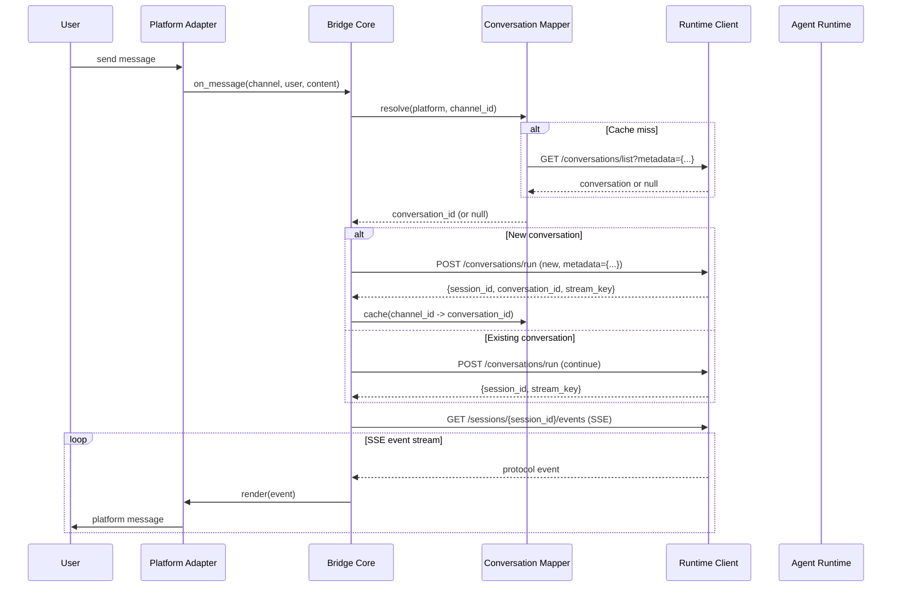
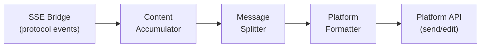
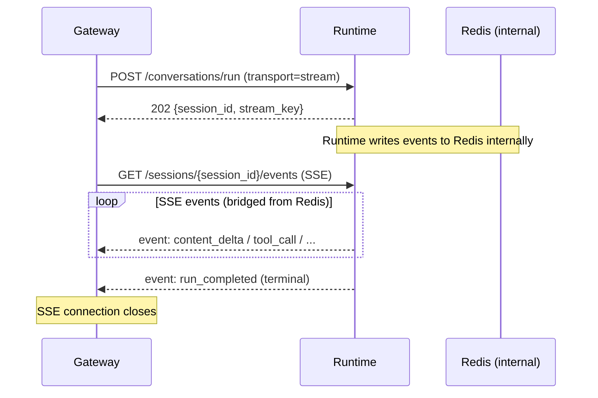
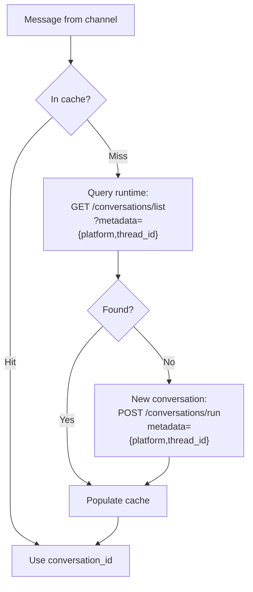
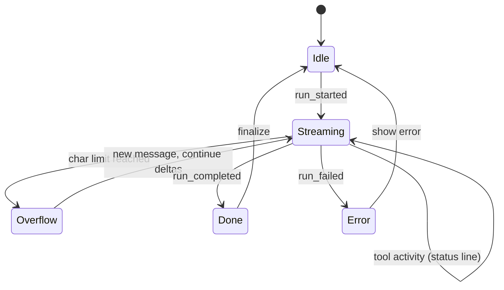

# 01 - Bridge Core

The bridge core orchestrates message flow between platform adapters and the agent runtime. It handles runtime communication, conversation mapping, and event-to-message rendering -- all via HTTP.

## Message Flow

### User to Agent



### Agent to User (Event Rendering)



## Runtime Client

HTTP-only client wrapping agent-runtime API calls and SSE consumption.

### API Operations

| Operation | Runtime Endpoint                         | When                                |
| --------- | ---------------------------------------- | ----------------------------------- |
| Run       | `POST /api/conversations/run`            | User sends message                  |
| Interrupt | `POST /api/conversations/{id}/interrupt` | User requests cancellation          |
| Steer     | `POST /api/conversations/{id}/steer`     | User sends message during execution |
| Fire      | `POST /api/conversations/{id}/fire`      | Async subagent results ready        |
| Get       | `GET /api/conversations/{id}/get`        | Check conversation state            |
| Lookup    | `GET /api/conversations/list`            | Recover mapping by metadata query   |

### Event Consumption

All runs use `transport=stream`. The runtime writes events to Redis internally. The gateway consumes them through the SSE bridge endpoint, never touching Redis directly.



Benefits of this approach:

- Gateway has no Redis dependency
- SSE bridge supports `Last-Event-ID` for reconnection
- Execution is decoupled from consumption (agent runs to completion regardless of gateway connection)

### Busy Handling

When `POST /conversations/run` returns `409 Conflict` (conversation already has a running session), the gateway falls back to steering:

1. Extract `active_session` from 409 response
2. `POST /conversations/{id}/steer` with the user's message
3. Attach to active session's SSE bridge if not already consuming

If steering also fails (session completed between calls), retry as a new run.

## Conversation Mapper

In-memory cache mapping platform channels to runtime conversations. Recoverable from runtime on restart.

### Cache Structure

```
{(platform, channel_id): conversation_id}
```

### Mapping Lifecycle



### Mapping Rules

| Platform Context            | Metadata                               | Lifecycle                           |
| --------------------------- | -------------------------------------- | ----------------------------------- |
| Discord thread              | `{platform: discord, thread_id: ...}`  | Created when thread is first used   |
| Discord DM                  | `{platform: discord, dm_user_id: ...}` | Created on first DM                 |
| Discord channel (no thread) | N/A                                    | Bot creates thread first, then maps |

### Recovery on Restart

On gateway restart, the in-memory cache is empty. Recovery is lazy:

- Each incoming message triggers a cache lookup
- On miss, query runtime by metadata containment
- If found, re-populate cache and continue conversation
- If not found (conversation was deleted), create new conversation

No bulk recovery needed. The cache warms up naturally as users send messages.

## Event Rendering

### Content Accumulator

Collects `content_delta` events into coherent text blocks. Buffers updates and flushes to the platform adapter at a controlled rate to respect API rate limits.

| Parameter       | Description                    | Default |
| --------------- | ------------------------------ | ------- |
| flush_interval  | Min time between message edits | 1s      |
| flush_threshold | Min new chars before edit      | 100     |

### Message Splitter

Splits accumulated content at platform character limits. Preserves structure:

- Never splits inside code blocks
- Prefers splitting at paragraph boundaries
- Falls back to sentence boundaries, then hard split at limit

### Rendering Strategy



During streaming:

1. Post an initial placeholder message
2. Edit the message as `content_delta` events arrive (rate-limited)
3. When approaching platform char limit, post a new message and continue
4. On `run_completed`, post the final clean content
5. On `run_failed`, post an error message

### Tool Call Display

Tool calls are secondary information. Rendering depends on platform capability:

| Approach      | Description                          | Platform      |
| ------------- | ------------------------------------ | ------------- |
| Inline status | Brief one-line status in the message | All           |
| Collapsed     | Expandable section with details      | Discord embed |
| Hidden        | Omitted; only final text shown       | Minimal UIs   |

Default: inline status during streaming, collapsed summary in final message.
