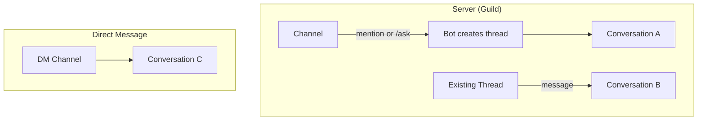
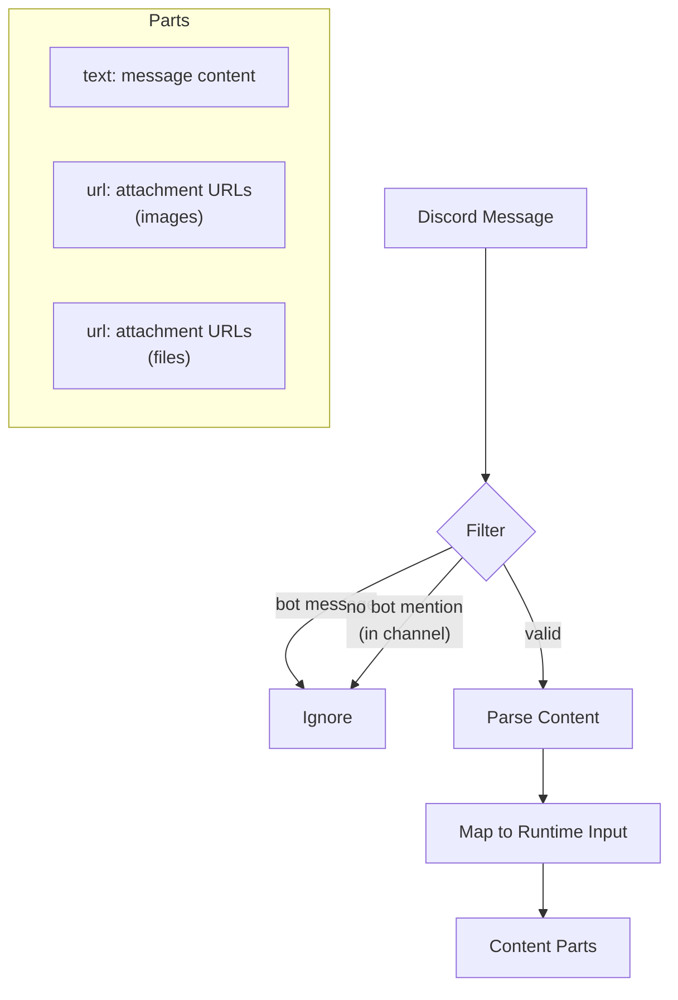
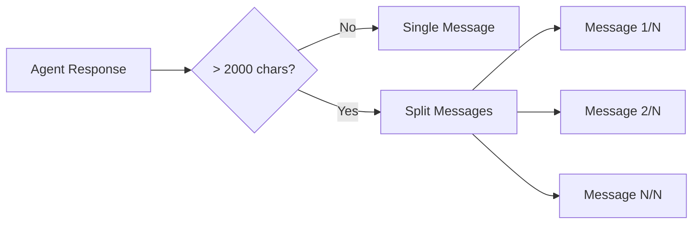
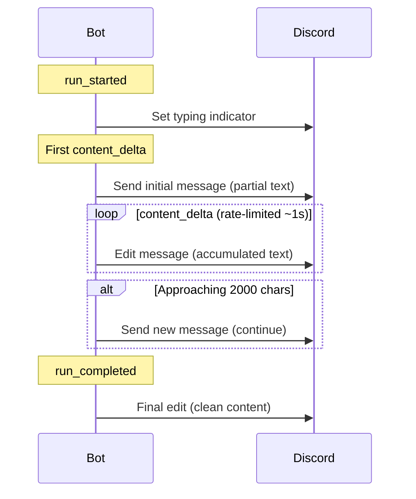
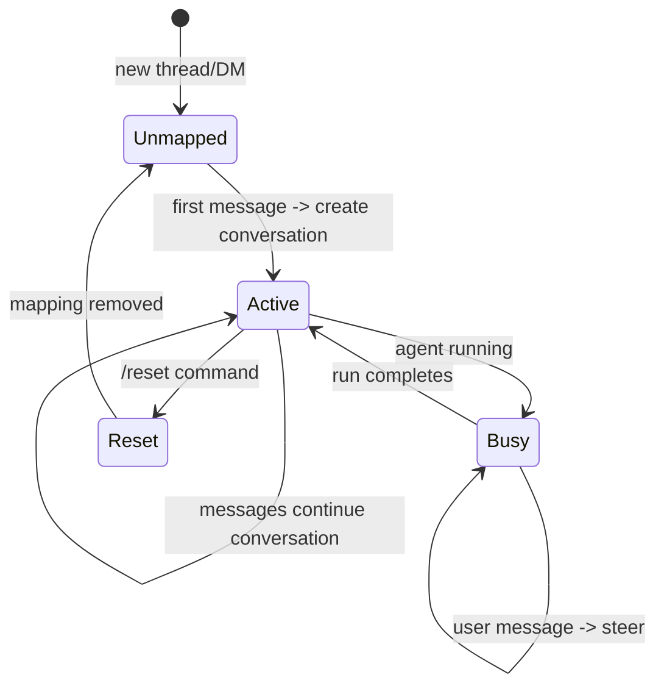

# 02 - Discord Adapter

Discord-specific bot implementation. Handles Discord events, slash commands, thread management, and message formatting within Discord's constraints.

## Bot Setup

- Library: `discord.py`
- Required intents: `guilds`, `messages`, `message_content`
- Required permissions: send messages, create public/private threads, embed links, attach files, read message history, add reactions

## Interaction Model



### Thread Mode (Server Channels)

Conversations in server channels always happen inside threads for clean isolation.

| Trigger                               | Bot Behavior                                        |
| ------------------------------------- | --------------------------------------------------- |
| User mentions bot in channel          | Create thread from that message, start conversation |
| User uses `/ask` in channel           | Create thread, start conversation                   |
| User sends message in mapped thread   | Continue existing conversation                      |
| User sends message in unmapped thread | Start new conversation in that thread               |

Thread naming: first ~50 chars of the user's initial message, or a generated title from the runtime after the first turn.

### DM Mode

Each user's DM channel maps to a single long-running conversation.

| Trigger       | Bot Behavior                    |
| ------------- | ------------------------------- |
| User sends DM | Continue or create conversation |

## Commands

### Slash Commands

| Command               | Context     | Description                                    |
| --------------------- | ----------- | ---------------------------------------------- |
| `/ask [message]`      | Channel     | Start new conversation in a new thread         |
| `/ask [message]`      | Thread / DM | Send message (same as typing directly)         |
| `/preset [preset_id]` | Thread / DM | Change agent preset for this conversation      |
| `/reset`              | Thread / DM | Unlink conversation; next message starts fresh |
| `/interrupt`          | Thread / DM | Interrupt running agent                        |

### Message Commands (Context Menu)

| Command     | Target  | Description                            |
| ----------- | ------- | -------------------------------------- |
| "Ask Agent" | Message | Start new thread from selected message |

## Message Handling

### Inbound (User to Agent)



**Filtering rules:**

- Ignore messages from bots (including self)
- In server channels (not threads): require bot mention or slash command
- In mapped threads: all messages go to agent
- In DMs: all messages go to agent

**Attachment handling:**

- Images: passed as `url` input parts (Discord CDN URLs)
- Files: passed as `url` input parts
- Unsupported types: ignored with a reaction indicator

### Outbound (Agent to User)

Agent responses are rendered into Discord messages respecting platform constraints.

#### Character Limit

Discord enforces a 2000-character limit per message. The message splitter handles overflow:



Splitting priorities:

1. Between top-level sections (## headings)
2. Between paragraphs (double newline)
3. Between lines (single newline)
4. Between sentences (period + space)
5. Hard split at 2000 chars (last resort)

Code blocks that span a split point are closed and reopened:

```
...end of message 1
\`\`\`

---

\`\`\`python
continuation in message 2...
```

#### Streaming Updates



Edit rate limiting: at most one edit per second to stay within Discord API limits.

#### Tool Call Display

Tool calls are shown as a brief status line during streaming, replaced with a clean summary on completion.

During streaming:

```
[Using tool: shell] ...
```

Final message (tool calls as collapsed embed or omitted if response is self-contained):

| Field       | Content                           |
| ----------- | --------------------------------- |
| Embed title | Tools Used                        |
| Embed body  | Bullet list of tools with summary |
| Embed color | Gray (subtle)                     |

Tool call details are secondary. If the agent's text response is self-explanatory, tool embeds can be omitted.

#### Thinking Content

Agent thinking/reasoning content is hidden by default. Optionally shown as Discord spoiler tags (`||thinking content||`) or omitted entirely.

## Conversation Lifecycle



### Concurrent Message Handling

When the agent is already running and the user sends another message:

1. Gateway attempts `POST /conversations/run` -> receives `409 Conflict`
2. Gateway falls back to `POST /conversations/{id}/steer` with the new message
3. User sees a reaction (e.g., checkmark) confirming the message was injected

If steering also fails (e.g., session completed between calls), the gateway retries as a new run.

## Error Handling

| Scenario               | User-Facing Behavior                              |
| ---------------------- | ------------------------------------------------- |
| Runtime unreachable    | Reply with error message; suggest retry later     |
| Agent execution fails  | Reply with error summary from `run_failed` event  |
| Discord API rate limit | Queue messages; backpressure on rendering         |
| Invalid preset         | Reply with error; suggest `/preset` with valid ID |
| Attachment too large   | React with warning emoji; send without attachment |

## Presence & Status

Bot status reflects runtime connectivity:

| Runtime State | Bot Status           |
| ------------- | -------------------- |
| Connected     | Online (green)       |
| Unreachable   | Idle (yellow)        |
| Auth failure  | Do Not Disturb (red) |
