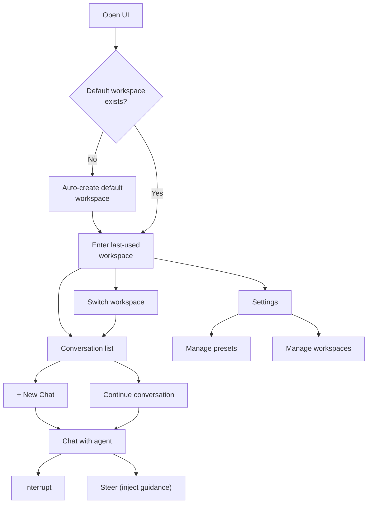

# UI Overview

## Product Identity

Netherbrain Web UI is a chat application for interacting with AI agents. The design language follows modern chat apps (ChatGPT, Claude) rather than admin dashboards. Conversation is the primary experience; configuration is secondary.

## Workspace-Centric Model

Workspaces are the primary organizational unit. Each workspace defines a set of project directories (folders) the agent can access.

| Concept   | User-Facing Term | Description                             |
| --------- | ---------------- | --------------------------------------- |
| Workspace | Workspace        | Named context with folders and a preset |
| project   | Folder           | Directory under DATA_ROOT               |
| Preset    | Agent            | Model + prompt + tools configuration    |

### Default Workspace

On first launch, the UI creates a default workspace via the API:

```
POST /api/workspaces/create
{
  workspace_id: "webui-default",
  name: "Default",
  projects: ["webui"],
  metadata: {"source": "webui", "default": true}
}
```

The UI identifies its default workspace by querying:

```
GET /api/workspaces/list?metadata={"source": "webui", "default": true}
```

If no result, the UI auto-creates it. Users can create additional workspaces freely.

### Workspace Metadata Convention

| Key       | Type   | Description                                   |
| --------- | ------ | --------------------------------------------- |
| `source`  | string | `"webui"` for UI-created workspaces           |
| `default` | bool   | `true` for the auto-created default workspace |

## User Flow



## Design Principles

- **Conversation first**: Chat is the default and dominant view.
- **Zero config start**: Default workspace and preset are auto-provisioned; user starts chatting immediately.
- **Responsive**: Desktop and mobile are both first-class. Sidebar collapses on mobile.
- **System theme**: Follow OS light/dark preference; manual toggle available.
- **Minimal chrome**: Generous whitespace, clean typography, content takes center stage.

## Tech Stack

| Layer          | Choice                     | Rationale                                    |
| -------------- | -------------------------- | -------------------------------------------- |
| Framework      | React 19 + TypeScript      | Already in use                               |
| Build          | Vite                       | Already in use                               |
| Routing        | React Router               | Already in use                               |
| Styling        | Tailwind CSS               | Utility-first, responsive, dark mode         |
| Components     | shadcn/ui (Radix-based)    | Copy-paste, customizable, chat-app aesthetic |
| State          | Zustand                    | Lightweight, no boilerplate                  |
| Markdown       | react-markdown + remark    | Extensible, handles code blocks              |
| Code Highlight | Shiki                      | Accurate, theme-aware                        |
| SSE            | Native EventSource / fetch | Built-in browser API                         |

## Section Index

| Section | Document                   | Topic                                  |
| ------- | -------------------------- | -------------------------------------- |
| 01      | [Layout](01-layout.md)     | Page structure, navigation, responsive |
| 02      | [Chat](02-chat.md)         | Message rendering, streaming, controls |
| 03      | [Settings](03-settings.md) | Preset and workspace management        |
