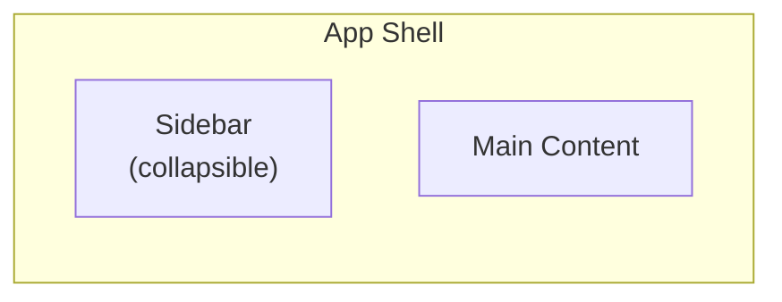
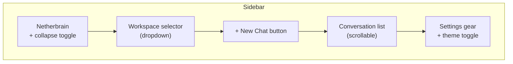
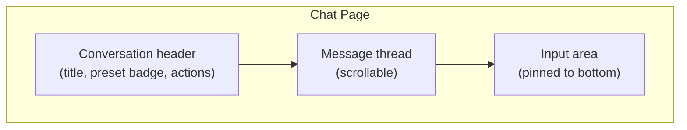
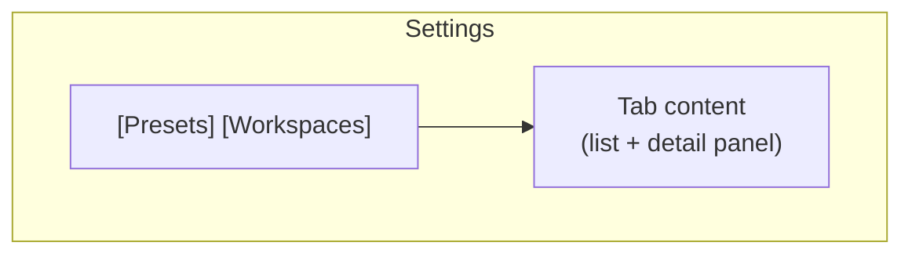
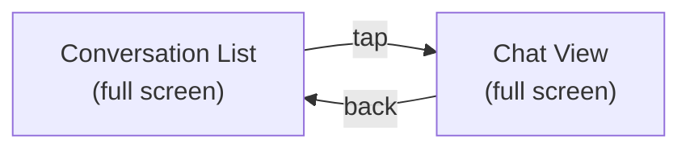

# 01 - Layout

## Page Structure

Two pages: **Chat** (default, `/`) and **Settings** (`/settings`).

## Shell Layout

The sidebar and main content fill the viewport. No persistent top bar; the sidebar header contains branding and navigation.

## Sidebar

### Workspace Selector

Dropdown showing all workspaces. Current workspace is highlighted. Actions:

- Select workspace: switches conversation list
- "Manage workspaces" link at bottom of dropdown: navigates to Settings

### Conversation List

Shows conversations for the current workspace, ordered by last activity. Each item shows:

- Title (or first message preview if untitled)
- Relative timestamp ("2m ago", "Yesterday")
- Active indicator (pulsing dot if agent is running)

Conversations are filtered by workspace via conversation metadata: `{"workspace_id": "..."}`.

### Collapsed Sidebar

On mobile or when manually collapsed, the sidebar reduces to an icon strip or disappears entirely. A hamburger button in the main content header reveals it as an overlay.

## Main Content Area

### Chat Page (/)

Full-height message thread with input area pinned to bottom.

### Settings Page (/settings)

Tab-based layout: Presets | Workspaces.

## Responsive Behavior

| Breakpoint    | Sidebar              | Main Content         |
| ------------- | -------------------- | -------------------- |
| Desktop (lg+) | Visible, resizable   | Full width - sidebar |
| Tablet (md)   | Collapsed by default | Full width           |
| Mobile (sm)   | Hidden, overlay      | Full width           |

### Mobile Chat

On mobile, the conversation list is the initial view. Tapping a conversation navigates to the full-screen chat view with a back button.

## Routing

| Path        | Page     | Description              |
| ----------- | -------- | ------------------------ |
| `/`         | Chat     | Last conversation or new |
| `/c/:id`    | Chat     | Specific conversation    |
| `/settings` | Settings | Presets and workspaces   |
