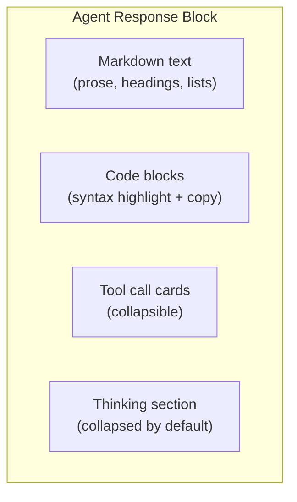
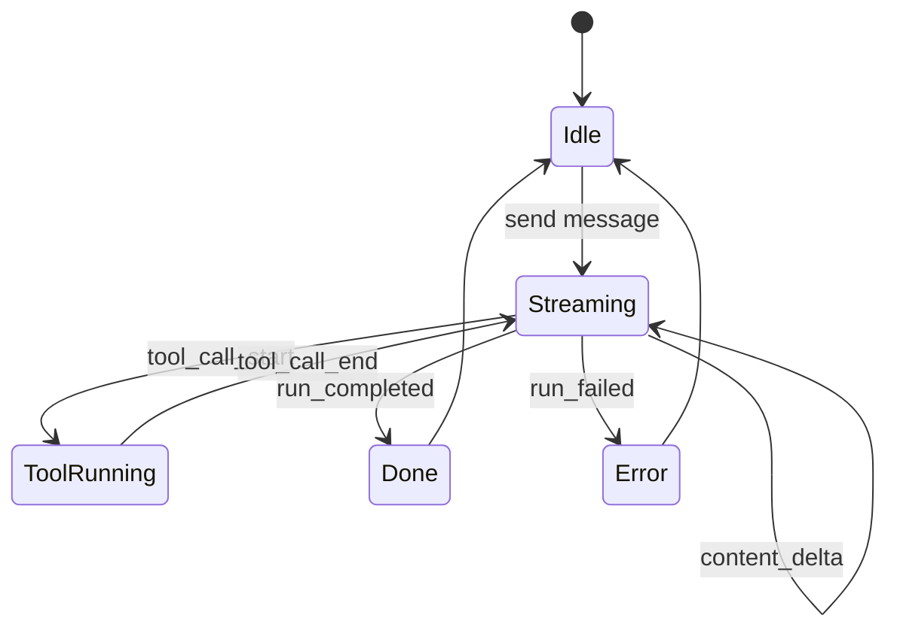
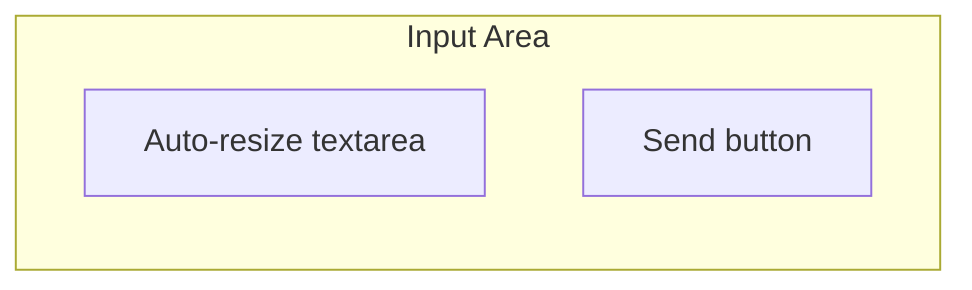
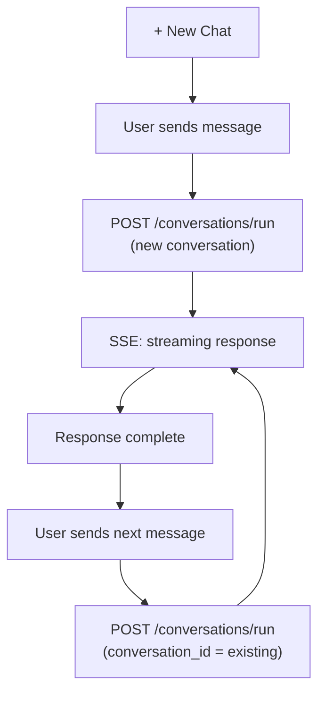

# 02 - Chat

## Message Thread

Messages are displayed in a vertical thread. User messages and agent responses are visually distinct through alignment, background color, and icons.

### Message Types

| Type           | Visual                                        |
| -------------- | --------------------------------------------- |
| User message   | Right-aligned or full-width with user icon    |
| Agent response | Left-aligned or full-width with agent icon    |
| System notice  | Centered, muted text (errors, status changes) |

### Agent Response Rendering

Agent responses contain rich content rendered from `display_messages` protocol events.



#### Markdown

Full CommonMark rendering with GFM extensions (tables, task lists, strikethrough). Code blocks use Shiki for syntax highlighting with theme-aware colors.

Each code block has:

- Language label (top-left)
- Copy button (top-right)

#### Tool Calls

Displayed as compact collapsible cards inline with the message flow.

Collapsed state: single line showing tool name and brief summary.

```
> Used shell: npm test (exit 0)
```

Expanded state: shows arguments and full output (scrollable, max height capped).

#### Thinking

Agent reasoning/thinking content is rendered in a collapsed section with muted styling. Click to expand. Hidden entirely if empty.

## Streaming

During agent execution, the response streams in real-time via SSE.



### Streaming Behavior

- Text appears incrementally (character/chunk level)
- Auto-scroll follows new content unless user has scrolled up
- Tool calls appear as "running" cards, then resolve with results
- Cursor/typing indicator shown at end of streaming text

### Connection

Chat page uses SSE transport (`transport=sse`) for direct streaming. The UI consumes `POST /api/conversations/run` and processes the event stream.

Reconnection on SSE drop: check session status, reattach via `/sessions/{id}/events` with `Last-Event-ID` if still running, or load `display_messages` if completed.

## Input Area

Pinned to the bottom of the chat view.



### States

| State     | Send Button | Textarea        | Extra Controls |
| --------- | ----------- | --------------- | -------------- |
| Idle      | Send        | Enabled         | None           |
| Streaming | Stop        | Enabled (steer) | None           |
| Empty     | Disabled    | Enabled         | None           |

### Send Behavior

- **Idle**: POST `/api/conversations/run`, start SSE stream
- **Streaming + Send**: POST `/api/conversations/{id}/steer` (inject guidance)
- **Stop**: POST `/api/conversations/{id}/interrupt`

### Keyboard

- `Enter`: Send message
- `Shift+Enter`: New line
- `Escape`: Cancel input / close panels

## Conversation Header

Shown at top of the chat area.

| Element      | Description                        |
| ------------ | ---------------------------------- |
| Title        | Editable conversation title        |
| Preset badge | Shows which agent preset is active |
| Actions menu | Fork, change preset, archive       |

## New Chat

Clicking "+ New Chat" in the sidebar:

1. Creates a new conversation via `POST /api/conversations/run`
2. Workspace's default preset is used (or system default)
3. Conversation metadata includes `{"workspace_id": "..."}`
4. Focus moves to the input area

## Conversation Lifecycle


