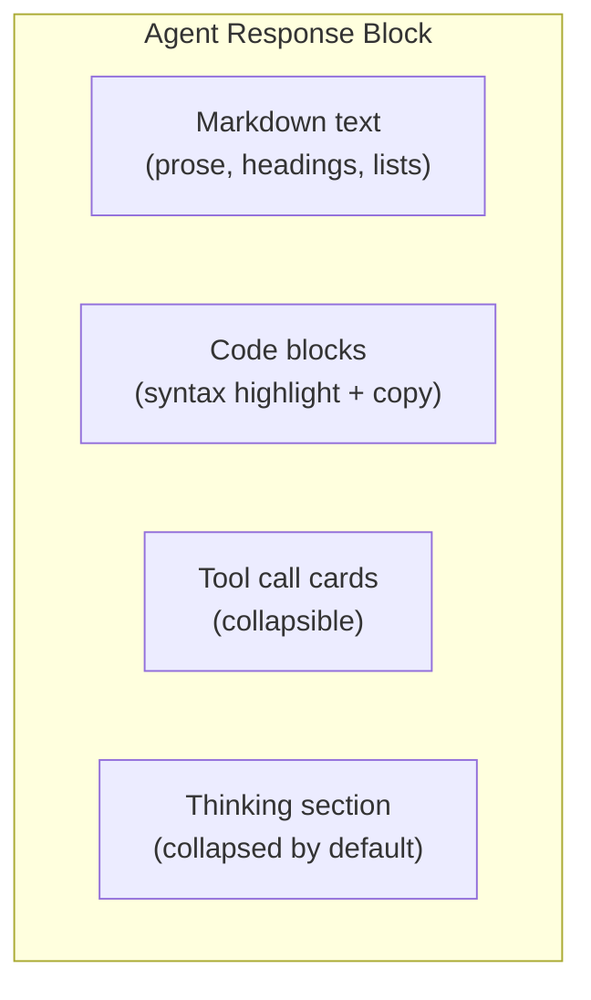
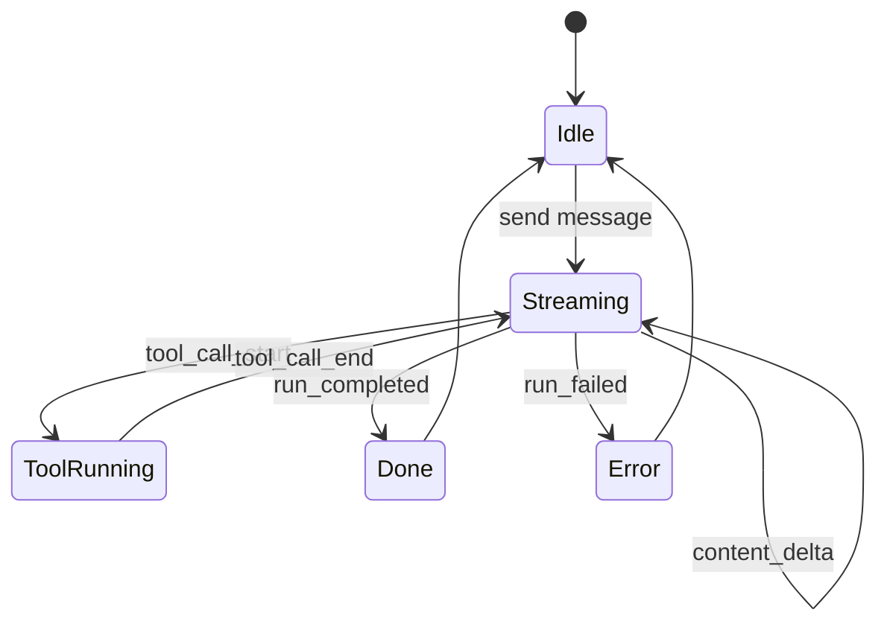
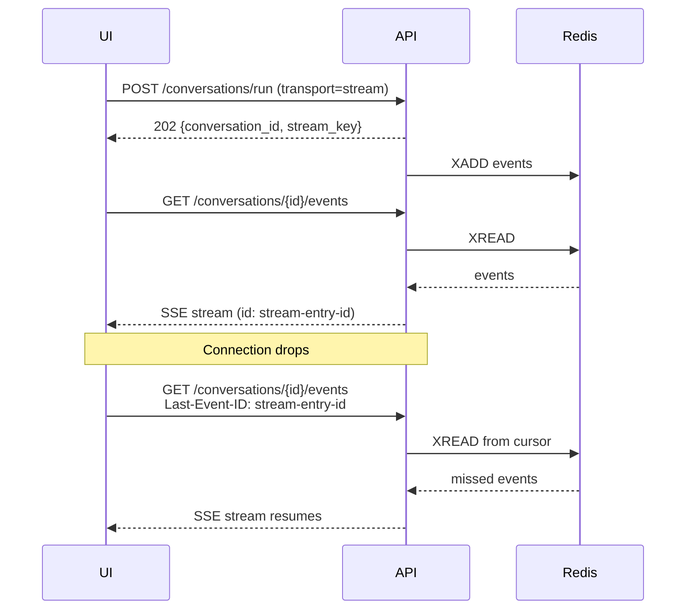
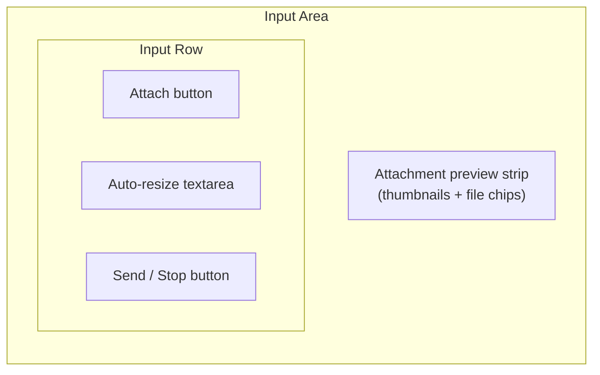
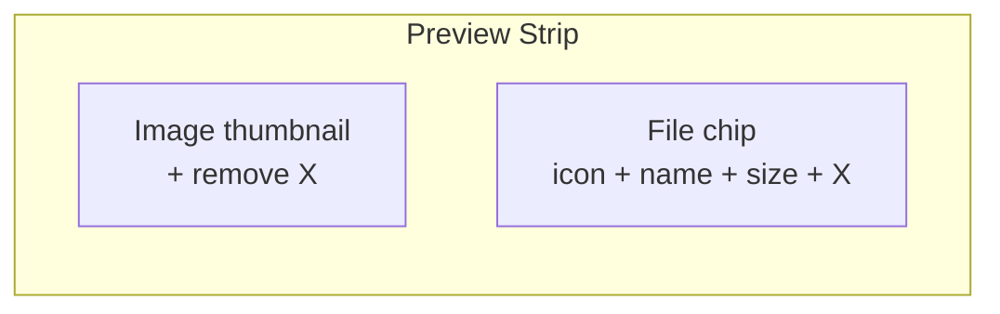
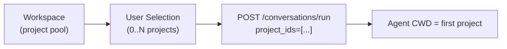
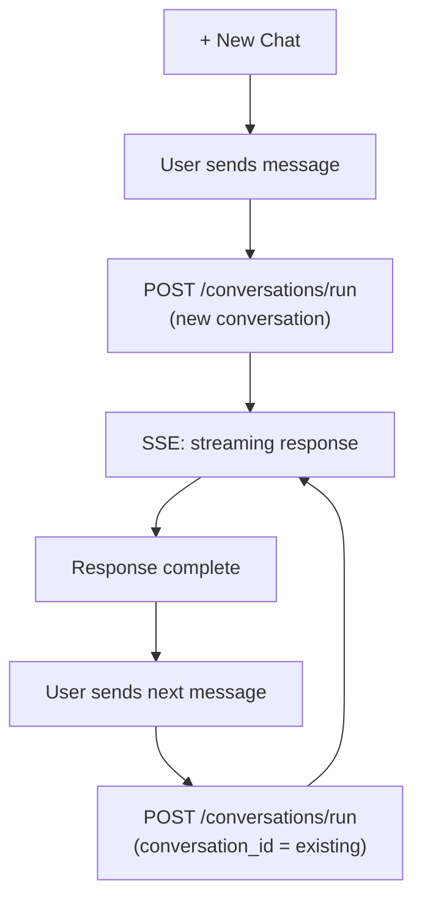

# 02 - Chat

## Message Thread

Messages are displayed in a vertical thread. User messages and agent responses are visually distinct through alignment, background color, and icons.

### Message Types

| Type           | Visual                                        |
| -------------- | --------------------------------------------- |
| User message   | Right-aligned or full-width with user icon    |
| Agent response | Left-aligned or full-width with agent icon    |
| System notice  | Centered, muted text (errors, status changes) |

### Agent Response Rendering

Agent responses are rendered from two sources:

- **Streaming**: SSE protocol events (`content_delta`, `tool_call_start`, etc.) during live execution.
- **History**: `input` / `final_message` pairs loaded via `GET /conversations/{id}/turns` for completed sessions.


```mermaid
flowchart TB
    subgraph Response["Agent Response Block"]
        TEXT["Markdown text<br/>(prose, headings, lists)"]
        CODE["Code blocks<br/>(syntax highlight + copy)"]
        TOOL["Tool call cards<br/>(collapsible)"]
        THINK["Thinking section<br/>(collapsed by default)"]
    end
```

#### Markdown

Full CommonMark rendering with GFM extensions (tables, task lists, strikethrough). Code blocks use Shiki for syntax highlighting with theme-aware colors.

Each code block has:

- Language label (top-left)
- Copy button (top-right)

#### Tool Calls

Displayed as compact collapsible cards inline with the message flow.

Collapsed state: single line showing tool name and brief summary.

```
> Used shell: npm test (exit 0)
```

Expanded state: shows arguments and full output (scrollable, max height capped).

#### Thinking

Agent reasoning/thinking content is rendered in a collapsed section with muted styling. Click to expand. Hidden entirely if empty.

## Streaming

During agent execution, the response streams in real-time via SSE.


```mermaid
stateDiagram-v2
    [*] --> Idle
    Idle --> Streaming: send message
    Streaming --> Streaming: content_delta
    Streaming --> ToolRunning: tool_call_start
    ToolRunning --> Streaming: tool_call_end
    Streaming --> Done: run_completed
    Streaming --> Error: run_failed
    Done --> Idle
    Error --> Idle
```

### Streaming Behavior

- Text appears incrementally (character/chunk level)
- Auto-scroll follows new content unless user has scrolled up
- Tool calls appear as "running" cards, then resolve with results
- Cursor/typing indicator shown at end of streaming text

### Connection

Chat page uses stream transport (`transport=stream`) for resilient streaming backed by Redis Streams. On connection drop, the UI reconnects automatically with no event loss.

Fallback: when Redis is not configured (422 from server), the UI retries with `transport=sse` for direct streaming without reconnection support.


```mermaid
sequenceDiagram
    participant UI
    participant API
    participant Redis

    UI->>API: POST /conversations/run (transport=stream)
    API-->>UI: 202 {conversation_id, stream_key}
    API->>Redis: XADD events

    UI->>API: GET /conversations/{id}/events
    API->>Redis: XREAD
    Redis-->>API: events
    API-->>UI: SSE stream (id: stream-entry-id)

    Note over UI,API: Connection drops

    UI->>API: GET /conversations/{id}/events<br/>Last-Event-ID: stream-entry-id
    API->>Redis: XREAD from cursor
    Redis-->>API: missed events
    API-->>UI: SSE stream resumes
```

#### Reconnection behavior

| Scenario                         | Action                                           |
| -------------------------------- | ------------------------------------------------ |
| Stream drops, session running    | Reconnect with `Last-Event-ID` (up to 3 times)   |
| Retries exhausted, session done  | Reload turns via `GET /conversations/{id}/turns` |
| Retries exhausted, session alive | Show "connection lost" error                     |
| Bridge returns 404               | Session finished; reload turns                   |
| Bridge returns 410               | Stream expired; reload turns                     |
| 409 Conversation busy            | Reattach to existing stream via bridge           |

#### Reattach on navigation

When loading an existing conversation (`/c/:id`) that has an active stream session, the UI loads turn history first, then reattaches to the live stream via `GET /conversations/{id}/events`.

## Input Area

Pinned to the bottom of the chat view. Supports text, image paste, file upload, and drag-and-drop.


```mermaid
flowchart TB
    subgraph Input["Input Area"]
        direction TB
        PREVIEW["Attachment preview strip<br/>(thumbnails + file chips)"]
        subgraph Row["Input Row"]
            direction LR
            ATTACH["Attach button"]
            TA["Auto-resize textarea"]
            SEND["Send / Stop button"]
        end
    end
```

The preview strip is only visible when attachments are present. Attach button opens a native file picker.

### States

| State     | Send Button | Textarea        | Attach Button | Attachments |
| --------- | ----------- | --------------- | ------------- | ----------- |
| Idle      | Send        | Enabled         | Enabled       | Editable    |
| Streaming | Stop        | Enabled (steer) | Disabled      | Frozen      |
| Empty     | Disabled    | Enabled         | Enabled       | Editable    |

### Send Behavior

- **Idle**: POST `/api/conversations/run`, start SSE stream
- **Streaming + Send**: POST `/api/conversations/{id}/steer` (inject guidance)
- **Stop**: POST `/api/conversations/{id}/interrupt`

All attached content is sent as `InputPart[]` alongside the text part. See Attachments section below.

### Keyboard

- `Enter`: Send message (with any pending attachments)
- `Shift+Enter`: New line
- `Ctrl+V` / `Cmd+V`: Paste images from clipboard (intercepted before text paste)
- `Escape`: Cancel input / close panels

## Attachments

Users can attach images and files to messages. Attachments are converted to `InputPart` objects and sent alongside text in the `input` array.

### Input Methods

| Method        | Trigger                    | Accepted Content |
| ------------- | -------------------------- | ---------------- |
| Clipboard     | Paste (Ctrl+V / Cmd+V)     | Images only      |
| File picker   | Click attach button        | All files        |
| Drag and drop | Drop files onto input area | All files        |

### Storage Mode Auto-Selection

The UI automatically chooses the `storage` mode based on MIME type. No manual storage mode picker is exposed.

| Content Type       | storage     | Rationale                                         |
| ------------------ | ----------- | ------------------------------------------------- |
| Images (`image/*`) | `inline`    | Direct to model context for vision                |
| All other files    | `ephemeral` | Downloaded/written for agent to analyze via tools |

### Client-Side Limits

| Constraint        | Limit  | Behavior when exceeded        |
| ----------------- | ------ | ----------------------------- |
| Inline (images)   | 20 MB  | Show error toast, reject file |
| Ephemeral (files) | 100 MB | Show error toast, reject file |
| Max attachments   | 10     | Disable attach button         |

### Attachment Preview Strip

Shown above the textarea inside the input wrapper when attachments are present.


```mermaid
flowchart LR
    subgraph Strip["Preview Strip"]
        IMG["Image thumbnail<br/>+ remove X"]
        FILE["File chip<br/>icon + name + size + X"]
    end
```

**Image attachments**: Square thumbnail (`h-16 w-16 rounded-lg object-cover`) with a small X button overlay (top-right corner). Uses `URL.createObjectURL` for local preview.

**File attachments**: Compact chip (`bg-muted rounded-lg px-3 py-2`) showing file type icon, truncated filename, and human-readable size. X button to remove.

The strip scrolls horizontally if attachments overflow.

### Wire Format

When sending, each attachment becomes an `InputPart`:

| Attachment Type | InputPart fields                                                           |
| --------------- | -------------------------------------------------------------------------- |
| Image (paste)   | `type: "binary"`, `data: base64`, `mime: "image/png"`, `storage: "inline"` |
| Image (file)    | `type: "binary"`, `data: base64`, `mime: detected`, `storage: "inline"`    |
| Other file      | `type: "binary"`, `data: base64`, `mime: detected`, `storage: "ephemeral"` |

Text content (if any) is always the first part: `{ type: "text", text: "..." }`. Attachments follow in order.

### User Message Display

When rendering user messages (both live and from history), non-text input parts are displayed:

| Part Type             | Display                                                    |
| --------------------- | ---------------------------------------------------------- |
| `binary` + image MIME | Inline thumbnail (clickable to view full size in a dialog) |
| `binary` + other MIME | File badge: icon + filename + size                         |
| `url`                 | Link badge: favicon + truncated URL                        |
| `file`                | Path badge: file icon + project-relative path              |

For history-loaded messages, binary image data is rendered from the base64 `data` field stored in the turn's `input` array. Non-image binaries show metadata only (no preview).

### Drag-and-Drop

The entire input area acts as a drop zone. On drag-over, the input wrapper shows a visual highlight (`border-primary border-dashed bg-primary/5`). Dropping adds files to the attachment list following the same auto-selection rules.

## Conversation Header

Shown at top of the chat area.

| Element      | Description                                                               |
| ------------ | ------------------------------------------------------------------------- |
| Title        | Editable conversation title (saved via `POST /conversations/{id}/update`) |
| Preset badge | Shows which agent preset is active                                        |
| Actions menu | Fork, change preset, archive (status update via same endpoint)            |

## Loading History

When the user opens an existing conversation (sidebar click or direct navigation to `/c/:id`):

1. Fetch conversation metadata: `GET /conversations/{id}/get`
2. Fetch turn history: `GET /conversations/{id}/turns`
3. Render each turn as a user message (`input`) followed by an agent response (`final_message`)
4. If a session is still running, reattach to its SSE stream via `GET /conversations/{id}/events`

Turns are returned in chronological order. Each turn contains `session_id`, `input` (list of content parts), `final_message` (markdown string or null for in-progress turns), and `created_at`.

## New Chat

Clicking "+ New Chat" in the sidebar:

1. Resets chat state (clears messages, project selection)
2. Focus moves to the input area
3. User optionally selects projects to mount from the workspace's project pool
4. First message triggers `POST /api/conversations/run` with `project_ids` and `metadata.workspace_id`
5. Workspace's default preset is used (or system default)

## Project Selection

Workspaces define a pool of available projects (filesystem paths). Users choose which projects to mount per conversation.


```mermaid
flowchart LR
    WS["Workspace<br/>(project pool)"] --> SEL["User Selection<br/>(0..N projects)"]
    SEL --> RUN["POST /conversations/run<br/>project_ids=[...]"]
    RUN --> AGENT["Agent CWD = first project"]
```

### Behavior

| Scenario             | project_ids sent       | Agent behavior                  |
| -------------------- | ---------------------- | ------------------------------- |
| No projects selected | `[]`                   | Pure conversation mode (no CWD) |
| One project selected | `["/path/to/project"]` | CWD = that project              |
| Multiple selected    | `["/a", "/b", "/c"]`   | CWD = first, all are accessible |

### UI

- **Project selector**: Shown above the input area when workspace has projects. Each project is a toggleable chip. First selected project shows a "cwd" indicator.
- **Conversation header**: Shows mounted projects as read-only badges.
- **Default**: No projects selected (pure conversation mode).
- **Existing conversations**: Project selection is restored from `latest_session.project_ids`. User can change selection before sending the next message.
- **During streaming**: Project selector is disabled.

### Data Flow

- `workspace_id` is stored only in conversation metadata (for sidebar filtering). It is NOT sent as a top-level field in the run request.
- `project_ids` is always sent explicitly in the run request, reflecting the user's selection.

## Conversation Lifecycle


```mermaid
flowchart TB
    NEW["+ New Chat"] --> SEND["User sends message"]
    SEND --> RUN["POST /conversations/run<br/>(new conversation)"]
    RUN --> STREAM["SSE: streaming response"]
    STREAM --> DONE["Response complete"]
    DONE --> NEXT["User sends next message"]
    NEXT --> CONTINUE["POST /conversations/run<br/>(conversation_id = existing)"]
    CONTINUE --> STREAM
```
