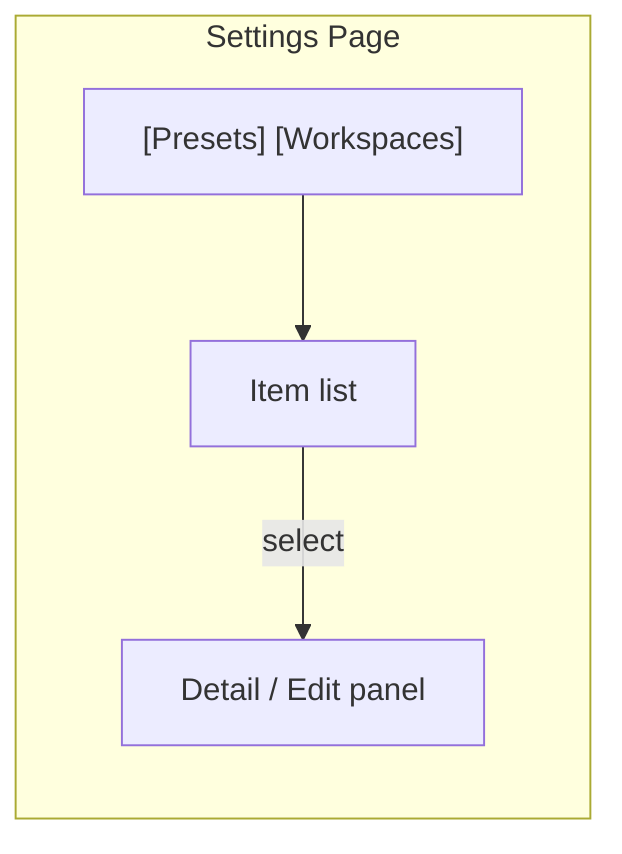

# 03 - Settings

Settings page (`/settings`) provides management for presets and workspaces. Accessed via the gear icon in the sidebar footer.

## Layout

Tab-based: **Presets** | **Workspaces**. Each tab shows a list on the left and a detail/edit panel on the right (on desktop). On mobile, list and detail are separate views.

## Presets Tab

### Preset List

Shows all presets ordered by name. Each item displays:

- Name
- Model name badge
- Default indicator (star or badge)

Actions: "+ New Preset" button at top.

### Preset Editor

Form for creating or editing a preset. Organized in sections:

| Section       | Fields                                              |
| ------------- | --------------------------------------------------- |
| General       | name, description, is_default                       |
| Model         | model name, temperature, max_tokens, context_window |
| System Prompt | Large textarea (monospace, Jinja2 highlighting)     |
| Toolsets      | Checklist of available toolsets + exclude config    |
| Environment   | Shell mode, default workspace/project selection     |
| Subagents     | Enable builtins, async toggle, preset refs          |

### Preset Actions

| Action | API                                | Confirmation |
| ------ | ---------------------------------- | ------------ |
| Save   | POST /api/presets/create or update | None         |
| Delete | POST /api/presets/{id}/delete      | Dialog       |
| Clone  | Create with copied fields          | None         |

## Workspaces Tab

### Workspace List

Shows all UI-created workspaces (filtered by `metadata.source = "webui"`). Each item displays:

- Name
- Folder count
- Default badge (if default workspace)

Actions: "+ New Workspace" button at top.

### Workspace Editor

| Section | Fields                                           |
| ------- | ------------------------------------------------ |
| General | name                                             |
| Folders | Ordered list of project_ids (add/remove/reorder) |
| Preset  | Default preset selector (optional)               |

Folder management:

- Text input to add a new folder (project_id = directory name)
- Drag to reorder (first = default working directory)
- Click to remove

### Workspace Actions

| Action | API                                   | Confirmation |
| ------ | ------------------------------------- | ------------ |
| Save   | POST /api/workspaces/create or update | None         |
| Delete | POST /api/workspaces/{id}/delete      | Dialog       |

Cannot delete the default workspace (UI-enforced).

## Mobile Behavior

On mobile, settings uses a full-screen list view. Tapping an item navigates to a full-screen editor with a back button (same pattern as chat).

## Navigation

A back arrow or "Chat" link in the settings header returns to the chat page. Settings state is not persisted in URL beyond `/settings`.
