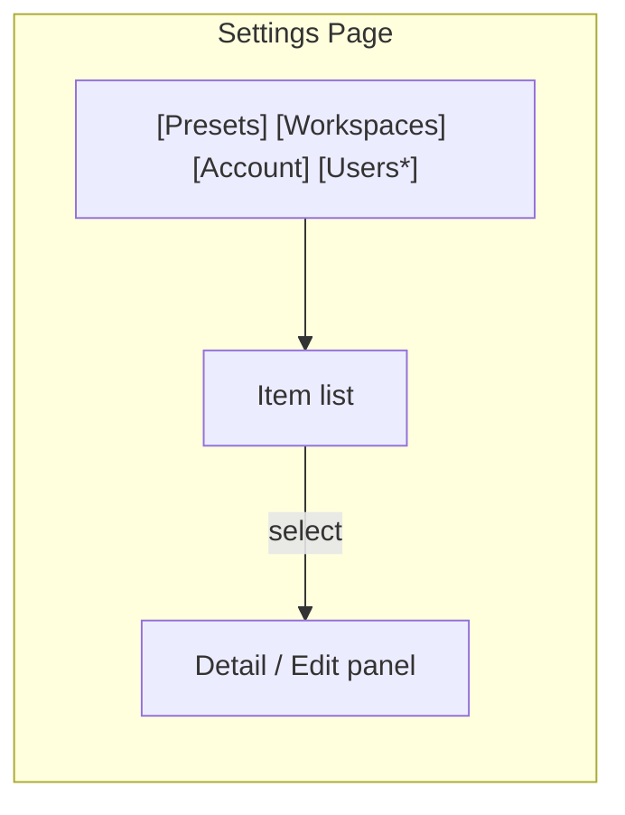

# 03 - Settings

Settings page (`/settings`) provides management for presets, workspaces, account, and users. Accessed via the gear icon in the sidebar footer.

## Layout

Tab-based: **Presets** | **Workspaces** | **Account** | **Users** (admin only). Each tab shows a list on the left and a detail/edit panel on the right (on desktop). On mobile, list and detail are separate views.

```mermaid
flowchart LR
    subgraph Settings["Settings Page"]
        TABS["[Presets] [Workspaces] [Account] [Users*]"]
        LIST["Item list"]
        DETAIL["Detail / Edit panel"]
    end

    TABS --> LIST
    LIST -->|"select"| DETAIL
```

\*Users tab visible to admins only.

## Presets Tab

### Preset List

Shows all presets ordered by name. Each item displays:

- Name
- Model name badge
- Default indicator (star or badge)

Actions: "+ New Preset" button at top.

### Preset Editor

Form for creating or editing a preset. Organized in sections:

| Section       | Fields                                              |
| ------------- | --------------------------------------------------- |
| General       | name, description, is_default                       |
| Model         | model name, temperature, max_tokens, context_window |
| System Prompt | Large textarea (monospace, Jinja2 highlighting)     |
| Toolsets      | Checklist of available toolsets + exclude config    |
| Environment   | Shell mode, default workspace/project selection     |
| Subagents     | Enable builtins, async toggle, preset refs          |
| MCP Servers   | Dynamic list of external MCP server connections     |

### Preset Actions

| Action | API                                | Confirmation |
| ------ | ---------------------------------- | ------------ |
| Save   | POST /api/presets/create or update | None         |
| Delete | POST /api/presets/{id}/delete      | Dialog       |
| Clone  | Create with copied fields          | None         |

## Workspaces Tab

### Workspace List

Shows all UI-created workspaces (filtered by `metadata.source = "webui"`). Each item displays:

- Name
- Folder count
- Default badge (if default workspace)

Actions: "+ New Workspace" button at top.

### Workspace Editor

| Section  | Fields                                                              |
| -------- | ------------------------------------------------------------------- |
| General  | name                                                                |
| Projects | Ordered list of project refs (id + description, add/remove/reorder) |
| Preset   | Default preset selector (optional)                                  |

Project management:

- Text input to add a new project (project_id = storage directory name)
- Each project shows an expandable description field (optional, single-line text input)
- Description is injected into the agent's environment context as an `InstructableResource`
- Each project maps to a managed directory on the server
- Drag to reorder (first = default working directory)
- Click to remove

### Workspace Actions

| Action | API                                   | Confirmation |
| ------ | ------------------------------------- | ------------ |
| Save   | POST /api/workspaces/create or update | None         |
| Delete | POST /api/workspaces/{id}/delete      | Dialog       |

Cannot delete the default workspace (UI-enforced).

## Mobile Behavior

On mobile, settings uses a full-screen list view. Tapping an item navigates to a full-screen editor with a back button (same pattern as chat).

## Navigation

A back arrow or "Chat" link in the settings header returns to the chat page. Settings state is not persisted in URL beyond `/settings`.

## Account Tab

Self-service account management. Available to all users.

### Profile Section

| Field        | Editable | Description                 |
| ------------ | -------- | --------------------------- |
| User ID      | No       | Read-only identifier        |
| Display Name | Yes      | POST /api/users/{id}/update |
| Role         | No       | Read-only badge             |

### Change Password Section

Form with three fields:

- Current password (required)
- New password (required, min 8 characters)
- Confirm new password (must match)

Submits `POST /api/auth/change-password`. On success: show confirmation message. On error: show inline error.

### API Keys Section

Self-service API key management for programmatic access.

- List of own keys: name, prefix (`nb_k7x9...`), created date, last used, status
- "+ New Key" button: name input, optional expiry, creates key and shows full key once (copy button)
- Revoke button per key (with confirmation)

## Users Tab (Admin Only)

Hidden for non-admin users. Full user management.

### User List

All users ordered by creation date. Each item shows:

- Display name
- User ID (secondary text)
- Role badge (admin / user)
- Status indicator (active / deactivated)

Actions: "+ New User" button at top.

### Create User Dialog

Modal dialog with fields:

| Field        | Type   | Required | Description                   |
| ------------ | ------ | -------- | ----------------------------- |
| User ID      | string | Yes      | Slug identifier               |
| Display Name | string | Yes      | Display name                  |
| Role         | select | No       | admin or user (default: user) |

On submit: `POST /api/users/create`. Response dialog shows:

- Generated password (with copy button, warning: shown once)
- Generated API key (with copy button, warning: shown once)
- "Done" button to dismiss

### User Detail Panel

Selected user's details and actions:

| Action         | API                                 | Confirmation |
| -------------- | ----------------------------------- | ------------ |
| Update role    | POST /api/users/{id}/update         | None         |
| Reset password | POST /api/users/{id}/reset-password | Dialog       |
| Deactivate     | POST /api/users/{id}/deactivate     | Dialog       |

Reset password shows the new generated password in a modal (copy button, shown once).

Cannot deactivate self (button disabled with tooltip).
