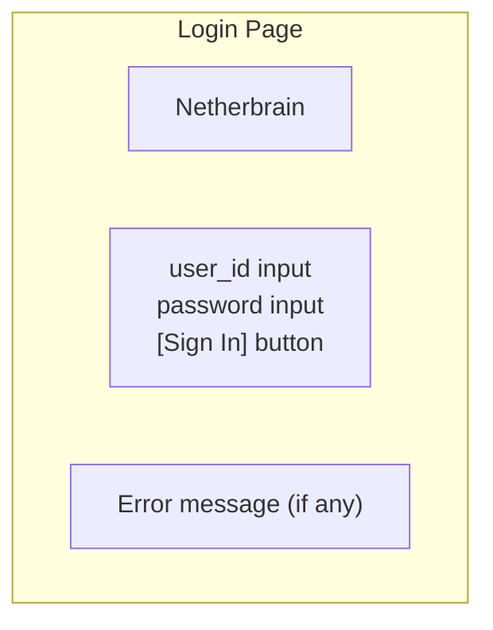
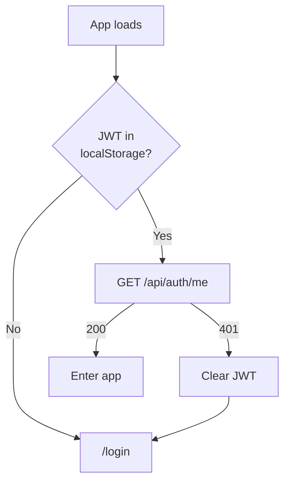
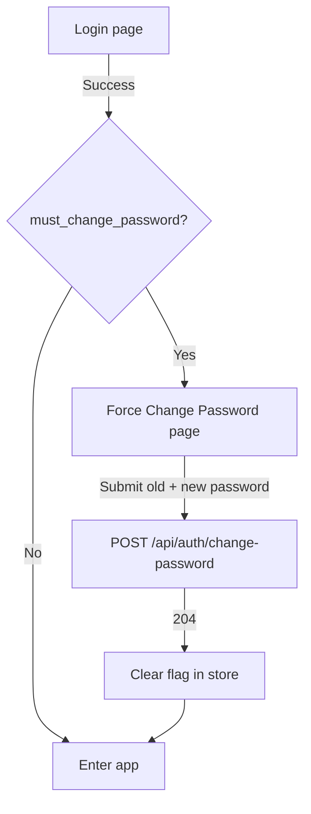

# 04 - Auth

Login and account management for the web UI. Unauthenticated users see the login page; authenticated users interact normally.

## Login Page (`/login`)

Minimal, centered login form. No registration (admin creates accounts).

### Behavior

- `POST /api/auth/login` with `{user_id, password}`
- On success: store JWT in `localStorage`, redirect to `/` (chat)
- On error: show inline error message ("Invalid credentials" / "Account deactivated")
- No "forgot password" link (homelab: ask the admin)

### Auth State Management

On app load:

- JWT stored as `localStorage.nether_token`
- Attached to all API requests as `Authorization: Bearer {jwt}`
- On 401 from any API call: clear token, redirect to `/login`
- Zustand auth store: `{user, token, isAdmin, login(), logout()}`

## First Login

When a user logs in with `must_change_password: true` (set for all new accounts and password resets), they are forced to change their password before accessing the app.

### Force Change Password Page

- Full-screen centered form (same layout as login page)
- Three fields: current password, new password, confirm new password
- Validates: new password >= 8 chars, confirmation matches
- On success: updates user in Zustand store (`must_change_password: false`), enters the app
- On error: shows inline error ("Current password is incorrect")

### Bootstrap Flow

For the initial admin user, the flow is:

1. Deploy with `NETHER_AUTH_TOKEN=mysecret`
2. First startup auto-creates `admin` user with password `mysecret`
3. Open web UI -> login as `admin / mysecret`
4. Immediately shown the "Change Password" page
5. Enter `mysecret` as current password, set a new one
6. Enter the app

## Logout

- Button in sidebar footer (below user display name)
- Clears JWT from localStorage
- Redirects to `/login`

## Role-Aware UI

After login, `GET /api/auth/me` determines what the user sees:

| Element              | Admin | User      |
| -------------------- | ----- | --------- |
| Chat page            | Yes   | Yes       |
| Settings: Presets    | Edit  | Read-only |
| Settings: Workspaces | Edit  | Read-only |
| Settings: Users      | Yes   | No        |
| Settings: Account    | Yes   | Yes       |
| Settings: API Keys   | Yes   | Yes       |
