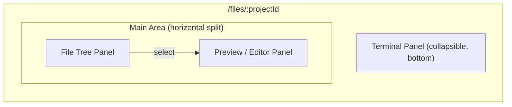

# 05 - Files

File browser and interactive shell for project directories. Provides browsing, preview, editing, upload, download, and terminal access.

## Page Structure

Route: `/files/:projectId`

Three-zone layout: file tree, preview/editor, and optional terminal panel.



### Header

- Back navigation: arrow icon returns to previous page (chat or settings)
- Project name as page title
- Workspace breadcrumb: `Workspace Name / Project ID`

## File Tree Panel (Left)

Lazy-loaded directory tree rooted at the project directory.

### Behavior

- On mount: fetch root directory contents via `GET /api/files/{projectId}/list`
- Click directory: toggle expand/collapse, fetch children on first expand
- Click file: load content in preview panel, highlight selected item
- Sorted: directories first (alphabetical), then files (alphabetical)
- **Refresh**: re-fetches the currently expanded directories, preserving expand/collapse state

### Visual

- Folder icon (open/closed state) for directories
- File type icons derived from extension (code, image, document, generic)
- Indentation per nesting level (16px per level)
- Selected file: primary background tint
- Hover: subtle background highlight

### Tree Toolbar

| Button  | Action                                                 |
| ------- | ------------------------------------------------------ |
| Refresh | Re-fetch all expanded directories, preserve tree state |
| Upload  | Open upload dialog / trigger file picker               |
| Select  | Toggle multi-select mode                               |

### Multi-Select Mode

- Checkbox column appears when "Select" toggle is activated
- Check individual files or entire directories (selects all contents recursively)
- Selection count badge in toolbar
- "Download Selected" button triggers `POST /download-archive`

### Upload

Two entry points:

1. **Upload button** in tree toolbar: opens native file picker (multiple files allowed)
2. **Drag and drop**: drop files onto the file tree panel or a specific directory node

Upload targets the currently selected directory (or project root if none selected). After upload completes, the target directory auto-refreshes.

Progress indicator: inline progress bar below the tree toolbar during upload. Shows file count and progress.

## Preview / Editor Panel (Right)

Shows content of the selected file. Empty state when no file is selected.

### Empty State

Centered message: "Select a file to preview" with a file icon.

### Text / Code Files

Determined by file extension (common text extensions: `.txt`, `.md`, `.py`, `.js`, `.ts`, `.json`, `.yaml`, `.toml`, `.sh`, `.css`, `.html`, `.xml`, `.sql`, `.rs`, `.go`, `.java`, `.c`, `.cpp`, `.h`, `.rb`, `.php`, `.swift`, `.kt`, `.env`, `.cfg`, `.ini`, `.log`, `.csv`).

**Read mode** (default):

- Syntax-highlighted display using Shiki (reuse existing chat code block theming)
- Line numbers
- File path and metadata bar: `src/main.py -- 1.2 KB -- Modified 2025-01-15 10:30`

**Edit mode**:

- Toggle via "Edit" button in toolbar
- Monospace textarea with line numbers
- Tab key inserts spaces (configurable: 2 or 4)
- "Save" button (Ctrl+S / Cmd+S shortcut) calls `POST /write`
- Unsaved changes: dot indicator on the Edit/Save button
- "Discard" to revert to last saved content
- Confirm dialog on navigation away with unsaved changes

### Image Files

Extensions: `.png`, `.jpg`, `.jpeg`, `.gif`, `.svg`, `.webp`, `.ico`

- Inline preview via `` tag pointing to `/api/files/{projectId}/download?path=...`
- Checkerboard background for transparency
- Fit-to-panel with max dimensions, click to view full size
- File metadata bar (same as text files)

### Other Files

- File icon, name, size, modified date
- "Download" button as primary action
- No inline preview

### Preview Toolbar

| Button       | Condition                   | Action                   |
| ------------ | --------------------------- | ------------------------ |
| Edit / Read  | Text file selected          | Toggle edit mode         |
| Save         | Edit mode, has changes      | Save file content        |
| Discard      | Edit mode, has changes      | Revert to saved content  |
| Download     | File selected               | Download current file    |
| Download Zip | Multi-select, has selection | Download selected as zip |

## Terminal Panel (Bottom)

Collapsible terminal panel at the bottom of the page. Uses xterm.js to provide an interactive shell session via WebSocket.

### Behavior

- **Toggle**: "Terminal" button in the page header or keyboard shortcut (Ctrl+\`)
- **Connect**: on first open, establishes WebSocket to `WS /api/shell/{projectId}/connect?token=...`
- **Resize**: terminal resizes with panel; sends resize control frame to server
- **Reconnect**: if connection drops, show "Disconnected" banner with "Reconnect" button
- **Close**: closing the panel sends WebSocket close; re-opening creates a new session

### Layout

- Default height: 250px (resizable via drag handle)
- Minimum height: 120px
- Maximum height: 60% of viewport
- Panel header: "Terminal" label + minimize/maximize/close buttons

### Visual

- Dark background (regardless of theme) matching standard terminal aesthetics
- Monospace font (same family as code blocks)
- Scrollback buffer: 1000 lines (xterm.js default)

## Entry Points

### From Workspace Editor (Settings)

Each project in the workspace's project list shows a folder/browse icon button. Clicking navigates to `/files/{projectId}`.

```
[my-project] [Browse] [drag-handle]
[shared-lib]  [Browse] [drag-handle]
```

### From Sidebar

When a workspace is active and has projects, the sidebar shows a "Files" section below the conversation list with project folders. Clicking a project navigates to `/files/{projectId}`.

## Responsive Behavior

### Desktop (>= 768px)

Side-by-side: file tree (280px fixed width) + preview panel (flex). Terminal panel spans full width below both.

### Mobile (< 768px)

- File tree is full-width
- Selecting a file navigates to a full-screen preview
- Back button returns to file tree
- Terminal: full-width bottom sheet (slide up), 50% viewport height
- Multi-select mode uses a bottom action bar
- Upload via button only (no drag-and-drop on mobile)

## Loading States

- File tree: skeleton lines while loading directory
- File tree refresh: subtle spinner on the refresh button, tree remains interactive
- Preview: centered spinner while loading file content
- Save: button shows spinner, disabled during save
- Upload: progress bar with file count
- Terminal: "Connecting..." message in terminal area until WebSocket opens

## Error States

- Project not found (404): "Project directory not found" message with back link
- Path traversal (403): silently treated as 404 (do not reveal the security check)
- Binary file via read (422): show "Binary file -- preview not available" with download button
- Large file (413): show truncated content with banner: "File truncated (showing first 1 MB)"
- Upload too large (413): toast notification with size limit info
- Network error: toast notification with retry option
- Terminal connection failed: inline error in terminal area with retry button
